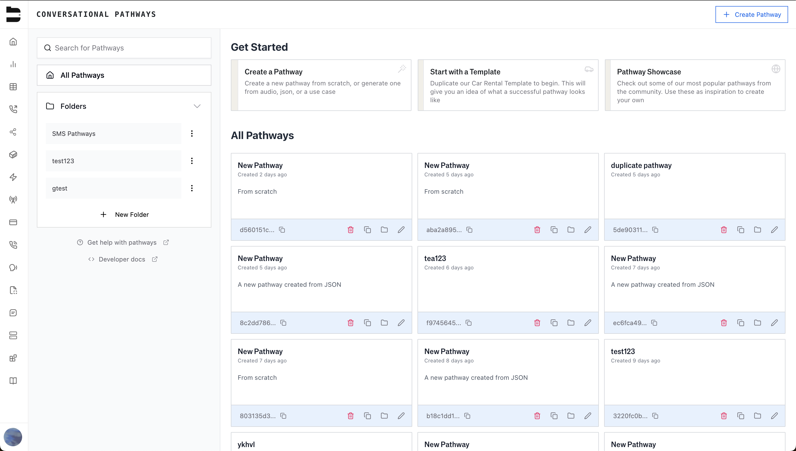

## May 2, 2025

### ✨ Introducing the Bland AI Web Chat Widget

Watch a quick demo of our latest feature - the Bland AI Chat Widget that can be easily integrated into any website:

<video 
  controls
  style={{ width: "100%", borderRadius: "0.5rem" }}
  src="/tutorials/final_web_chat_video.mp4"
>
  <track kind="captions" />
</video>

### 💎 Improvements

**Pathway Experience**
- Reskinned Pathways interface with a fresh new look:

- Added Status Code support for Webhook Nodes routing

**Call Management**
- Scheduled calls are now visible in active calls dashboard
- Added start time selection in 'Send Call' Page
- Added SMS logs navigation with pagination
- Clearer error messages when sending calls

**Voice & Audio**
- Optimized noise cancellation for clearer conversations
- Improved call interruption handling during webhook requests
- Extended max length of voicemails to 60 seconds

### 🐞 Fixes

**System Reliability**
- Resolved transcription connection issues
- Fixed issues with [transcript correction API endpoint](/api-v1/get/calls-corrected-transcript)
- Fixed issue where fields were being unintentionally deleted when updating inbound numbers
- Fixed bug with voices getting removed

**Editor**
- Eliminated double loading in Pathways Editor
- Fixed configuration loading issues
- Resolved dropdown menu overlapping

