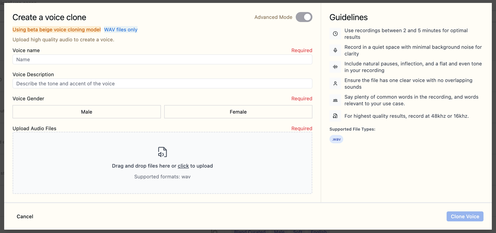
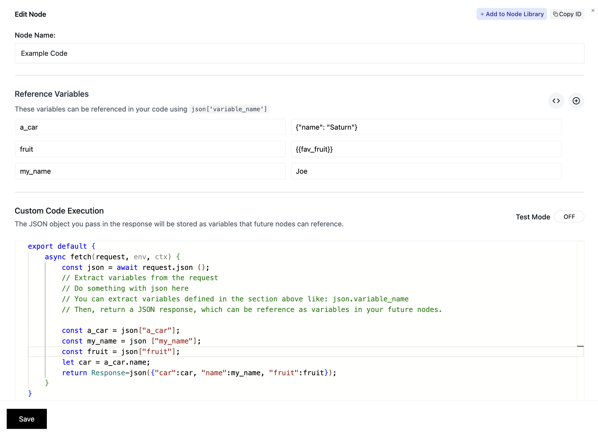
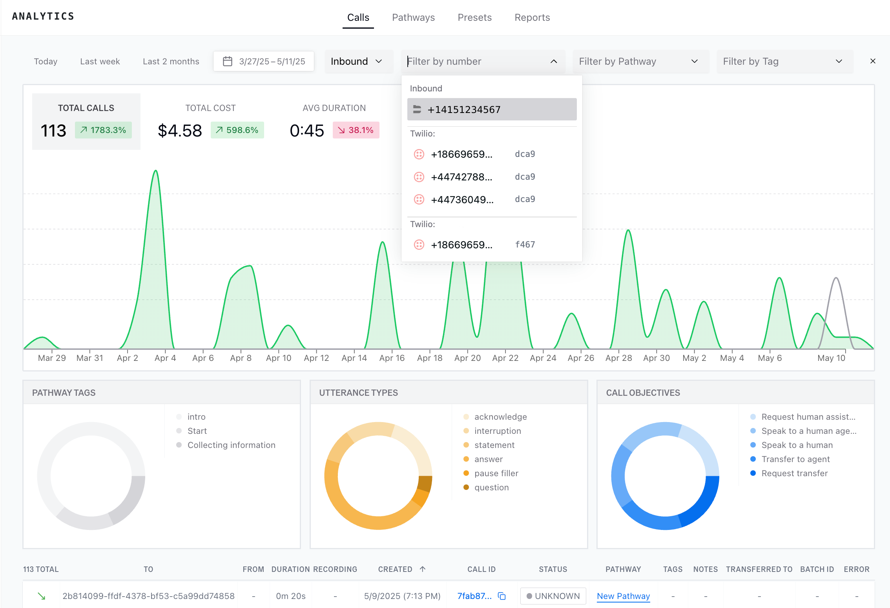
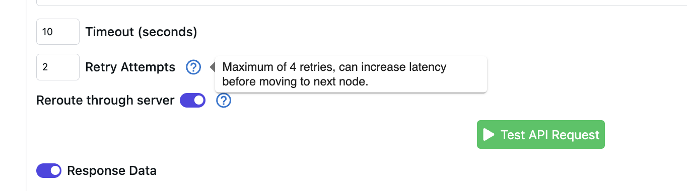

## May 11, 2025

Happy Mother's Day!

Last week was a big one, we rolled out some exciting new features and improvements! Check out what the Bland team has been building below.

### 🎧 Live Call Monitoring

You are soon able to **listen to active calls in real time**, making it easier for QA, support, and customer-facing teams to stay on top of live interactions.

- Access from the Active Call Logs page
- Playback begins as soon as the call starts
- Hear both agent and user conversation audio alongside transcripts!

### 🗣 New TTS Engine & Voice Cloning (Beta)

We've rolled out an upgraded text-to-speech engine with enhanced expressiveness, named "Beige"!

- Smoother, more natural speech output
- Support for cloning your own voice
- New voices added to the Voice Library, try out Maeve and Beige in our [Bland Curated voices list](https://app.bland.ai/dashboard/voices)!
- Hint: Ask your agent to laugh, speak faster, or slower! :)

### 🛠 Pathways Enhancements

**Heatmap Fixes**
- Pathway heatmaps now render correctly across all screen sizes and browsers.

**Custom Code Execution Node (Enterprise)**
- Add inline JavaScript to extend your Pathway logic or trigger external services.

### 📊 Analytics & Webhook Updates

**Improved Filtering**
- You can now filter analytics by `to` and `from` phone numbers, helping you drill into call-specific behavior.

**Webhook Retries**
- You can now enable your Webhook Nodes to retry automatically on failure error codes 429 (rate limit) and all those above 500.

### 🚀 Performance Improvements

We've significantly improved load times across the platform, particularly for our call logs.

- Faster render for analytics and call playback
- Backend optimizations for large orgs
- Preloading of call logs for faster loading when navigating to the page

### 📞 Calling & Voicemail Improvements

- Enhanced voicemail detection to improve accuracy and reduce misclassifications.
- Users now receive a clear error when attempting to import the same number into different orgs.
- **Express Dial (Beta)**: Optimized call dispatch system for select customers, reducing call initiation latency.

## May 2, 2025

### ✨ Introducing the Bland AI Web Chat Widget

Watch a quick demo of our latest feature - the Bland AI Chat Widget that can be easily integrated into any website:

<video 
  controls
  style={{ width: "100%", borderRadius: "0.5rem" }}
  src="/tutorials/final_web_chat_video.mp4"
>
  <track kind="captions" />
</video>

### 💎 Improvements

**Pathway Experience**
- Reskinned Pathways interface with a fresh new look:

- Added Status Code support for Webhook Nodes routing

**Call Management**
- Scheduled calls are now visible in active calls dashboard
- Added start time selection in 'Send Call' Page
- Added SMS logs navigation with pagination
- Clearer error messages when sending calls

**Voice & Audio**
- Optimized noise cancellation for clearer conversations
- Improved call interruption handling during webhook requests
- Extended max length of voicemails to 60 seconds

### 🐞 Fixes

**System Reliability**
- Resolved transcription connection issues
- Fixed issues with [transcript correction API endpoint](/api-v1/get/calls-corrected-transcript)
- Fixed issue where fields were being unintentionally deleted when updating inbound numbers
- Fixed bug with voices getting removed

**Editor**
- Eliminated double loading in Pathways Editor
- Fixed configuration loading issues
- Resolved dropdown menu overlapping

