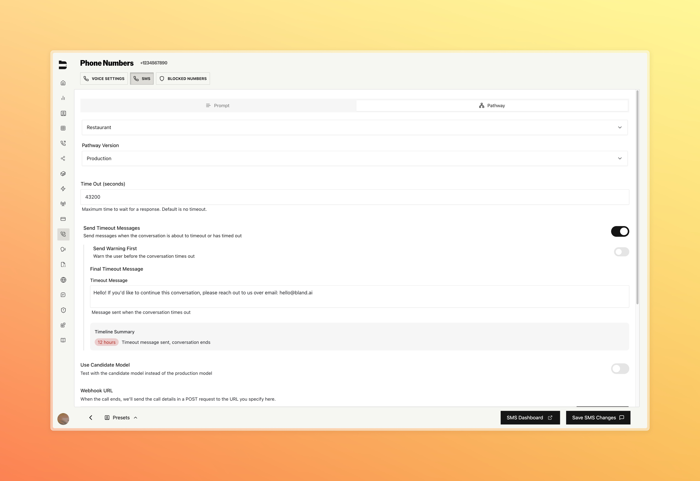

### Improvements

**Integrations**
- Added Salesforce Case creation with custom field support to the Salesforce integration

**API & Development**
- Added org level fallback URL for webhooks that automatically applies when a webhook URL isn't passed in call configuration

**SMS**
- [Enterprise] Added customizable timeout message to SMS agent for both prompt and pathway configurations

> This new feature allows you to add a customized timeout message to be sent in the SMS agent once it has been reached. Works with both prompt and pathway calls.

**Call Logs & Management**
- Removed download and play buttons in call logs when a call wasn't recorded

**Pathways & Routing**
- [Enterprise] Fixed test proxy agent for warm transfer nodes

**Web Widget**
- Added markdown rendering for widget messages