### BTTS V2 Voice Launch

We are excited to roll out major improvements to our text to speech experience over the next week. When your account is upgraded, you will see a new voice appear tagged as BTTSV2 in your [voices page](https://app.bland.ai/dashboard/voices).

BTTSV2 is significantly more expressive and stable, and is the new version of voices that we are rolling out to customers going forward.

Attached is a [prompting guide](/tutorials/btts) that outlines best practices for using these new voices. In most cases, BTTSV2 should behave one to one with existing voices, though some differences may appear depending on usage and prompting.

**Supported Languages:**
English, Spanish, German, French, Czech, Dutch, Bulgarian, Chinese, Danish, Estonian, Finnish, Korean, Japanese, Norwegian, Italian, Polish, and Russian.

**Experimental Support:**
Hungarian, Swedish, Romanian, Greek, Portuguese, Indonesian, Serbo-Croatian, Slovenian, Slovak, and Welsh.

**TLDR** — Voices flagged as Legacy in the voice UI will be upgraded to BTTSV2. All other V1 voices will remain unchanged, so your experience will stay the same if you are not using a legacy voice.

---

### Triggers and Automations [Beta]

Automate your workflows with visual trigger builders that respond to events from Salesforce, Notion, and more.

- Build out your automations through our drag-and-drop UI
- Connect to trigger sources such as Salesforce, Notion, and more soon
- Configure actions to automatically send calls, and soon webhooks, SMS, and Slack messages
- Adjust trigger conditions with scheduling (immediate, business hours, custom) and conditional logic with change detection (e.g., only trigger if Status changed to "Hot")
- Test with mock data before deploying and track execution history

<Tabs>
  <Tab title="Gallery">
    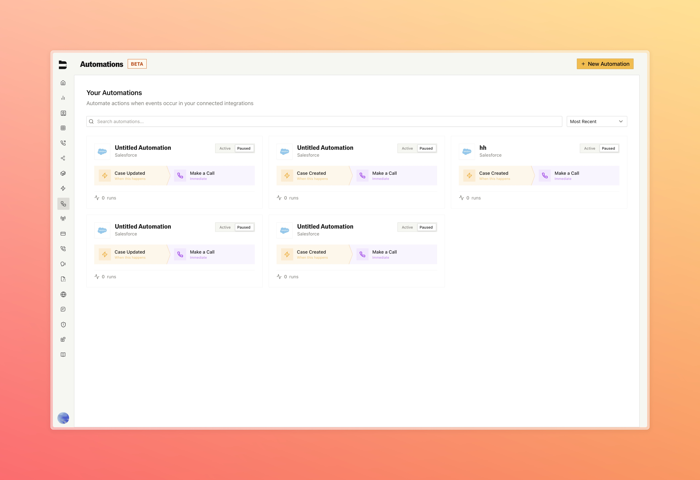
  </Tab>
  <Tab title="Builder">
    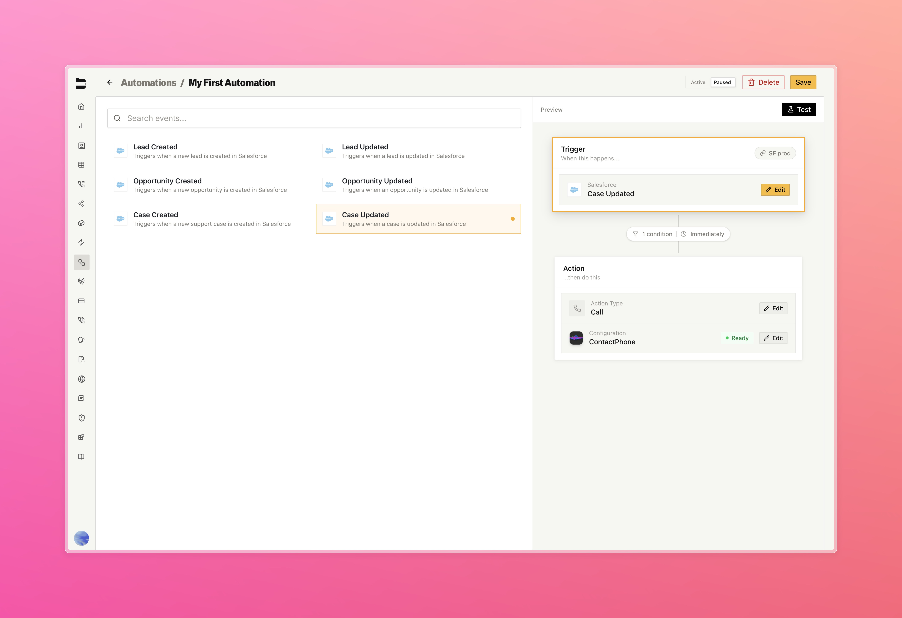
  </Tab>
  <Tab title="Connections">
    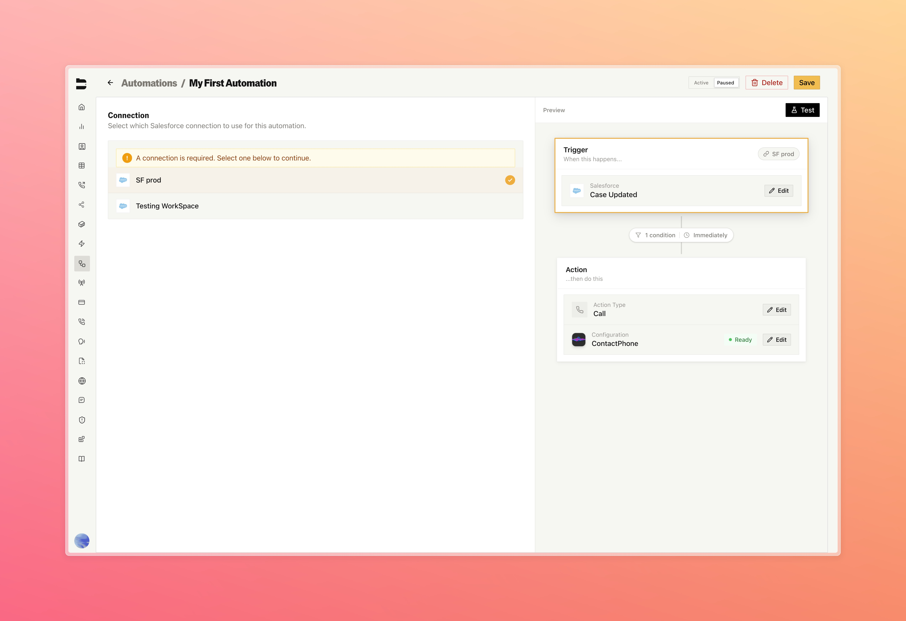
  </Tab>
  <Tab title="Action Selection">
    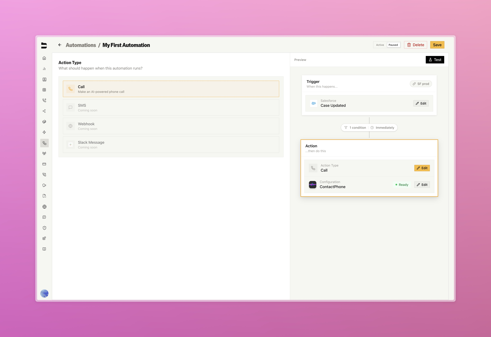
  </Tab>
  <Tab title="Call Configuration">
    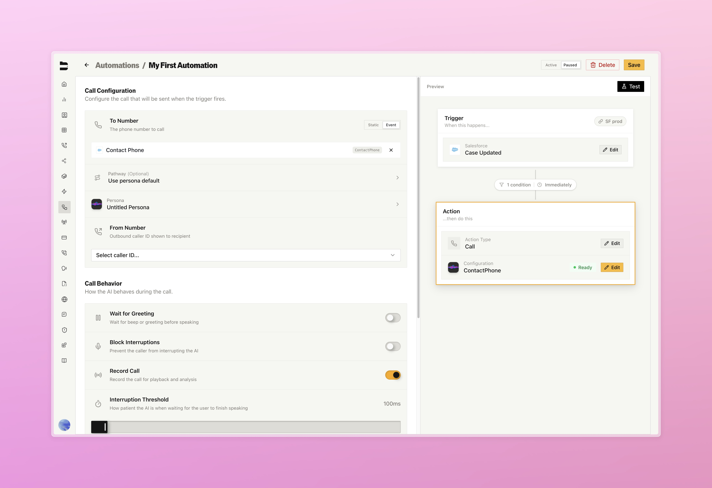
  </Tab>
  <Tab title="Test Trigger">
    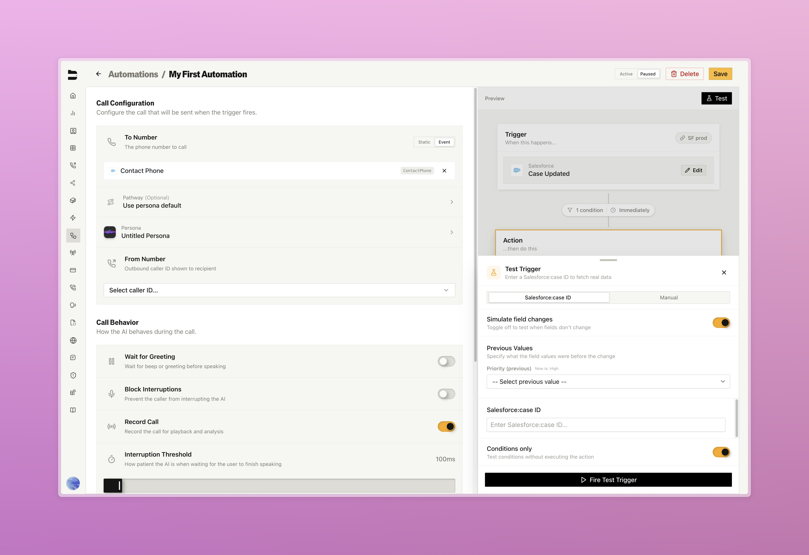
  </Tab>
</Tabs>

---

### Knowledge Base Editing

Edit your knowledge base files directly in Bland with full version control and change previews.

- Edit text, pdf, and docx files with code editor, CSV spreadsheets with inline editing, and web scrape URL management
- Full version control with history, compare versions side-by-side, and restore previous versions
- Diff previews to see exactly what changed before saving your new version
- Integrated chat widget to test against any version
- Upload new files while keeping version history

<Tabs>
  <Tab title="Editing Page">
    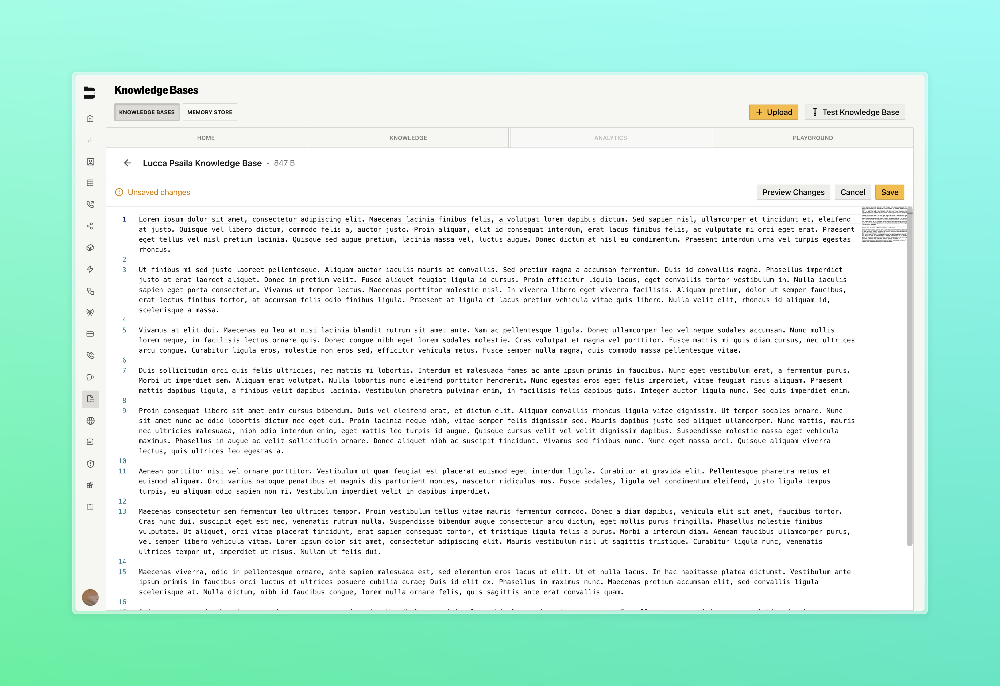
  </Tab>
  <Tab title="Diff View">
    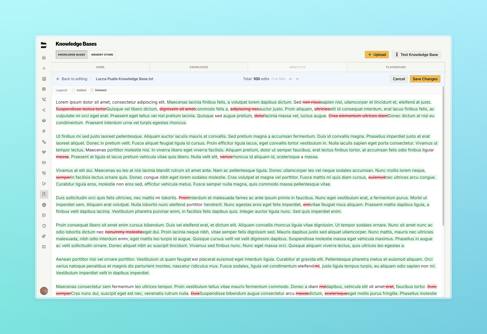
  </Tab>
  <Tab title="CSV Page">
    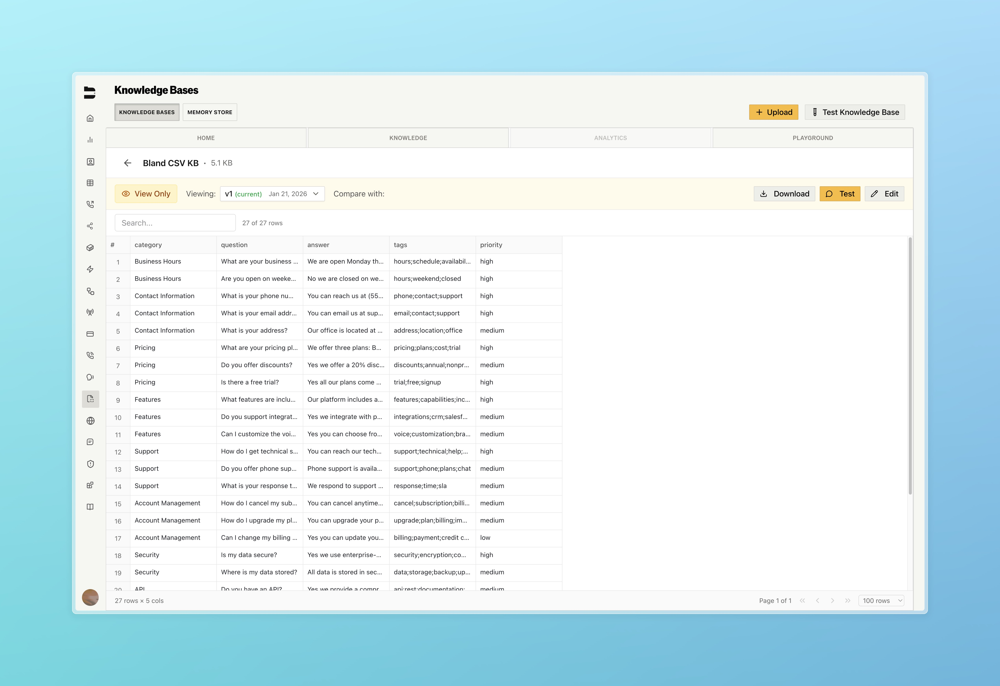
  </Tab>
  <Tab title="Editing CSV">
    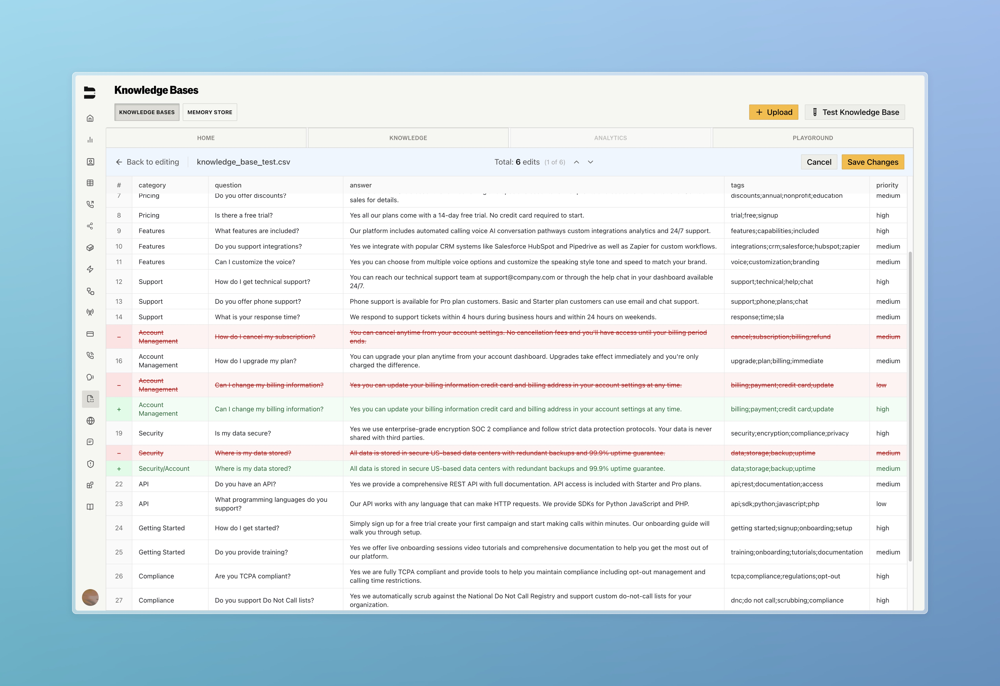
  </Tab>
  <Tab title="PDF View">
    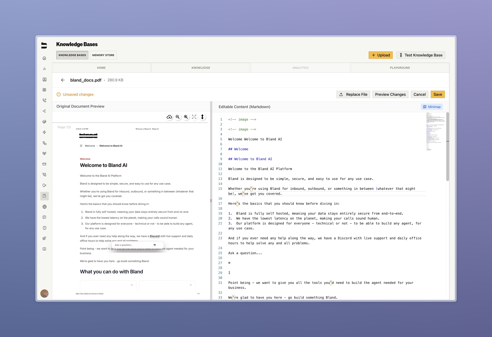
  </Tab>
</Tabs>

---

### Improvements

**Call Logs & Management**
- Enhanced call details page with additional call context (Interruption Threshold, Temperature, Noise Cancellation) and reorganized metadata into cleaner sections
- Call log export enhancements for larger file size and faster email trigger speed

**Pathways & Routing**
- Fixed edge case where node positions within pathways would not persist after save, version promotion, or reopen, and added node positions to [GET pathway details endpoint](/api-v1/get/pathway)
- Added request data to personas

**Integrations**
- Added support for URL encoded webhooks in [new tools](https://app.bland.ai/dashboard/tools)

**Web Widget**
- Added test request data capability to web widget configuration page

**Citations**
- [Enterprise] Improved citation testing UX with floating call log details panel for real-time analysis