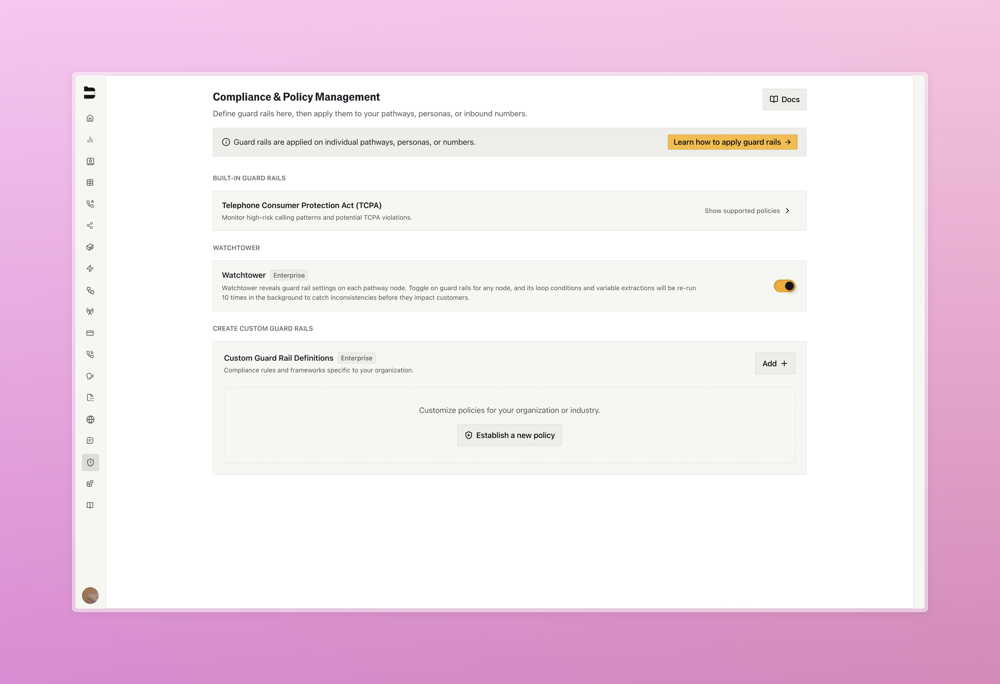
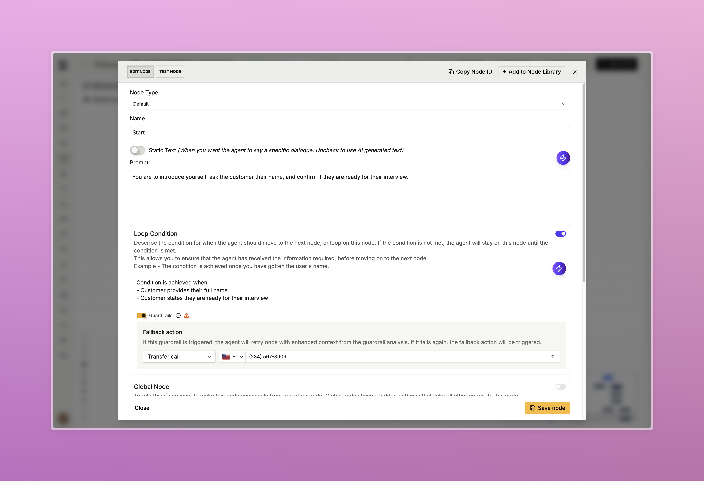

### Watchtower [Enterprise]

Enterprise hallucination prevention that addresses incorrect value extraction and false loop condition assessments at scale.

- Runs critical decisions multiple times in parallel to identify consensus patterns, then automatically flags low confidence when outputs diverge across variable extractions and loop conditions
- When unreliable results are detected, retry with clarification prompts, transfer to human agents, or route to alternative pathway nodes
- Surfaces unreliable nodes and uses fail-safe protocols that handle uncertainty gracefully instead of returning confident but incorrect responses

<Tabs>
  <Tab title="Compliance View">
    
    

      Enable watchtower under the Compliance & Policy Management section page of the dashboard
    

  </Tab>
  <Tab title="Node Configuration">
    
    

      This node uses watchtower to enable guard rails specifically on the loop condition, which will transfer the call if the condition fails after unreliable results are detected
    

  </Tab>
</Tabs>

---

### Improvements

**[Automations & Integrations](https://app.bland.ai/dashboard/automations)**
- Added Slack notifications and webhook triggers for internal automation events
- Hubspot integration enhancements including custom field support, user-defined validation rules, and association-based automation triggers for calling contacts linked to tickets, tasks, and deals

**Voice & Telephony**
- [Enterprise] Added background audio support for SIP calls