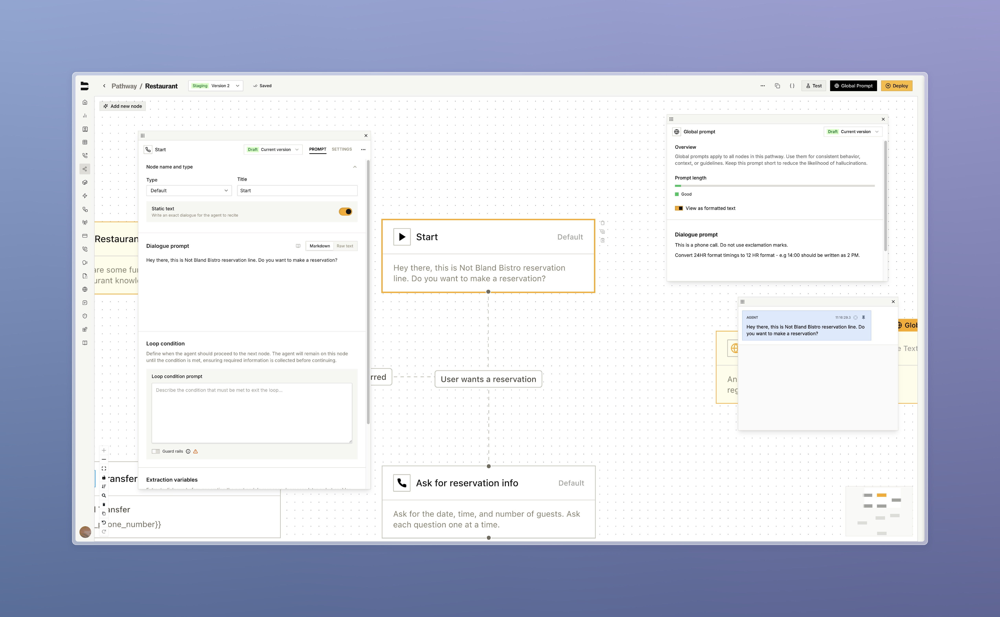
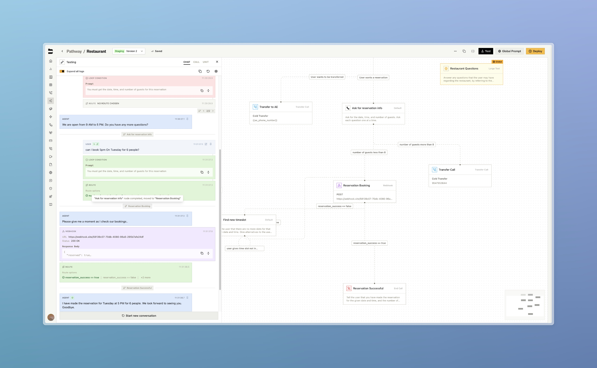
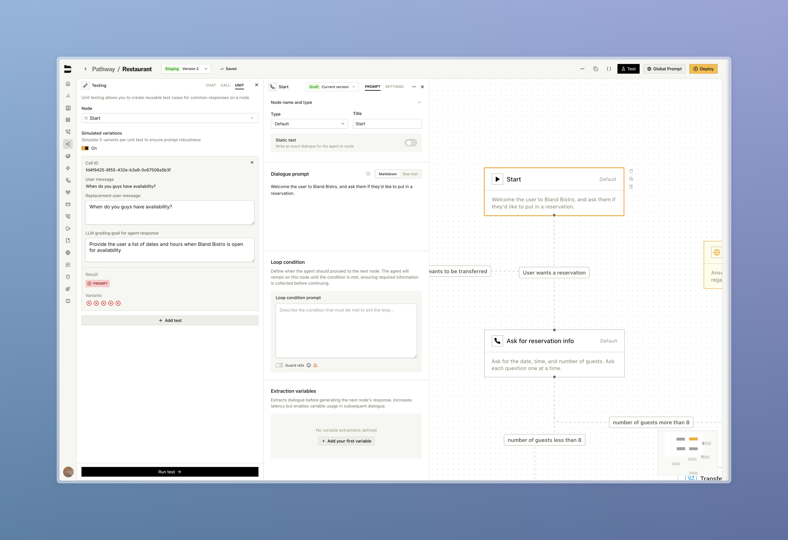
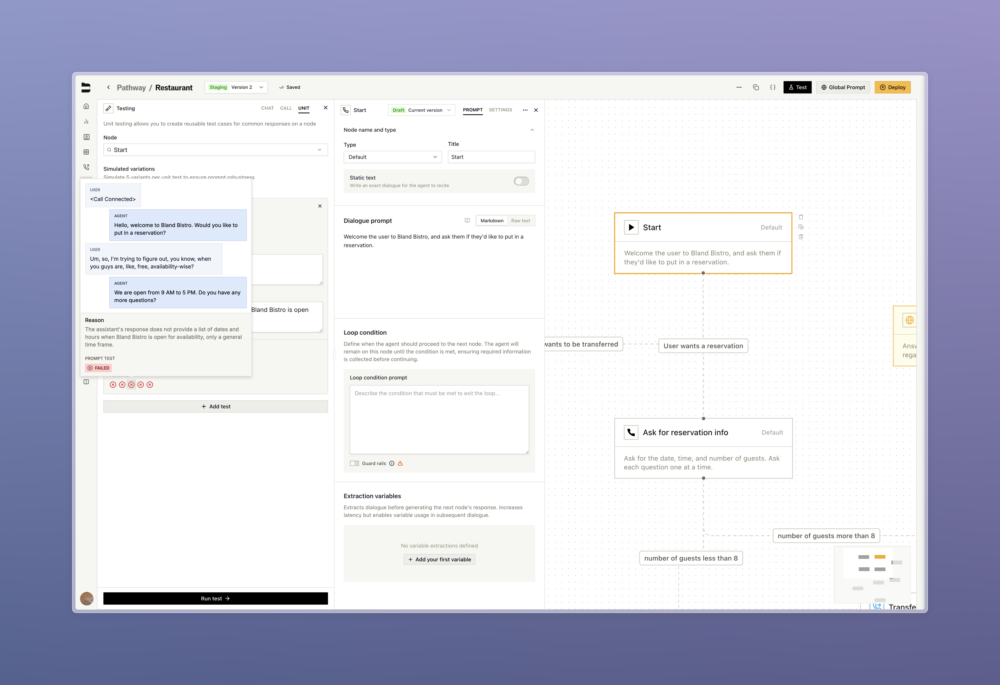

### Pathway UI Update

Complete redesign of the pathway testing interface with resizable panels, advanced debugging capabilities, and conversation branching.

- Drag to resize panels or open floating windows, and pin key messages for quick access, with your layout preferences saved between sessions
- Branch new conversation paths from any message during testing to explore alternate scenarios without restarting
- Toggle detailed execution logs showing secondary actions (loop conditions, variable extractions, routing) 
- Run test simlulations on historic calls using your drafted node changes

<Tabs>
  <Tab title="New Panels">
    
    

      Along with converting our node views into draggable panels, you can pop them out to create floating windows
    

  </Tab>
  <Tab title="Conversation Branching">
    
    

      At any point during a test chat, edit your user message to branch to a new conversation, where that input was used and subsequent agent responses are changed. You can view and swith between these from the conversation UI
    

  </Tab>
  <Tab title="Advanced Debugging">
    
    

      View detailed logs including webhooks, knowledge base calls, and node transitions (routes and loops)
    

  </Tab>
  <Tab title="Testing Integration">
    
    

      Reference previous calls using your pathway, and generate user responses based on a node's prompting
    

  </Tab>
  <Tab title="Draft Testing">
    
    

      Run your prompting against the generated user responses and see how often your outputs meet your LLM grading goal
    

  </Tab>
</Tabs>

---

### Upgraded Memory

Massive update to our memory feature, bridging voice and SMS modalities. [Learn more about memory](https://docs.bland.ai/tutorials/memories)

- Memory context automatically synced between phone calls and SMS conversations for the same contact
- New memory UI that displays new information added to contact based on their conversation
- Enable or disable memory per pathway and persona

---

### Improvements

**Personas**
- [BLA-5243] Personas now support SMS conversations with full feature parity to voice calls

**Pathways & Routing**
- [BLA-5222] Transfer pathway node now accepts variables as input for dynamic pathway routing

**UI/UX Improvements**
- [BLA-5443] Added prompter role to permission set for granular access control. Prompters are able to read and write pathways, but cannot publish or deploy
