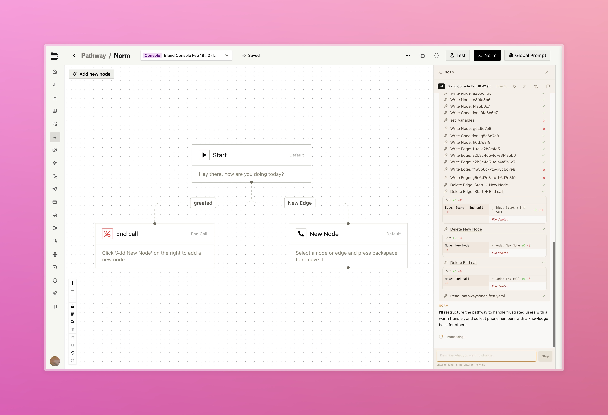
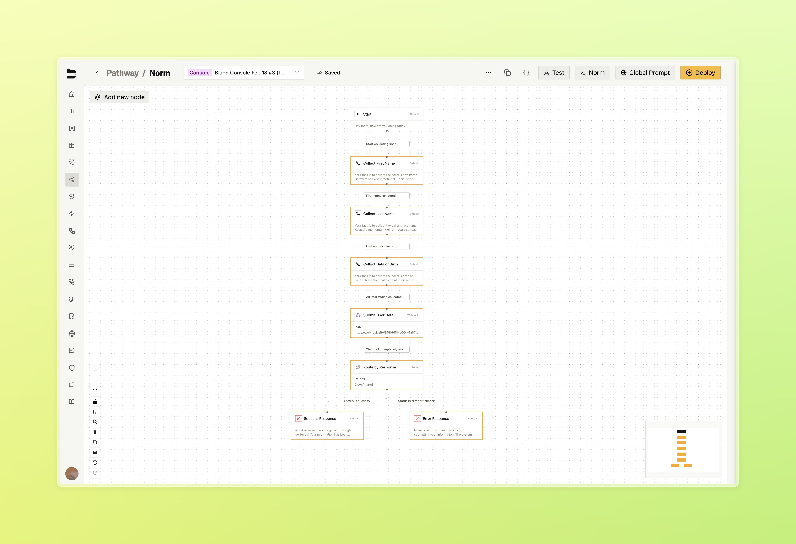
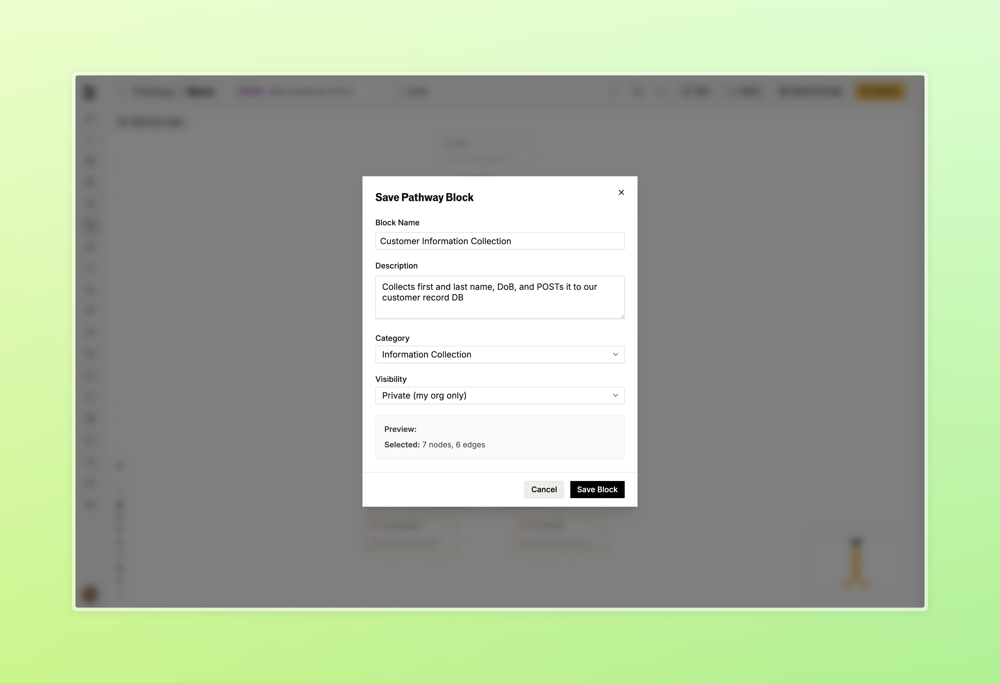
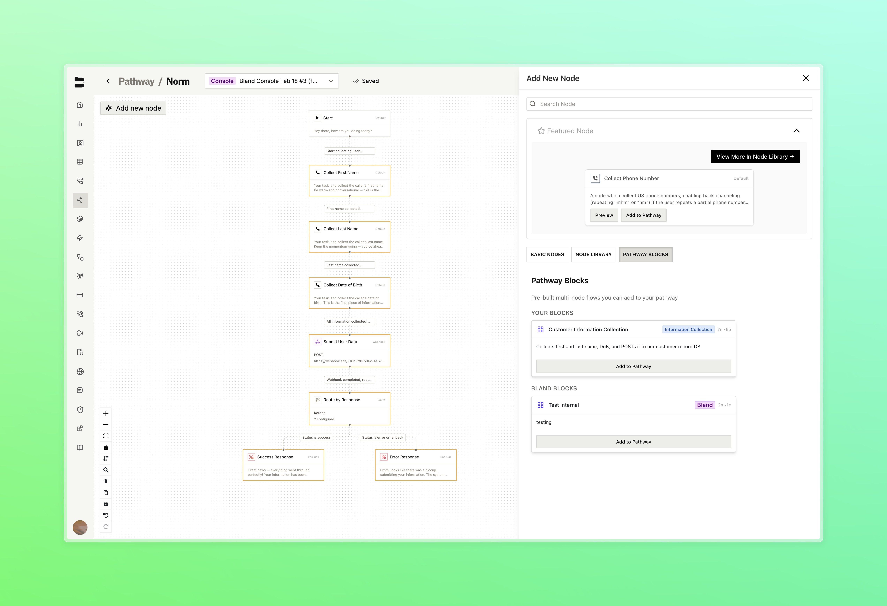

### Norm, The Bland Console

Meet Norm, our new AI assistant built directly into the pathway editor. Norm understands your entire pathway and lets you propose changes in plain language. Just describe what you want, then review a clear diff of every node and edge before you apply the update.

- Changes are applied to a forked version of your pathway, keeping your original intact until you're ready to publish
- Reference specific nodes by name using @ mentions for targeted changes, with the AI asking for confirmation or clarification before applying anything
- View before and after content for every node and edge changed

<Tabs>
  <Tab title="Console">
    
    

      Describe changes in plain language directly from the pathway editor
    

  </Tab>
  <Tab title="Diff View">
    
    

      Review every proposed change before applying to your pathway
    

  </Tab>
</Tabs>

---

### Canary Deployments [Enterprise]

Test new agent releases against live traffic before committing to a full rollout, with dedicated canary infrastructure running alongside production and full control over traffic routing. 

Available under your org's settings page, under [Releases](https://app.bland.ai/dashboard/settings/releases)

[Learn more about Infrastructure & Releases](/enterprise-features/infrastructure-and-releases)

---

### Pathway Blocks

Save any group of nodes and edges as a reusable block and insert it into any pathway with one click.

- Select 2 or more nodes and save them as a named block with a description and category
- Browse your saved blocks alongside Bland-curated blocks in the node library
- Insert any block directly onto the canvas with "Add to Pathway"

<Tabs>
  <Tab title="Block Library">
    
    

      Select groups of nodes within your pathway to be saved as a block
    

  </Tab>
  <Tab title="Save Block">
    
    

      After selecting, click the save button in the bottom left to create a new block
    

  </Tab>
  <Tab title="Insert Block">
    
    

      Insert any block directly onto the canvas with one click through the "Add New Node" pane
    

  </Tab>
</Tabs>

---

### Improvements

**Pathways & Routing**
- Existing edges can now be dragged and dropped onto a new target node to reroute without deleting and recreating them
- Node drawer prompt section now includes a markdown toggle and draggable cheatsheet window, with accordion state remembered between sessions

**Call Logs & Management**
- Fixed inbound calls not properly displaying the pathway version used within the call logs page

**Citation Testing**
- Redesigned citation testing flow with a multi-stage interface for call selection, running tests, and viewing results as a slide-over panel instead of a modal

**Web Widget**
- Webhook settings now include a mode toggle to send events on every message or only when the conversation ends

**UI/UX Improvements**
- Redesigned home dashboard with updated layout, new summary stats showing total calls, daily average, and active regions, and reorganized sections for call distribution and recent activity
