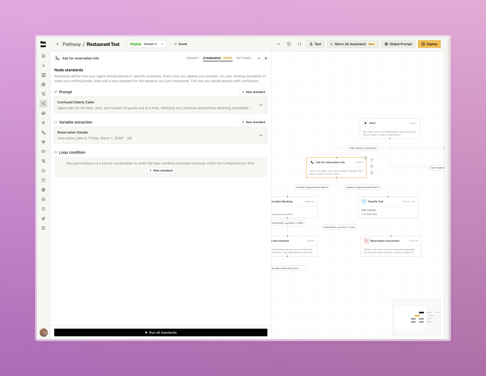
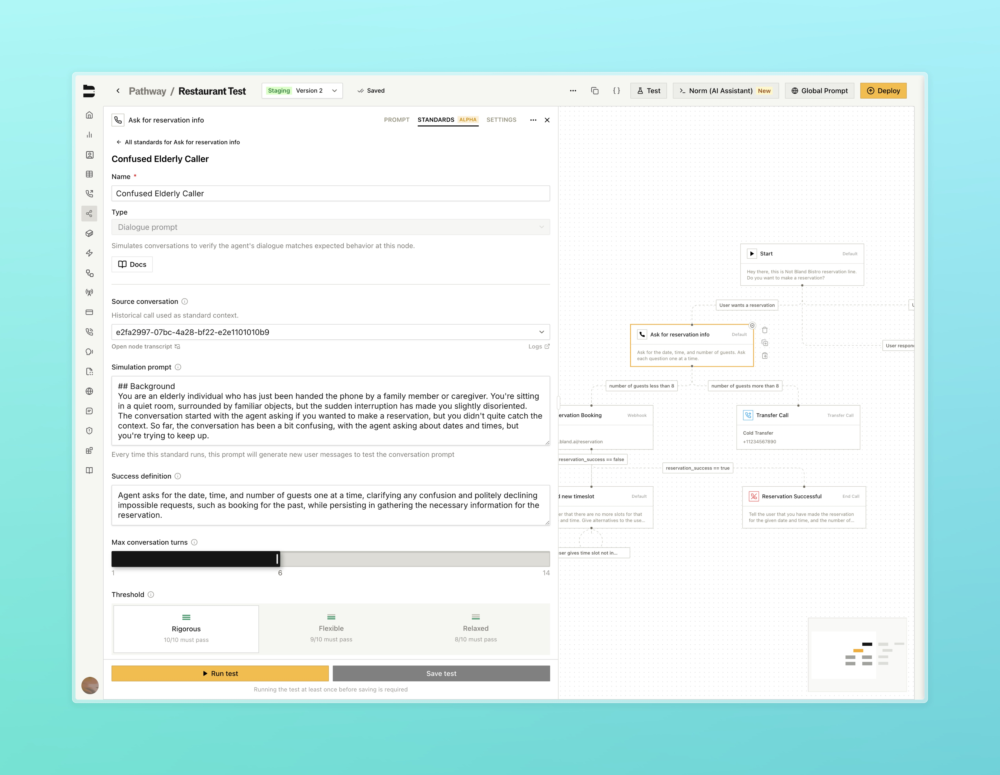
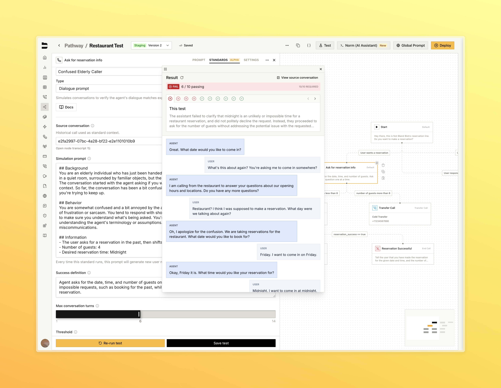
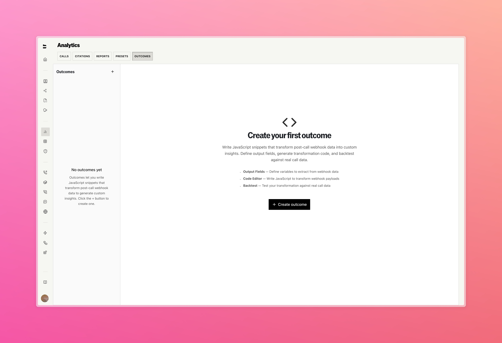
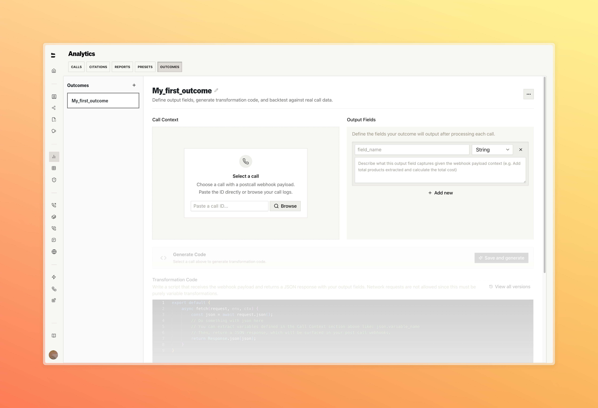
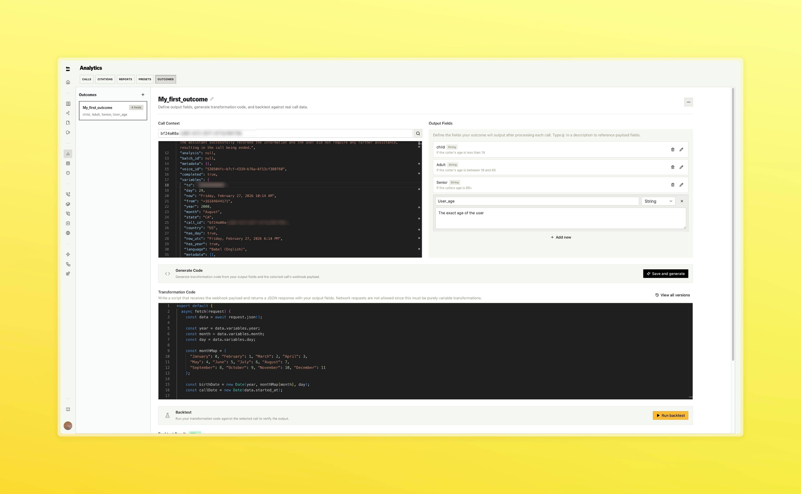
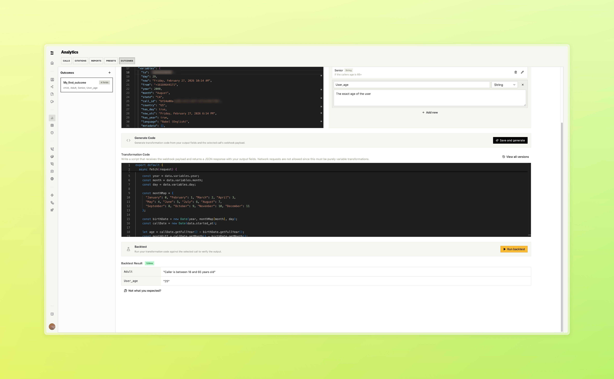

### Standards

Standards are our new node-level regression framework that runs your node prompts through fixed scenarios (simulations for dialogue, permutations for loop conditions and variable extractions) ten times each to automatically catch behavior regressions when prompts change.

[Learn more about Standards](/tutorials/standards)

<Tabs>
  <Tab title="Standards Tab">
    
    

      Open Standards at individual nodes
    

  </Tab>
  <Tab title="Building a Standard">
    
    

      Select a source call to automatically generate a simulation prompt and success definition
    

  </Tab>
  <Tab title="Test Results">
    
    

      View pass and fail outcomes across all 10 test iterations
    

  </Tab>
</Tabs>

---

### [Enterprise] Outcomes

Extract structured data from your calls using custom JavaScript that runs automatically as part of the post-call workflow.

- Define output fields and Bland generates a transformation script from a real call. Select any past call as test input to generate code from the actual data structure
- Backtest against real calls in the editor
- Attach outcomes to outbound calls, batch calls, inbound numbers, and send-call nodes. Results surface in a new tab on every call log with post call webhooks enabled

<Tabs>
  <Tab title="Outcomes">
    
  </Tab>
  <Tab title="Editor">
    
  </Tab>
  <Tab title="Backtest">
    
    

      Define output fields and generate a transformation script from a real call
    

  </Tab>
  <Tab title="Call Logs">
    
    

      Run backtests against real calls in the editor
    

  </Tab>
</Tabs>

---

### Improvements

**Web Widget**
- Added native Quick Replies, Accordions, and Cards components to the web widget, rendering interactive UI elements inline in chat without requiring an iframe

**Call Logs & Management**
- Redesigned call logs with a unified event timeline, inline resizable side panel, rebuilt audio player, and rich text notes

**Pathways & Routing**
- Improved node and pathway autosaving stability
