### Pathway Testbed

An interactive testing environment for individual pathway nodes, accessible directly from the testing panel.

- Run any node against custom inputs to see prompt outputs, variable extractions, and condition evaluations in real time
- Review full conversation histories and rerun with adjusted variables or prompts without placing a live call
- Standards are integrated directly into the testbed so you can view and run regression checks alongside your manual tests

<Tabs>
  <Tab title="Open in Testbed">
    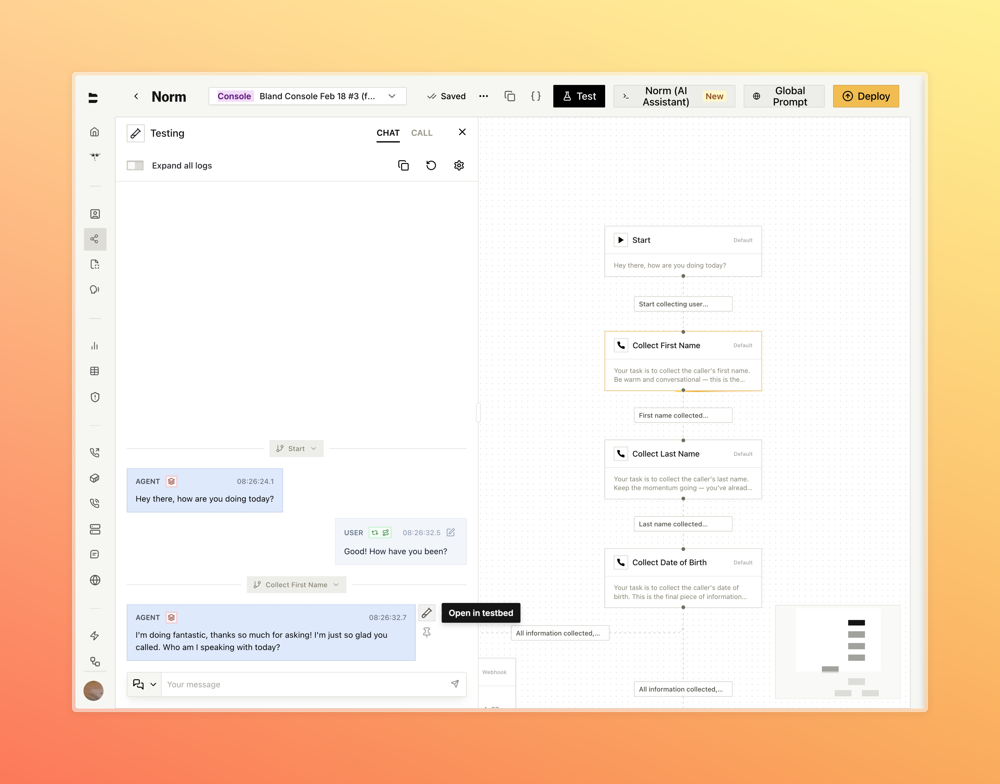
    

      Open any node directly in the testbed from an active chat session
    

  </Tab>
  <Tab title="Configuration">
    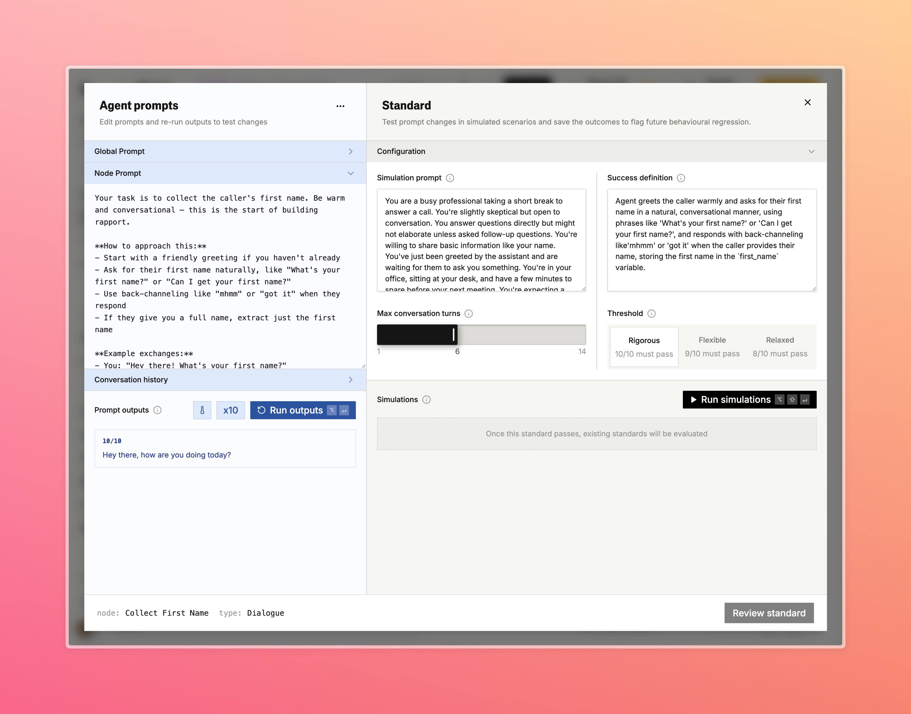
    

      Edit the node prompt and configure simulation scenarios and success criteria side by side
    

  </Tab>
  <Tab title="Results">
    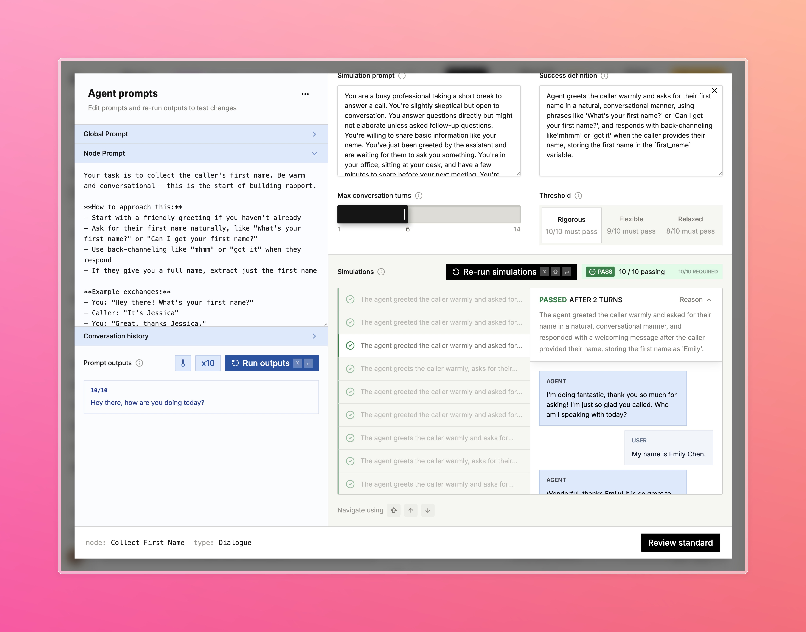
    

      Review simulation results and inspect individual conversation transcripts
    

  </Tab>
  <Tab title="Variable Extraction">
    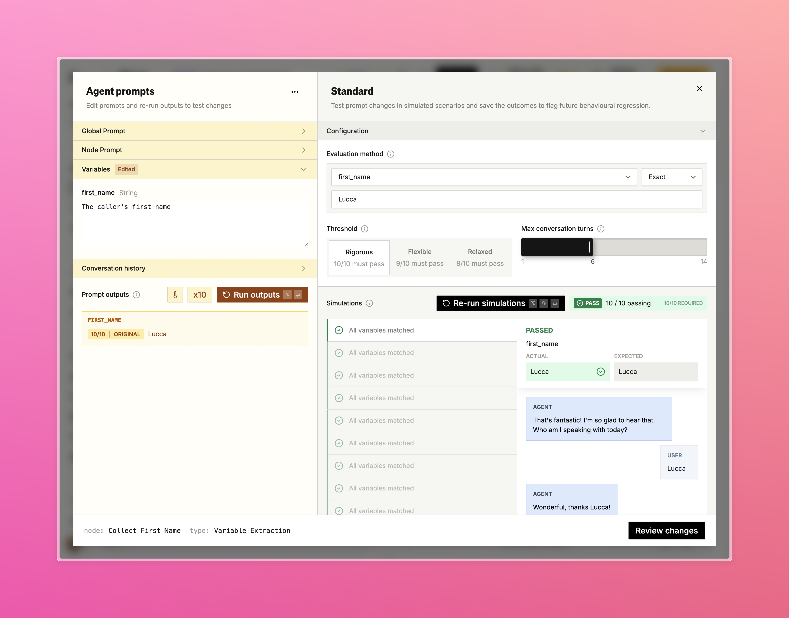
    

      Validate variable extraction with exact match evaluation across 10 simulations
    

  </Tab>
  <Tab title="Loop Condition">
    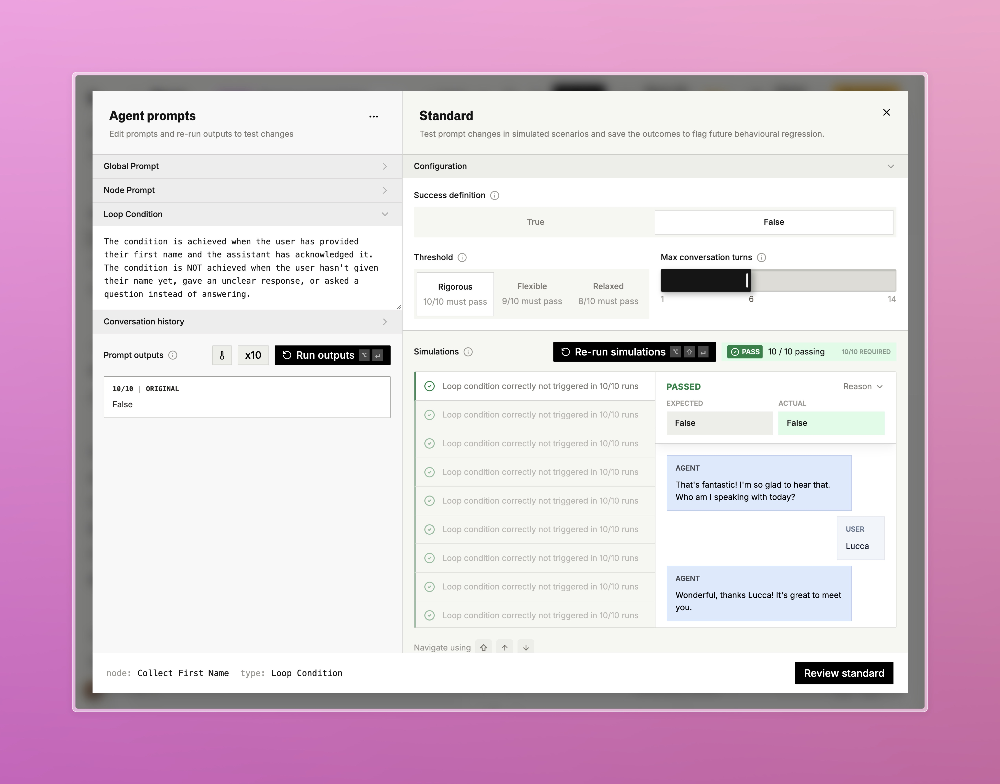
    

      Test loop conditions with a True/False success definition and configurable threshold
    

  </Tab>
</Tabs>

---

### SIP Wizard [Enterprise]

A new SIP dashboard with a guided setup wizard, call logs, monitoring, and number porting.

- Step-by-step setup wizard covers trunk direction, auto-discovery, destination routing, authentication, firewall configuration, and inbound number assignment
- Place a live test call directly from the final wizard step to verify connectivity before going live
- Full SIP dashboard with dedicated call logs, SIP trace viewer, and monitoring configuration for alerts, codecs, and failover

<Tabs>
  <Tab title="Setup Type">
    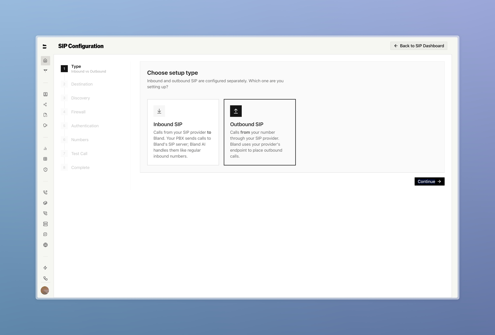
    

      Start by choosing inbound or outbound — each is configured separately
    

  </Tab>
  <Tab title="Destination">
    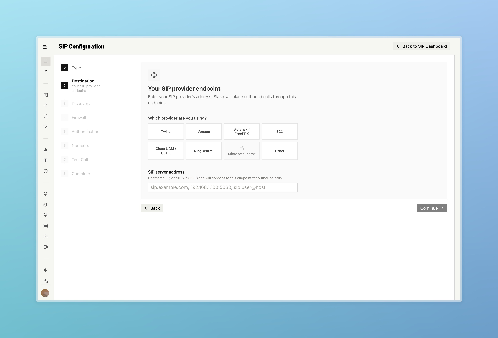
    

      Select your provider and enter your SIP server address
    

  </Tab>
  <Tab title="SIP Trunks">
    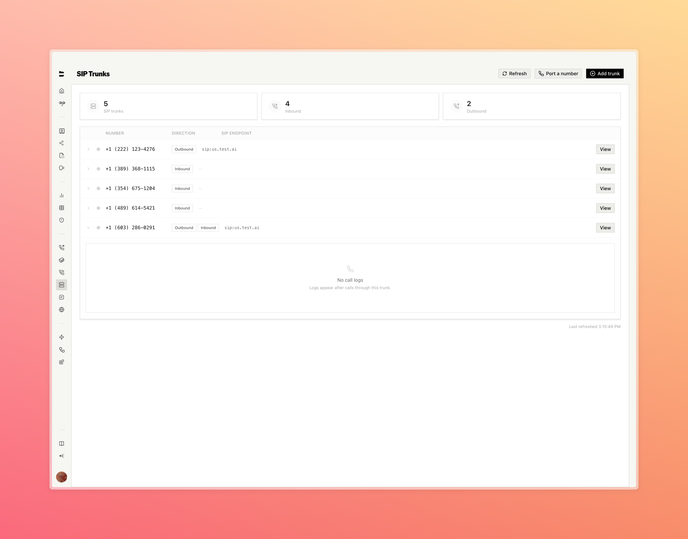
    

      Manage all your trunks and view per-trunk call logs from the SIP dashboard
    

  </Tab>
  <Tab title="Number Porting">
    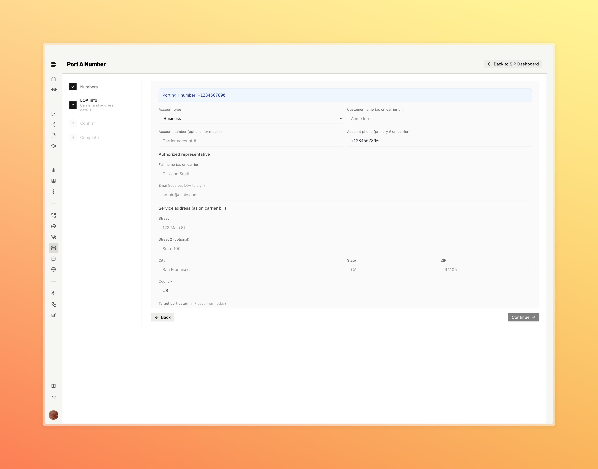
    

      Port existing numbers with a guided LOA form — carrier details, authorized rep, and target port date
    

  </Tab>
</Tabs>

---

### Bland Speech

A standalone text-to-speech product now available directly from the dashboard. [Try it here.](https://app.bland.ai/dashboard/tts)

- Synthesize speech from any text using the full Bland voice library, with live audio playback, cost estimates, and a persistent generation history
- Browse, preview, and add voices from the voice library to your account, or clone and manage custom voices in the voice lab
- Access usage analytics and a complete developer API reference, plus quick-start code examples in cURL, Python, and Node.js

<Tabs>
  <Tab title="Text to Speech">
    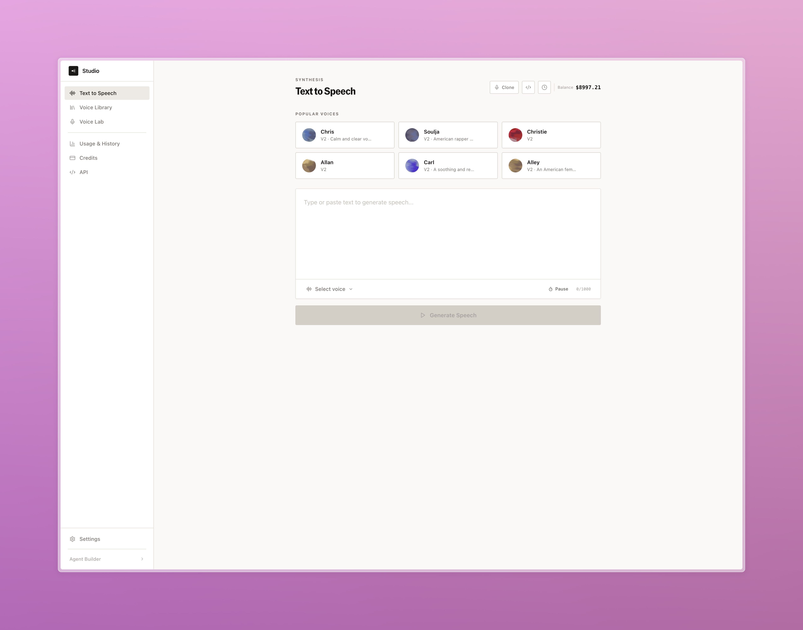
    

      Pick a voice, type your text, and generate speech directly from the dashboard
    

  </Tab>
  <Tab title="Developer API">
    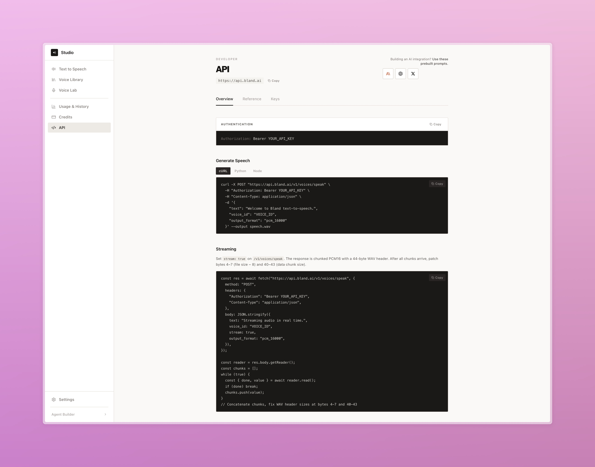
    

      Quick-start code examples and full API reference including streaming
    

  </Tab>
</Tabs>

---

### Improvements

**Pathways & Routing**
- Added a persistent save banner to node and edge drawers so unsaved changes are always visible

**Call Logs & Management**
- Fixed call logs not correctly displaying pathway context when calls crossed a Transfer Pathway node
- Live Translation logs are now captured per call and surfaced in call details, showing source and target language alongside original and translated text

**Tools**
- Redesigned tool creation with a step-by-step flow covering setup, output variables, and value inputs

**API**
- Added `timezone` parameter to `GET /v1/calls` for timezone-aware date filtering
- Added org-level option to exclude `pathway_logs` from post-call webhook payloads
