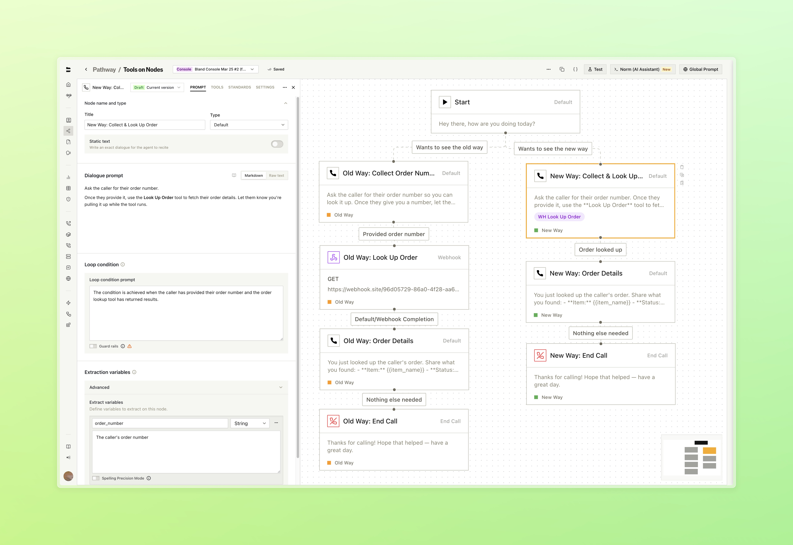
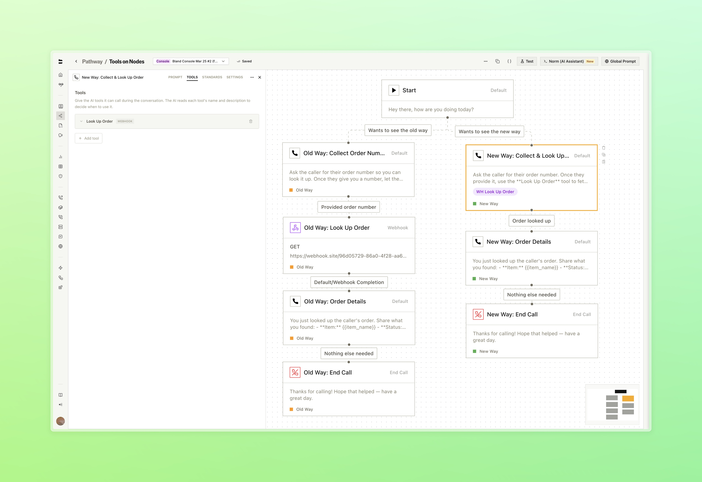
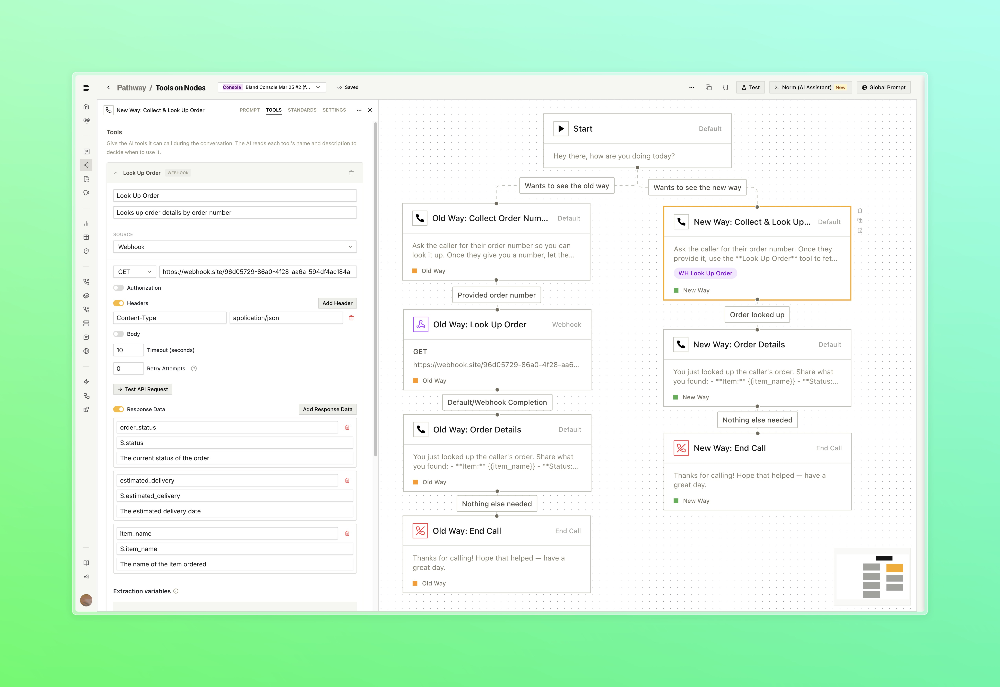
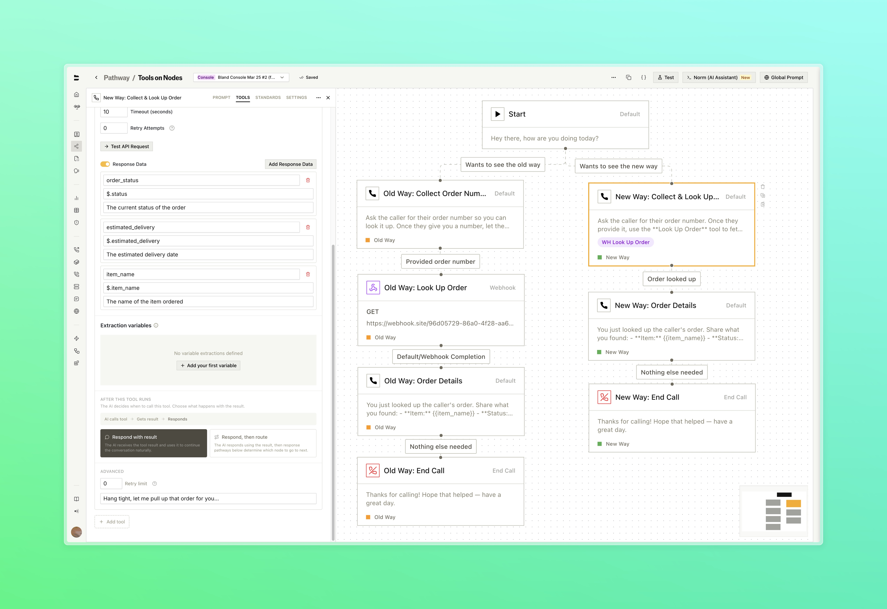
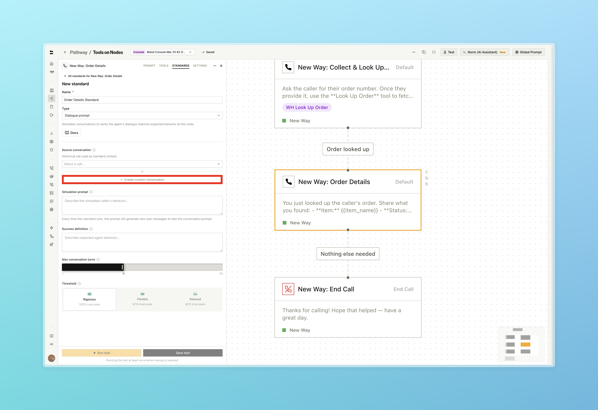
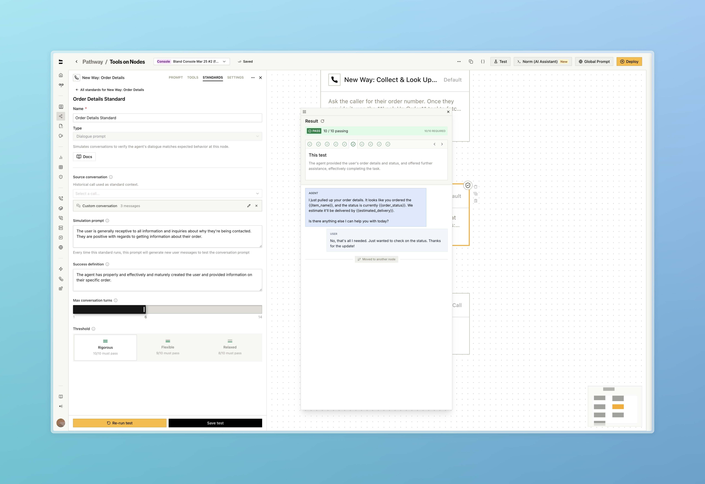
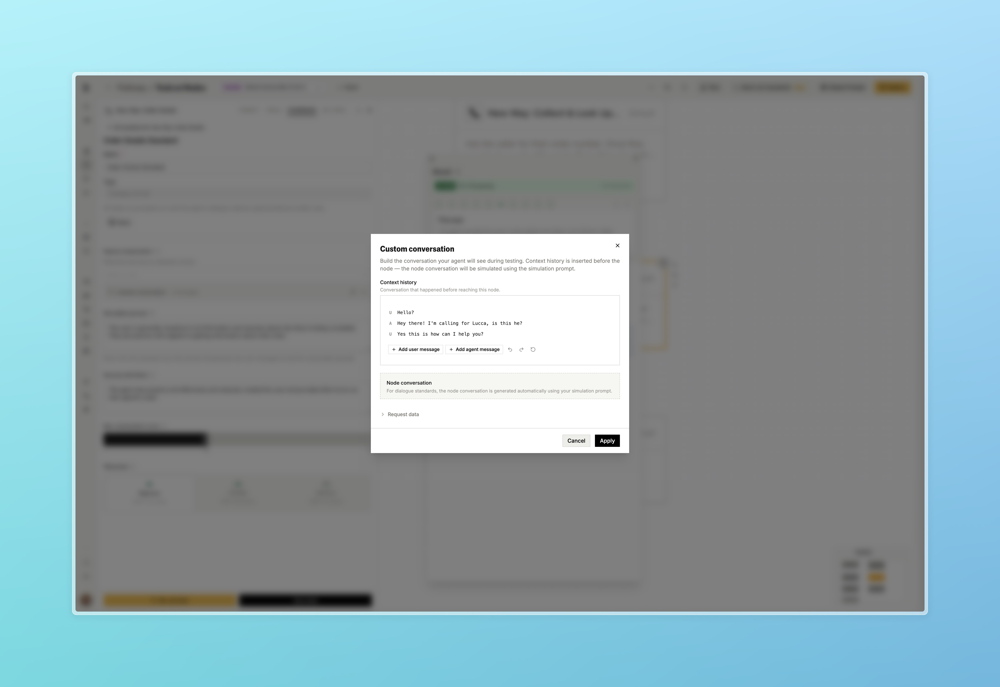

### Tools on Pathway Nodes

Condense your pathways by running tools directly inside Default nodes. What previously required dedicated separate nodes can now live inline, with suport for more tool types being revealed soon.

- Attach webhook configurations to a Default node. The Bland agent decides when to call the tool based on the dialogue prompt and conversation context (reference the name of the tool from within your dialogue prompt)
- Route the call based on what the tool returns using configurable response pathways, with variable extraction from the tool output
- Set speech behavior during tool execution, configure timeout and retry limits, and extract variables from the response, all inline with the node

<Tabs>
  <Tab title="Before & After">
    
    

      What used to require a separate node for every tool call can now live inside a single Default node. Reference the name of your tool within the dialogue prompt to describe when it shoudld be triggered
    

  </Tab>
  <Tab title="Attach a Tool">
    
    

      Each tool is configured with its own name, webhook, and settings directly inside the node
    

  </Tab>
  <Tab title="Webhook & Variables">
    
    

      Each tool is configured with its own name, webhook, and settings directly inside the node
    

  </Tab>
  <Tab title="Response Pathways">
    
    

      You can also choose how the agent handles the request response. Decide to respond naturally and continue, or respond and follow defined pathways to route the call
    

  </Tab>
</Tabs>

---

### Improvements

**Standards**
- Custom messages can now be set when configuring a standard, rather than relying solely on auto-generated simulation prompts

<Tabs>
  <Tab title="Custom Conversation">
    
    

      Set a custom conversation directly on the standard instead of selecting one from your call history
    

  </Tab>
  <Tab title="Simulation">
    
    

      Build out conversation history exactly as you see fit. With additional section for adding the conversation happening at that node (for variable extraction and loop condition standards)
    

  </Tab>
  <Tab title="Conversation Builder">
    
    

      Test the standard on simulation prompt and success definition
    

  </Tab>
</Tabs>

**Web Widget**
- A translate button has been added to widget conversation logs for messages in non-English languages

**SIP**
- SIP trunks are now available to all organizations. The previous entitlement requirement has been removed. Visit the [SIP dashboard](https://app.bland.ai/dashboard/sip-trunks) or read the [SIP integration docs](/enterprise-features/SIP-integration) to get started
