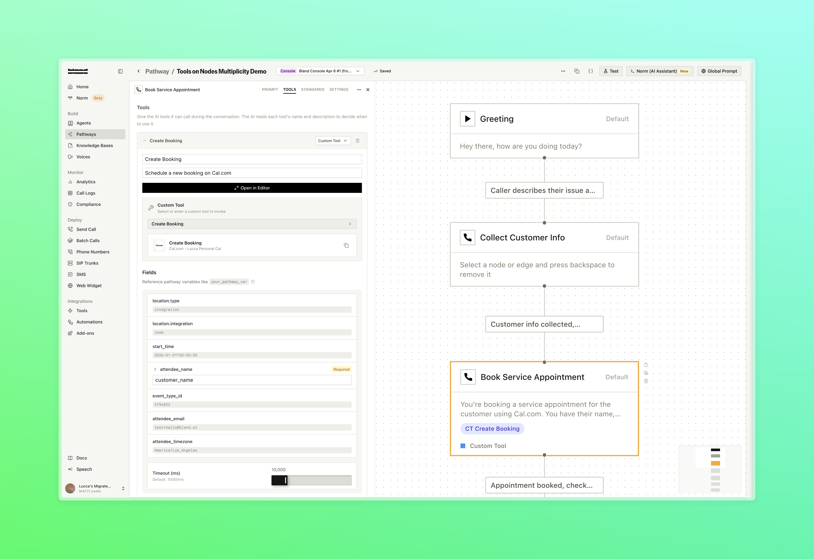
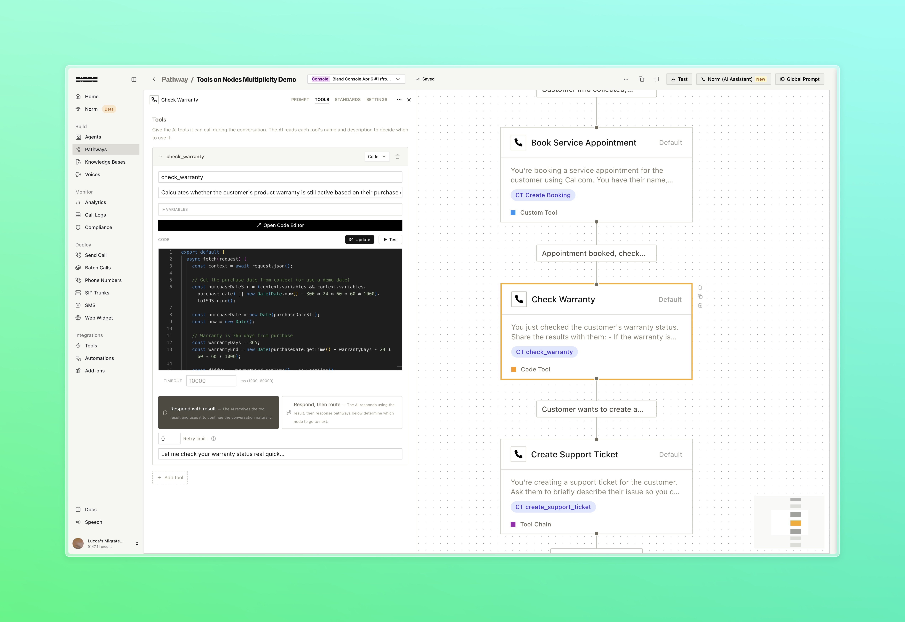
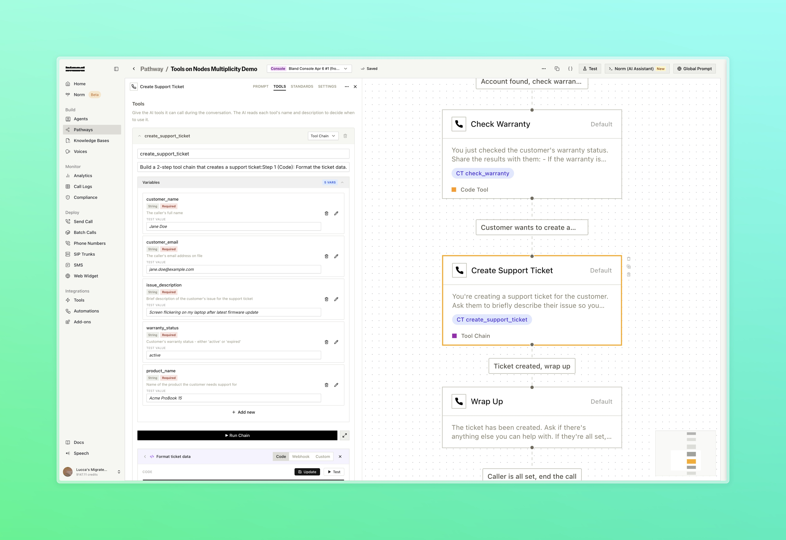
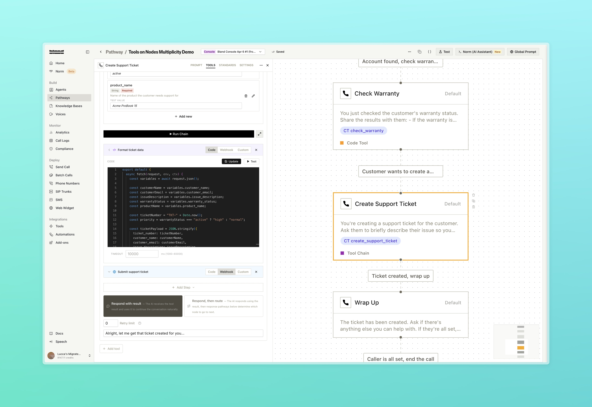
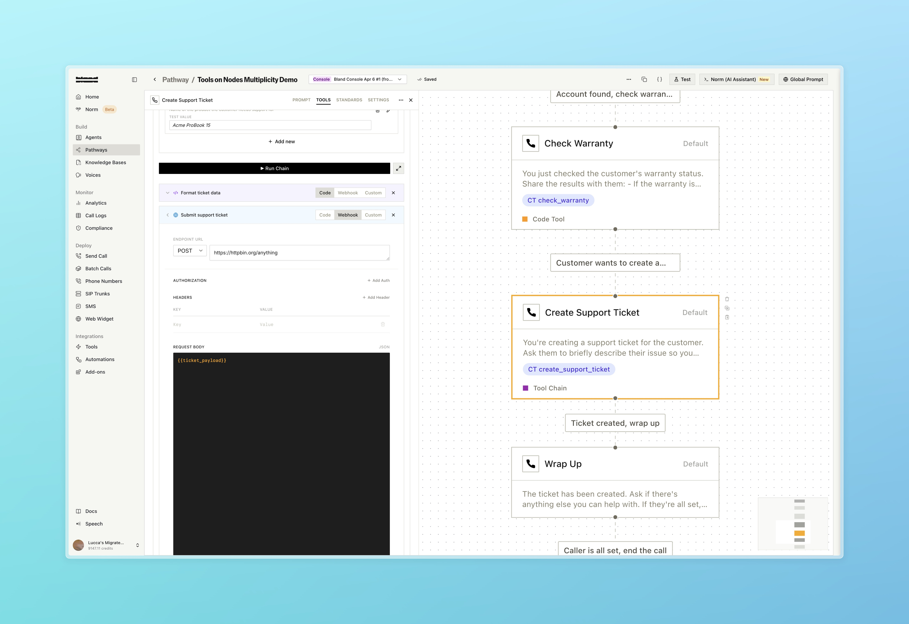
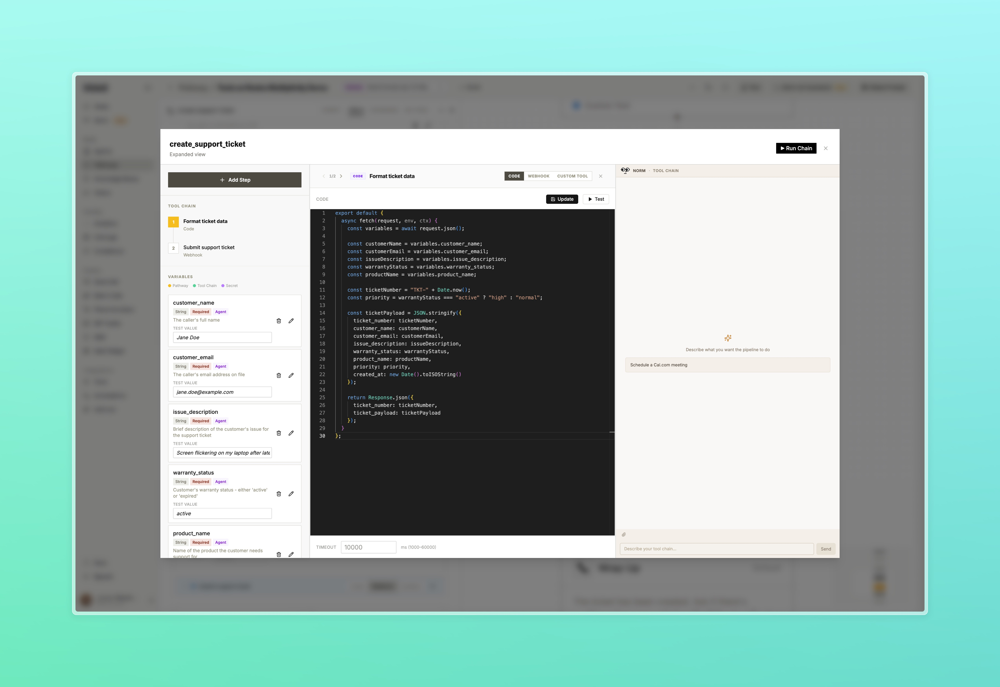

### More Tool Types on Pathway Nodes

Three new tool types are now available directly on Default nodes, expanding on the [webhook tool support introduced on March 23](/changelog/03_23_2026). Each type runs inline with the node and follows the same pattern: the agent decides when to invoke based on your dialogue prompt.

- **Code:** Write JavaScript directly in the node using the inline code editor. Code runs in a secure isolate and has access to conversation variables
- **Custom Tool:** Attach any saved tool from your tool library directly to a node, with support for overriding individual fields using pathway variables
- **Tool Chain:** Build a multi-step pipeline that sequences webhooks, code, and custom tools in order, passing variables between steps. Use Norm within the expanded view to help configure and test the chain without leaving the node drawer!

The screenshots below show a customer support pathway that handles a full service interaction in three nodes: booking a service appointment, checking a product warranty, and creating a support ticket, each using a different tool type.

<Tabs>
  <Tab title="Book Appointment">
    
    

      The Book Service Appointment node uses a Custom Tool to call the Cal.com Create Booking integration directly from the node
    

  </Tab>
  <Tab title="Check Warranty">
    
    

      The Check Warranty node runs inline JavaScript to calculate whether the warranty is active, how many days remain, and the expiry date
    

  </Tab>
  <Tab title="Tool Chain: Variables">
    
    

      The Create Support Ticket node uses a Tool Chain. Input variables collected earlier in the conversation are passed into the chain
    

  </Tab>
  <Tab title="Tool Chain: Step 1">
    
    

      Step 1 is a Code step that generates a ticket number and formats the full ticket payload, setting priority based on warranty status
    

  </Tab>
  <Tab title="Tool Chain: Step 2">
    
    

      Step 2 is a Webhook step that POSTs the formatted ticket and extracts the confirmed ticket number from the response
    

  </Tab>
  <Tab title="Expanded View">
    
    

      The full pipeline builder with input variables, code editor, and Norm open side by side
    

  </Tab>
</Tabs>

The above pathway was entirely built by [Norm](/changelog/02_16_2026#norm-the-bland-console)

---

### Improvements

**Call Logs**
- Added Dialed At, Outcomes, and Transferred To as filterable fields in call logs. Dialed At and disposition logs are also now included in the call logs export

**Languages**
- Fluent is now available as the recommended multilingual language option. Supports improved language switching across English, Spanish, French, and German

**Web Widget**
- Quick replies, cards, and accordions now persist in the chat across page refreshes
- The active widget thread ID is now reflected in the URL for direct linking

**Integrations**
- Calendly tools now support dynamic resource routing. Set `resource_id` using a pathway variable (e.g. `{{advisor_resource_id}}`) to route bookings to different calendars at call time

**Settings**
- Admins and owners can now set a default role for new members joining the organization
