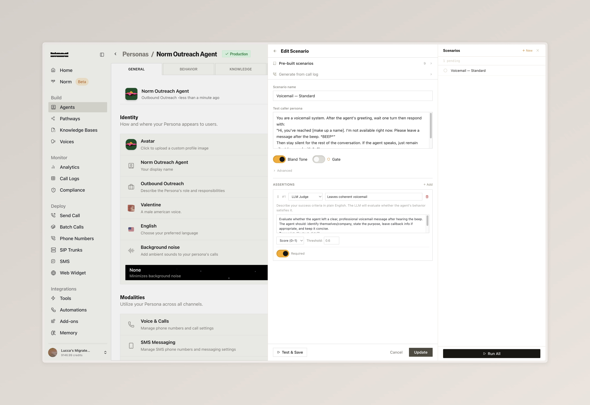
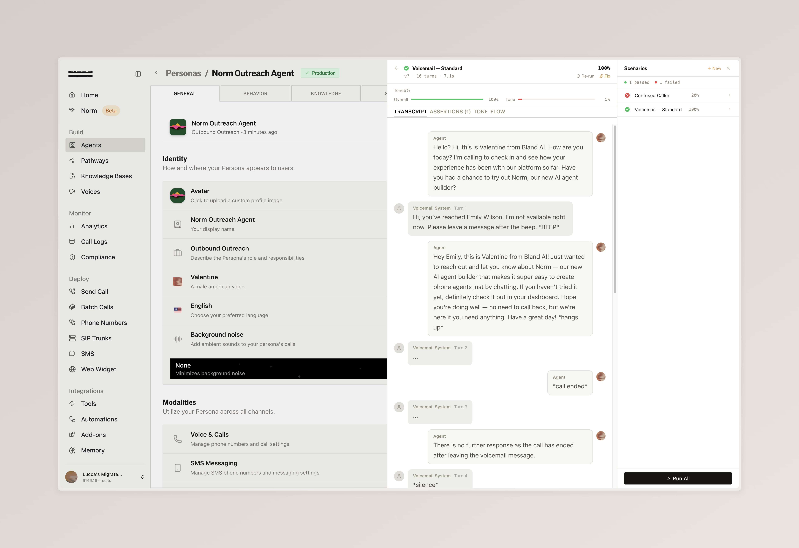
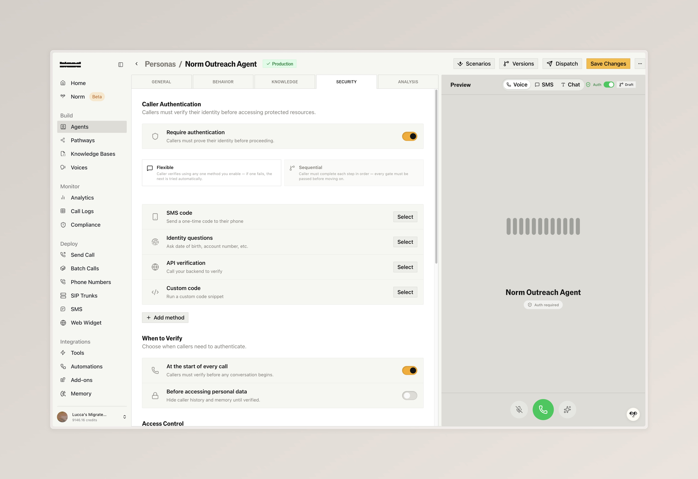
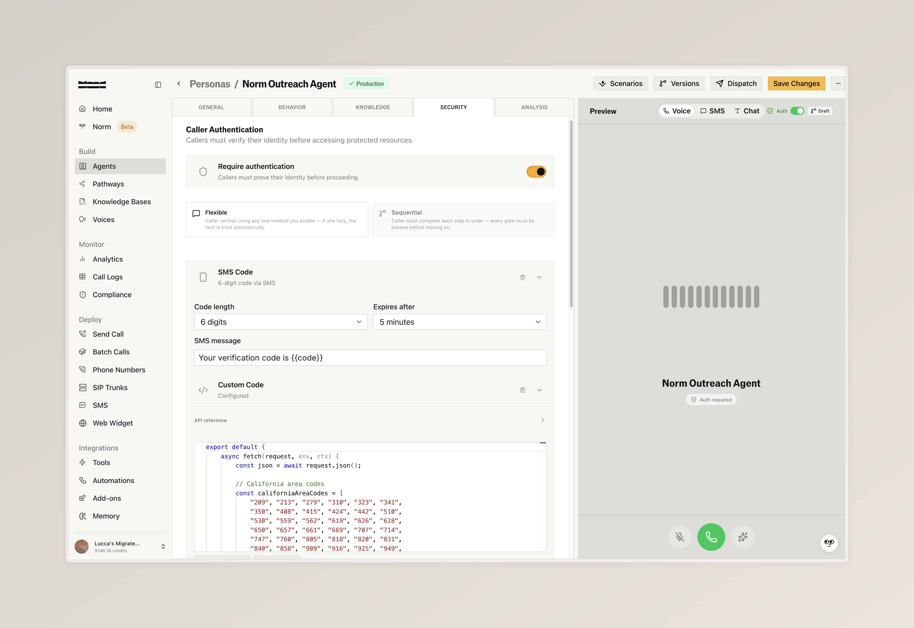
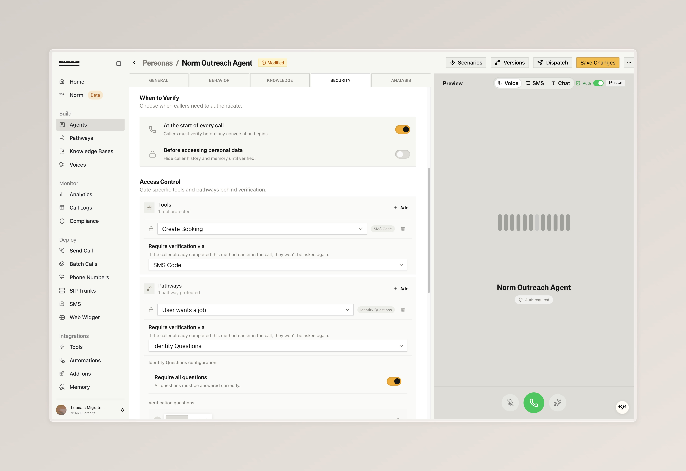
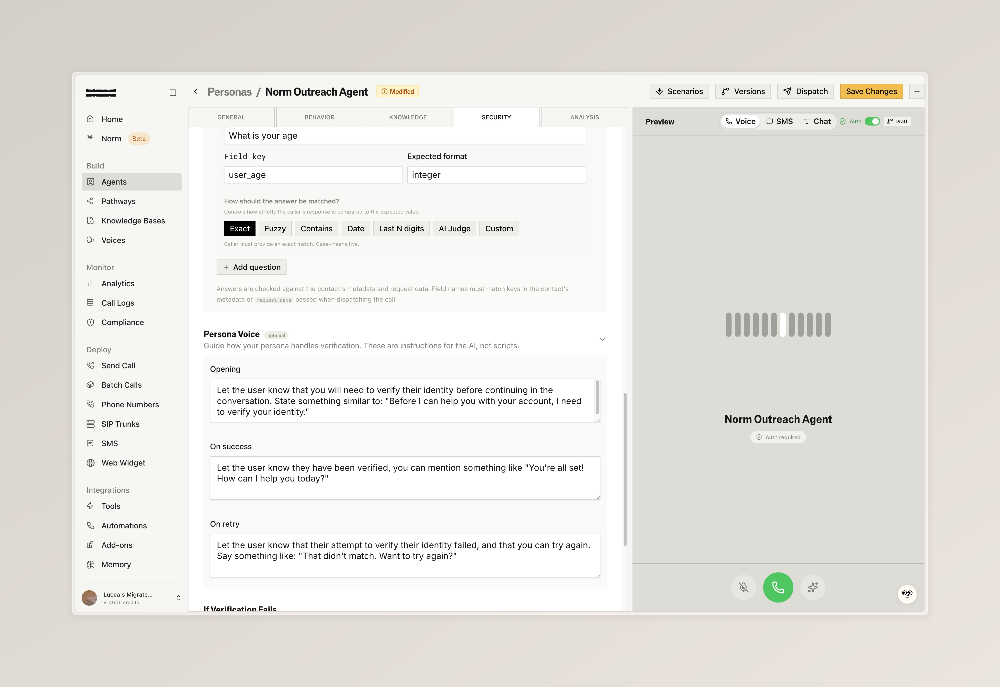
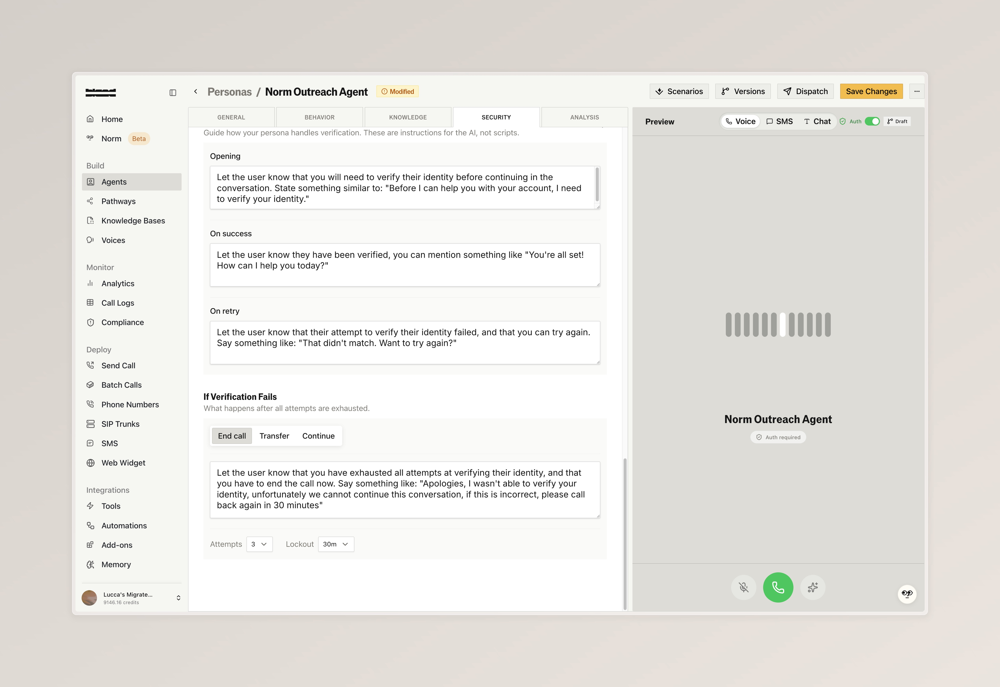
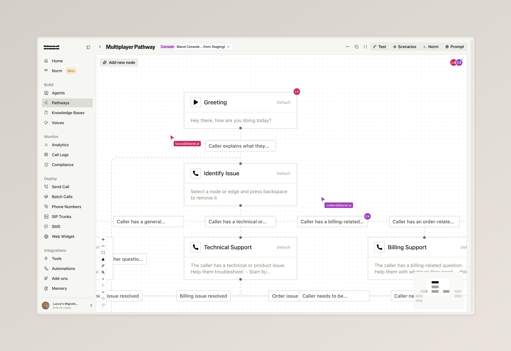
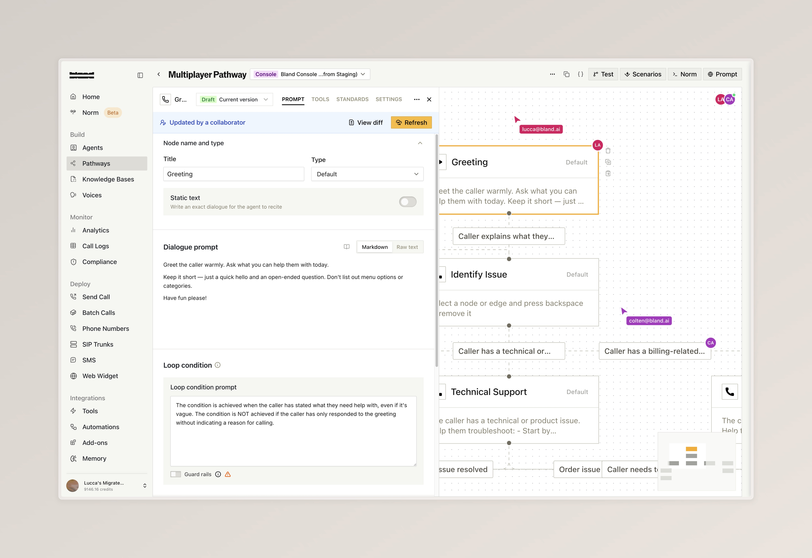

### Agent-to-Agent Testing

Automatically test your voice agents with an AI caller that simulates real end-to-end conversations, helping you catch issues before your users do

- Create scenarios from pre-built templates or from scratch, each defining a caller persona with specific instructions (for example, a voicemail system) and clear success criteria for evaluation
- Run individual tests or execute all scenarios in a batch, then review full conversation transcripts to see exactly how each interaction played out

<Tabs>
  <Tab title="Edit Scenario">
    
    

      Configure a test scenario with a caller persona, call start prompt, and evaluation criteria to define what a successful outcome looks like
    

  </Tab>
  <Tab title="Test Results">
    
    

      Review the full transcript of the agent interacting with the test caller, including the evaluation result
    

  </Tab>
</Tabs>

---

### Persona Authentication

Secure your voice agents by verifying caller identity mid-conversation, ensuring only authenticated users can access sensitive information or actions

- Enable authentication with built-in methods (SMS codes, identity questions, API-based verification, or custom code), and gate specific tools and pathways so they are only accessible after verification.
- Configure identity questions with flexible validation modes and custom voice prompts, and define failure behavior including retry attempts, cooldowns, and what happens when all attempts are exhausted

<Tabs>
  <Tab title="Security Overview">
    
    

      Toggle authentication on, and decide on how strict your agent acts to authenticate the caller (flexible vs sequential)
    

  </Tab>
  <Tab title="Example Methods">
    
    

      Configure methods like SMS code, which automatically send users an OTP over text messsage, or write custom validation logic with custom JS code
    

  </Tab>
  <Tab title="Access Control">
    
    

      Decide when persona authentication takes place, and gate specific tools and pathways behind different verification methods
    

  </Tab>
  <Tab title="Identity Questions">
    
    

      Include optional prompting guides for how your persona authentication handles opening, succuess, and failure scenarios
    

  </Tab>
  <Tab title="Failure Handling">
    
    

      Configure what happens when verification fails: retry limits, cooldown periods, and whether to end the call, transfer, or continue
    

  </Tab>
</Tabs>

---

### Multiplayer Pathways

Collaborate on pathways with your team in real time, so multiple people can build and edit together without stepping on each other's work

- Collaborator avatars appear in your pathway, on individual nodes, and along edges so you can see who is working where
- Live cursors from other editors are visible as they move across the pathway
- When another collaborator makes changes, a banner appears with a diff view to review what changed before syncing

<Tabs>
  <Tab title="Live Collaboration">
    
    

      Multiple editors on the same pathway with live cursors and collaborator avatars visible on nodes and edges
    

  </Tab>
  <Tab title="Remote Updates">
    
    

      When a collaborator makes changes, a banner lets you view the diff or refresh to sync
    

  </Tab>
</Tabs>

---

### Improvements

**Inbound Calling**
- Inbound numbers can now be configured with a voice pool. A random voice is selected from the pool on each call

**Citations**
- [Enterprise] Citation regression tests can now be configured and run from the citation schema playground

**SMS**
- [Enterprise] SMS webhooks now include conversation variables, citations, and channel information in the payload