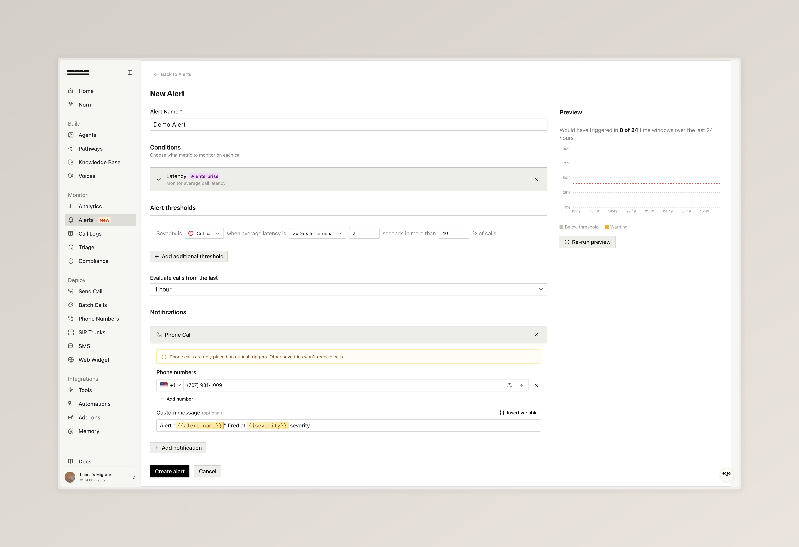
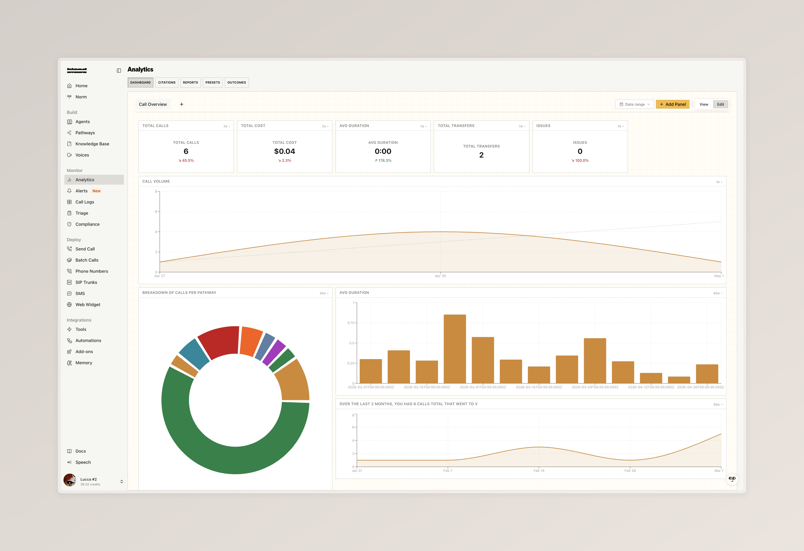
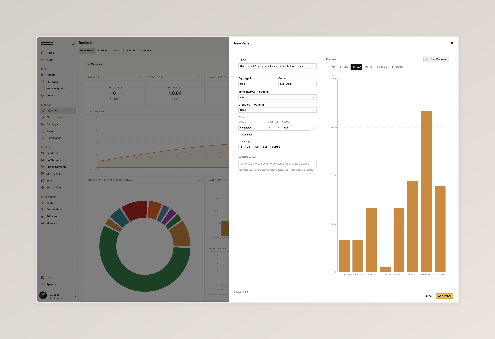

### Triage

A new monitoring product for capturing issues from your calls and resolving them inside the console with Norm. Flag a problem from the call logs, write a description, and let Norm reproduce, diagnose, and fix it across your pathways. Available at the [Triage dashboard](https://app.bland.ai/dashboard/monitor/triage).

- Flag any call for triage from the call detail view to create an issue with severity, owner, assignee, and a description. Existing related issues automatically surface so you can link the call instead of duplicating
- Each issue auto-attaches the originating calls and the pathways involved, giving Norm the full evidence profile it needs to work
- Hit 'Norm Fix' to have Norm investigate the evidence, identify the root cause, apply the fix to the relevant pathway, and verify it by running testbed simulations against the patched version
- Test the fixed pathway directly in chat from the issue, or open the pathway to review every change Norm made and read its full triage summary

  <iframe
    src="https://www.loom.com/embed/cd851a3070e24c3bb6d49bd53462fa8b"
    frameBorder="0"
    allowFullScreen
    style={{ position: "absolute", top: 0, left: 0, width: "100%", height: "100%" }}
  />

---

### GitHub Integration for Pathway Versions

Pathway versions can now be bound to a GitHub repository, giving your team a familiar Git-based workflow for reviewing and managing pathway changes alongside the rest of your codebase.

- Use the "Connect to GitHub" option in a pathway version's ellipsis menu to install the Bland Agent Sync GitHub App, then pick a repository and branch to sync with
- Export pathway configuration to GitHub or import changes from GitHub back into Bland from the Manage Syncs panel. Pathways are written to a structured `source/` directory with separate folders for `nodes/` and `edges/`
- Edit nodes and edges directly on GitHub, commit your changes, then re-import into Bland. The sync status previews exactly what changed (additions, deletions, modifications) before you apply it

  <iframe
    src="https://www.loom.com/embed/b6351dc32123481bab406b2287c380ad"
    frameBorder="0"
    allowFullScreen
    style={{ position: "absolute", top: 0, left: 0, width: "100%", height: "100%" }}
  />

---

### Alerts

A new alerts surface for monitoring agent behavior in real time. Configure thresholds on built-in call metrics or define your own custom conditions, then route notifications to email, phone, or a custom tool. Available at the [Alerts dashboard](https://app.bland.ai/dashboard/alerts).

- Alert on call length and API errors out of the box, or write custom conditions in plain language (for example, "caller asked for a manager"). Enterprise plans add advanced metrics including latency, sentiment, silence count, transcription quality, engagement, and interruptions
- Set severity levels with percentage triggers and lookback windows from 10 minutes to 24 hours, so alerts only fire when an issue is actually trending
- Deliver notifications by email, phone, or custom tool when a condition fires

---

### Analytics Dashboards Overhaul [Enterprise]

The analytics dashboard has been rebuilt around custom panels you can configure yourself, with AI-powered generation to spin up new charts from a plain-language description.

- Build your own panels with full control over aggregation, columns, filters, and date ranges, then choose how to visualize them as KPI tiles, line charts, bar charts, pie charts, tables, or scatter plots
- Generate panels with AI by describing what you want to see in plain language (for example, "Daily call volume per pathway for the last 30 days") and the form populates itself with a live preview before you save
- Switch between view and edit modes to safely browse a dashboard, and apply a single global date range across every panel on the board

<Tabs>
  <Tab title="Analytics Dashboard">
    
  </Tab>
  <Tab title="Build a Panel">
    
  </Tab>
</Tabs>

---

### BTTS Experimental Voice Cloning

BTTS Experimental is now live as a direct upgrade from BTTS V2. To try it, clone a new voice and select `Experimental` from the model dropdown.

- 48 kHz high quality audio with broad multilingual support across Asia, Europe and the Americas, the Middle East, and Africa
- Voices created with this service are tagged with an EXPERIMENTAL badge in the voice library, voice studio, and selection panels

---

### Improvements

**Pathways**
- [Enterprise] Warm transfers can now run a pathway on the proxy agent. Toggle "Use Pathway" in the warm transfer config and pick the pathway, version, and start node to drive the transferred call
- Background tracks can now be configured per node, letting you set ambient audio (cafe, restaurant, office, or your own uploaded WAV) for specific parts of a conversation rather than the entire pathway
- Code tools on nodes can now extract values from their return value and route the call to different nodes based on those values, matching the routing already available for webhook tools
- You can now override the default "Goodbye." line the agent says before hanging up after extended silence. Available on inbound number config, the Send Call form, and the pathway Settings tab

**SMS**
- [Enterprise] Custom SMS timeouts can now be set per conversation or per message
- [Enterprise] RCS messages can now include images from the dashboard send call interface

**Call Logs**
- Playback speed now persists when navigating between calls

**Agent Testing**
- You can now generate a test scenario from a call log via a single modal, with toggles to include sanitized request data, variable-extraction assertions, and an LLM-generated persona prompt
- Test scenarios now accept a `request_data` payload so persona and agent prompts can reference variables like `{{profile}}` or `{{customer.name}}` the same way they would on a real call

**Pathway Editor (Norm)**
- Norm has a redesigned chat UI with cleaner diff and skill controls, a consolidated assistant panel, and improved pathway awareness when suggesting changes
- The pathway chat recursion cap has been raised and now surfaces a clear error instead of silently failing when reached

**Account & Phone Numbers**
- New users can now activate a free Bland phone number with each org

