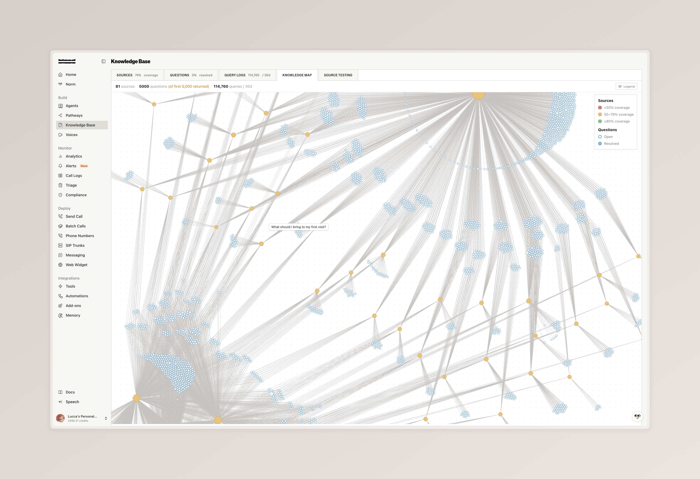
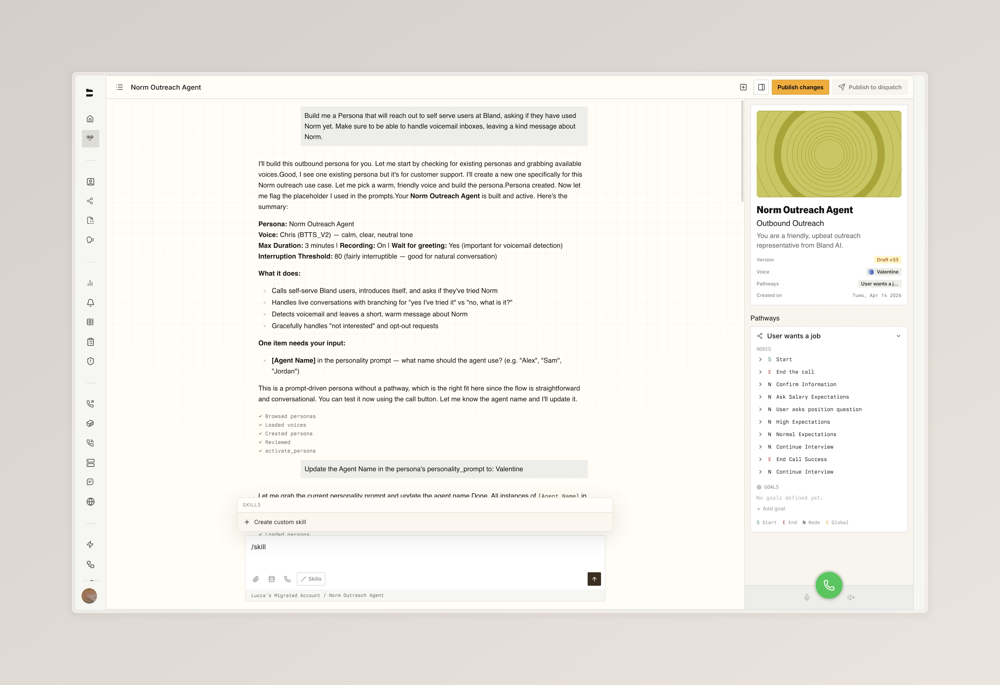
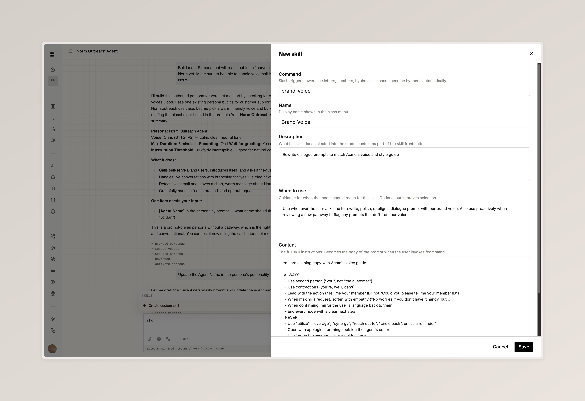

### iMessage Support [Enterprise]

Bland now supports iMessage as a third messaging channel alongside voice and SMS. Reach customers from a branded contact with your company name and profile image instead of a random number, with all the iMessage features they already use every day. Read the full announcement: [Bland iMessage: A branded contact in every customer's phone](https://www.bland.ai/blogs/bland-imessage-a-branded-contact-in-every-customers-phone).

- Messages come from a branded contact with your company name and profile image, in iMessage's blue bubbles, with end-to-end encryption
- Send and receive high-resolution photos, videos, PDFs, spreadsheets, and other documents, plus tapbacks, text effects, Live Stickers, and voice memos. Delivery status, read receipts, and typing indicators give you richer analytics than SMS
- One agent powers every channel: iMessage agents share the same pathways, personas, and persona memory as your voice and SMS agents

<iframe
  src="https://www.loom.com/embed/2efad77478c247079bce4c16b4cee4f2"
  frameBorder="0"
  allowFullScreen
  style={{ width: "100%", aspectRatio: "1540 / 1000", borderRadius: "0.5rem", marginTop: "1rem", marginBottom: "1rem", display: "block" }}
/>

---

### Knowledge Base Updates

A handful of upgrades to the Knowledge Base this week, headlined by a new visual map of your sources and questions.

- The new Knowledge Map tab lays out every source and question as connected nodes, color-coded by source coverage and question status, with a legend for coverage tiers (under 50%, 50 to 79%, 80% and above) and resolved versus open questions
- Aggregate stats are now shown on the Sources tab, giving you a quick snapshot of size and coverage
- The Query Logs tab now displays the full query context inline, so you can see exactly what the agent was working with when each query fired

  An interactive map of every source and question in your Knowledge Base, color-coded by coverage and resolution

---

### Custom Skills for Norm

Teach Norm to do exactly what your team needs. Custom skills are scoped to your organization and live alongside the built-in skill set in the Norm chat.

- Type `/` in Norm chat to trigger any skill or to create a new one via "Create custom skill", with the editor opening in a side drawer with five fields: command, name, description, when to use, and the content Norm should follow
- Use skills for anything your team does repeatedly, like enforcing a brand voice across dialogue prompts, scaffolding common flows such as insurance verification, or generating your standard QA scenarios for every new pathway

<Tabs>
  <Tab title="Slash Menu">
    
    

      Type `/` in Norm to open the slash menu and create or trigger a skill
    

  </Tab>
  <Tab title="Skill Editor">
    
    

      Build the skill in a side drawer with command, name, description, when-to-use, and content fields
    

  </Tab>
</Tabs>

---

### Improvements

**Pathways**
- [Enterprise] The Scheduling node now supports caller authentication, so you can verify a caller's identity before booking on their behalf
- Outcomes are now surfaced inline during pathway test calls, so you can see how each test resolved without leaving the test panel

**Agent Testing**
- A pathway version selector has been added to the testbed, so you can target a specific version when testing a pathway
- Scenarios can now be tagged with labels, and a Run Batch by label modal lets you execute every scenario sharing a label as a single batch
- Each historical test run now has a unique ID you can copy and search by, making it easier to revisit a specific run

**SMS**
- [Enterprise] The memory system for SMS now autofills standard conversation fields like the contact's name and number, so memory lookups happen without extra setup

**Web Widget**
- Widget webhooks now include conversation variables in the payload, so downstream systems can use the same context the agent had