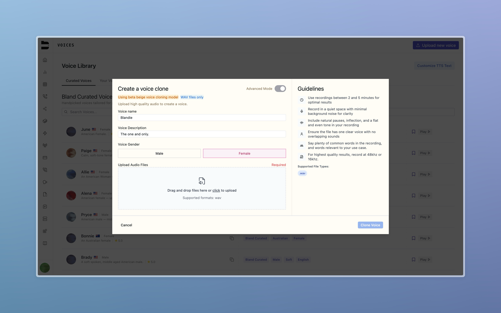
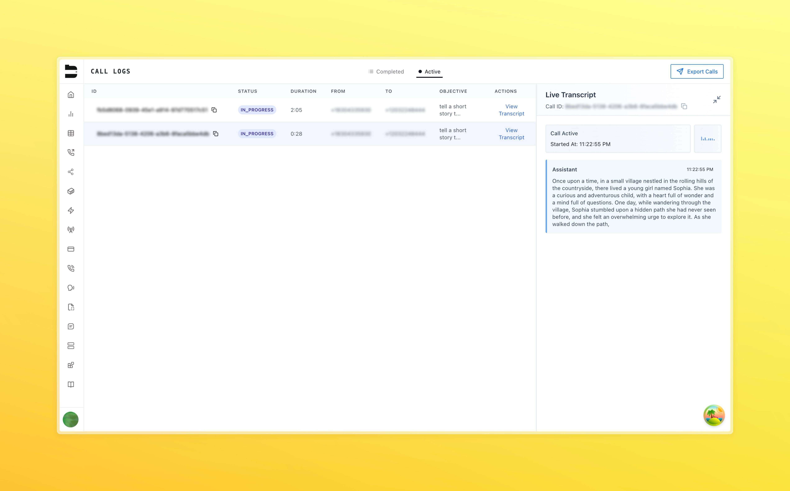
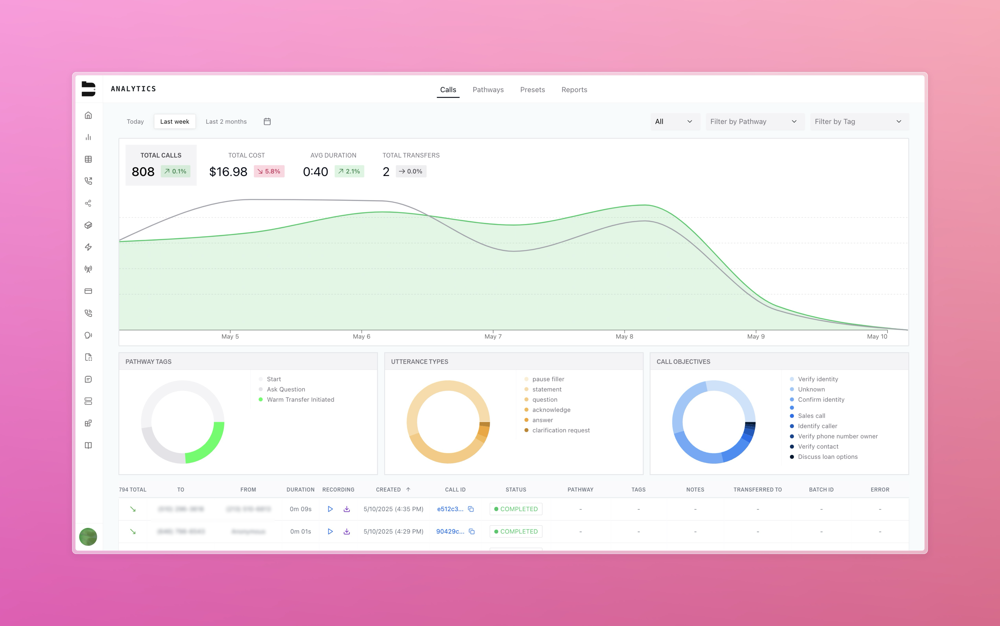

Check out what the Bland team has been building below.

### New TTS Engine & Voice Cloning (Beta)

We've rolled out an upgraded text-to-speech engine with enhanced expressiveness, named "Beige"!

- Smoother, more natural speech output
- Support for cloning your own voice
- New voices added to the Voice Library, try out Maeve and Beige in our [Bland Curated voices list](https://app.bland.ai/dashboard/voices)!

### Custom Code Execution Node (Enterprise)
Add inline JavaScript to extend your Pathway logic or trigger external services.

- Access and manipulate existing pathway variables
- Return new variables for use later in the call flow

### Live Call Monitoring

You are now able to **listen to active calls in real time**, making it easier for QA, support, and customer-facing teams to stay on top of live interactions.

- Access from the Active Call Logs page
- Playback begins as soon as the call starts
- Hear both agent and user conversation audio alongside transcripts!

### Advanced Call Analytics (Enterprise)

Easily track and explore your inbound and outbound call history. Filter by number or pathway to uncover insights on call durations, usage, and spend.

Enterprise users gain access to deeper analytics—breakdowns by pathway tags, utterance types, and call objectives for advanced reporting and optimization.

**Improved Filtering**
- You can now filter analytics by `to` and `from` phone numbers, helping you drill into call-specific behavior.

### Small Improvements and Fixes

- Pathway heatmaps now render correctly across all screen sizes and browsers.
- We've significantly improved load times across the platform, particularly for our call logs.
  - Faster render for analytics and call playback
  - Backend optimizations for large orgs
  - Preloading of call logs for faster loading when navigating to the page
- Enhanced voicemail detection to improve accuracy and reduce misclassifications.
- Users now receive a clear error when attempting to import the same number into different orgs.
- You can now enable your Webhook Nodes to retry automatically on failure error codes 429 (rate limit) and all those above 500.
- Express Dial (Enterprise): Optimized call dispatch system for select customers, reducing call initiation latency.