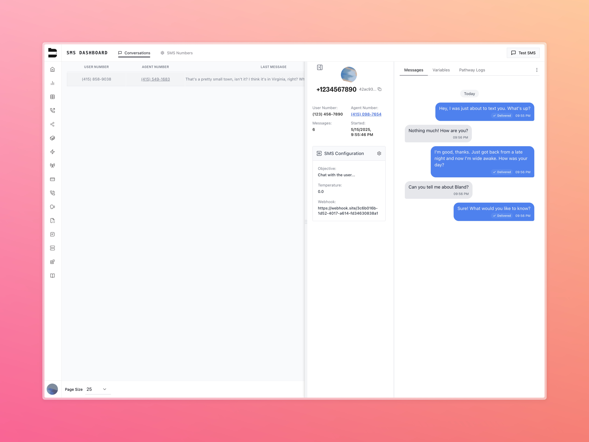
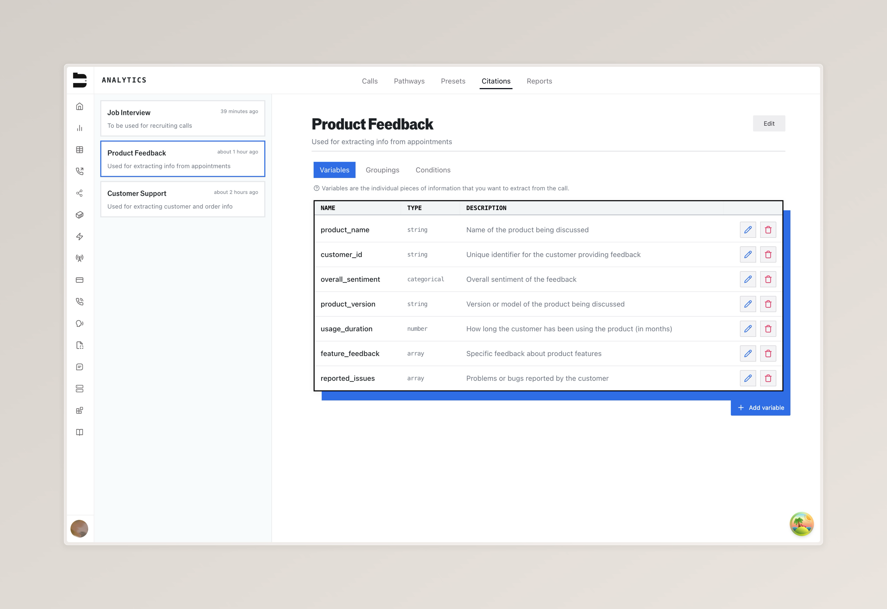
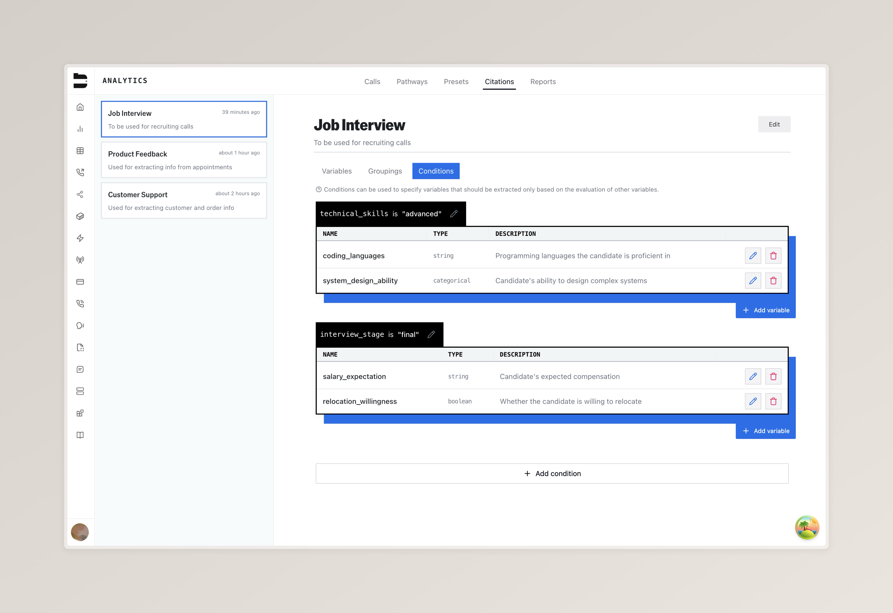
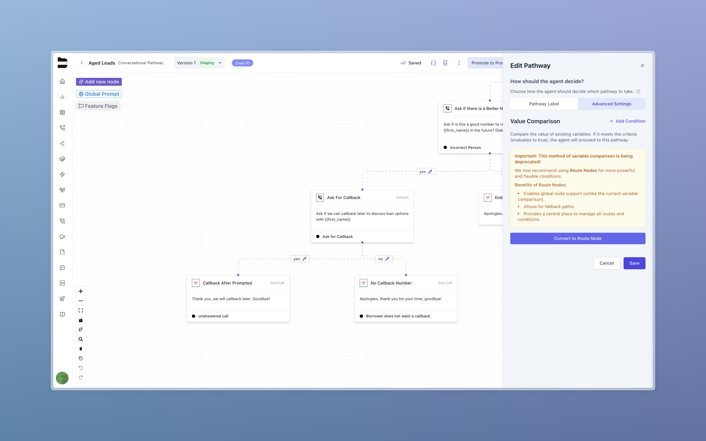

### Introducing SMS

We're excited to launch SMS functionality on the Bland AI platform.

SMS messages can now be sent and received through Bland AI, enabling a new mode of customer engagement—powered by the same logic infrastructure as your voice pathways. This allows you to build text-based conversations using the same interface and tools, making it easy to confirm appointments, send follow-ups, or deliver information via SMS.

> **Note:** SMS is currently available for Enterprise customers only.

**Key features:**
- Programmatic SMS sending via Pathways
- Variable support for message personalization
- Full delivery and response logging
- API endpoints for SMS control and automation

Technical details are available in our [SMS Documentation](https://docs.bland.ai/api-v1/get/sms-numbers), and you can follow our [Getting Started Tutorial](https://docs.bland.ai/tutorials/sms) for a step-by-step walkthrough.

---

### New: Citation Extraction in Call Analytics (Enterprise)

Enterprise users can now define conditions for when certain variables should be extracted from calls—introducing a more powerful and flexible way to structure insights in the Analytics workflow.

Using the new **Citation Schema Builder**, you can:
- Define conditional logic to extract specific data points (e.g., extract “salary expectation” only when `interview_stage = "final"`)
- Organize variables by use case (e.g., recruiting, support, feedback)
- View extracted citations directly within call logs

This feature unlocks more structured post-call analysis and supports deeper reporting across your team's workflows.

> Additional improvements to citation display and analytics will follow in upcoming updates.

---

### Deprecation of Advanced Pathway Settings

We’re moving away from the legacy Advanced Settings system for managing pathway navigation and logic.

Advanced logic is now easier to manage using **Route Nodes**, which offer a clearer and more consistent way to structure conditions in the editor.

**Why Route Nodes?**
- Able to now work with your global nodes
- Support fallback default paths
- Centralize your routing logic in a single place

This update simplifies how branching logic is built—directly in the flow, without hidden settings.

[Watch a quick walkthrough on the migration](https://www.loom.com/share/42d137ba8dde427d83761019f3cc5503)

---

### Improvements

Call Handling
- Reduced queue time during warm transfers for faster agent handoffs
- Improved voicemail tone detection for higher accuracy in leaving messages
- Fixed transcription repetition issues while using Babel language model

Editor & Logic
- Fixed issue where pressing Escape while editing the Custom Code Node would prevent changes from saving

---

### Platform Updates

Access & Plans
- Voice cloning is now available for all users to try on the Start plan
