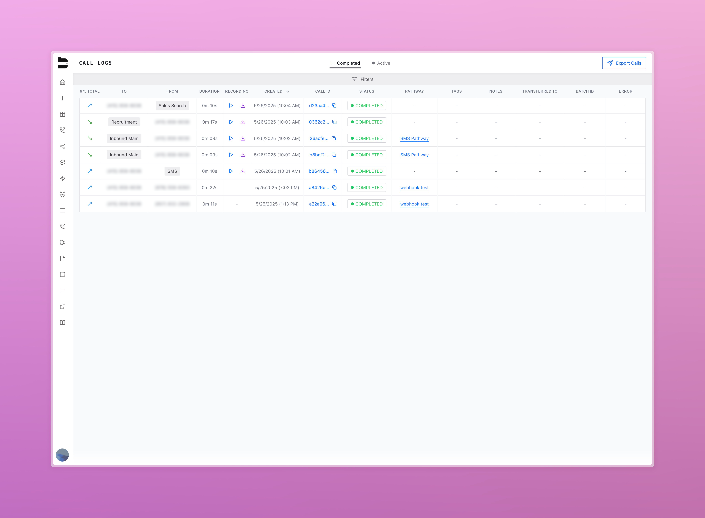
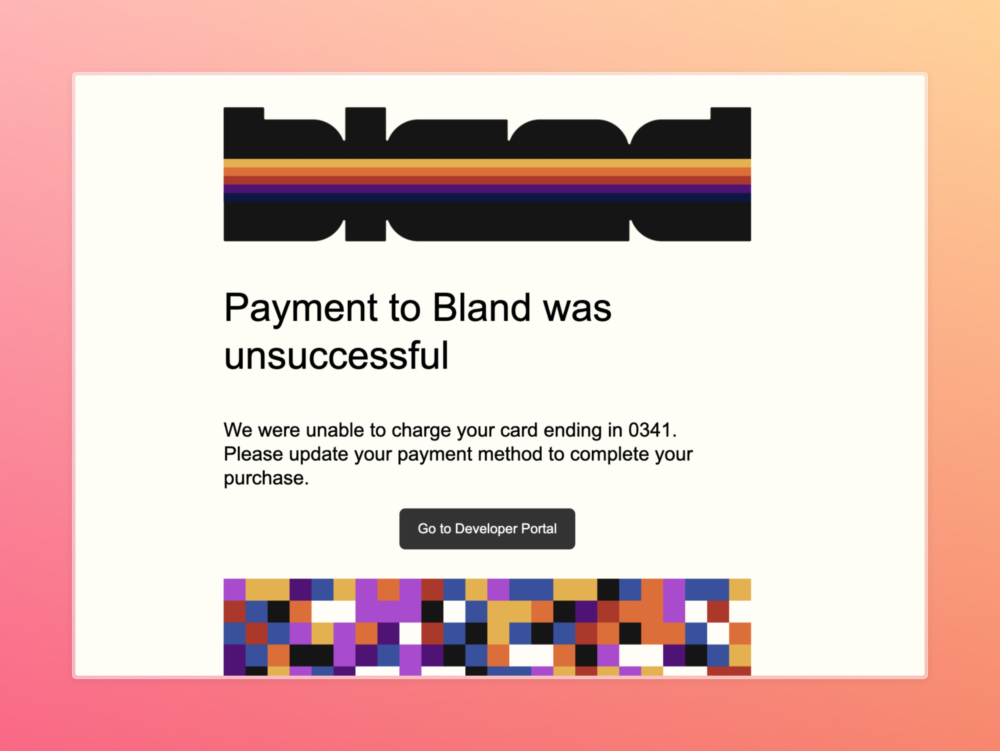
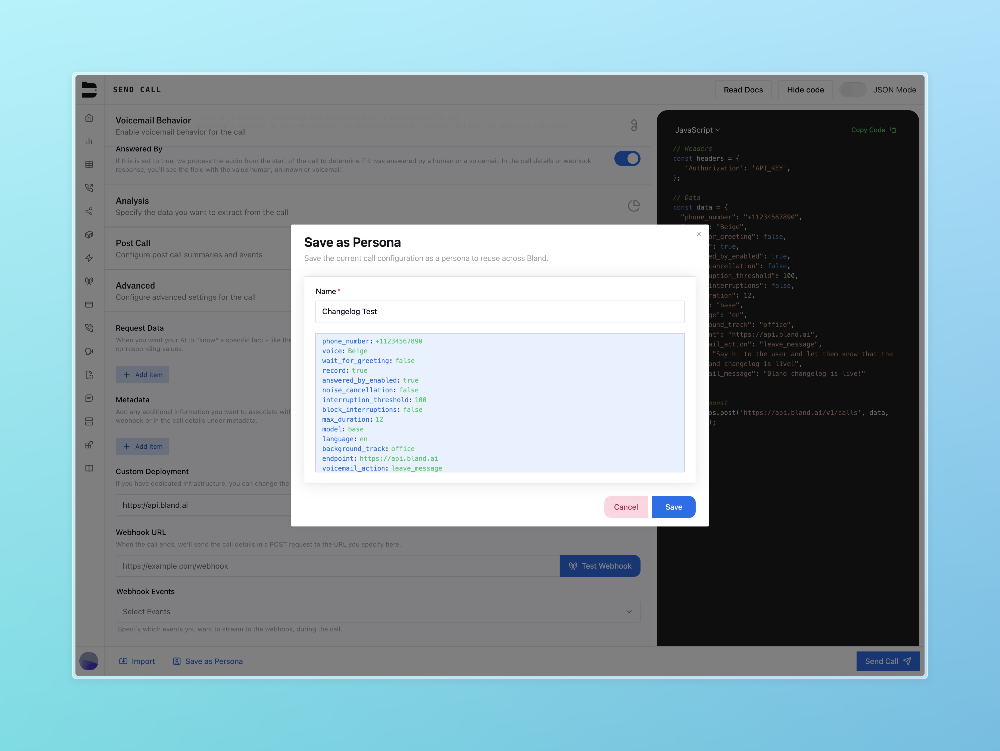
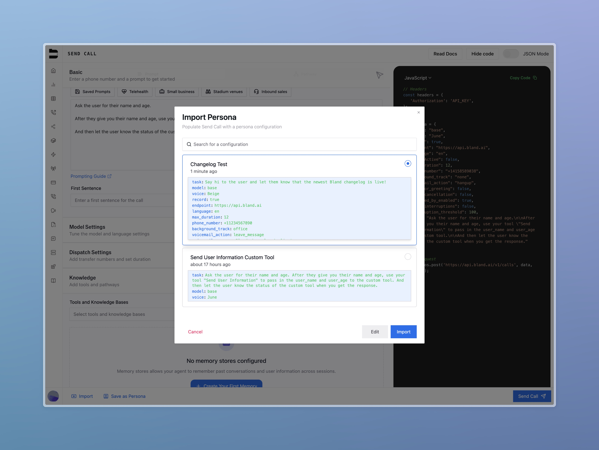

### Call Logs Enhancements

Performance improvements have been made to support faster loading of call logs, particularly for larger organizations.

We’ve also added **phone number labels** to call log entries to and from columns, helping users quickly identify the type or source of each number based on the label set on your owned phone numbers.

---

### Email Notifications on Payment Failure

We now automatically notify users via email when a payment failure occurs. This ensures that billing issues can be addressed quickly and with full visibility.

---

### Persona Updates

You can now update and edit saved personas after they’ve been created, making it easier to evolve call configurations over time.

---

### Scheduling Node Improvements (Enterprise)

We’ve expanded the functionality of the Scheduling Node to support more flexible logic and broader time-based configurations.

**New capabilities:**
- Timezone support: schedule logic based on the user’s local time
- Loop conditions: allow recurring or conditional time-based flows

---

### Improvements

- Increased the maximum voicemail message duration from 30 seconds to 80 seconds
- Improved call recording autoplay behavior when switching organizations—playback now starts reliably on load
- Fixed issue where the Test API button under Custom Tools was not including query parameters
- Variables used across the platform are now limited to valid characters: letters, numbers, hyphens, and underscores only
