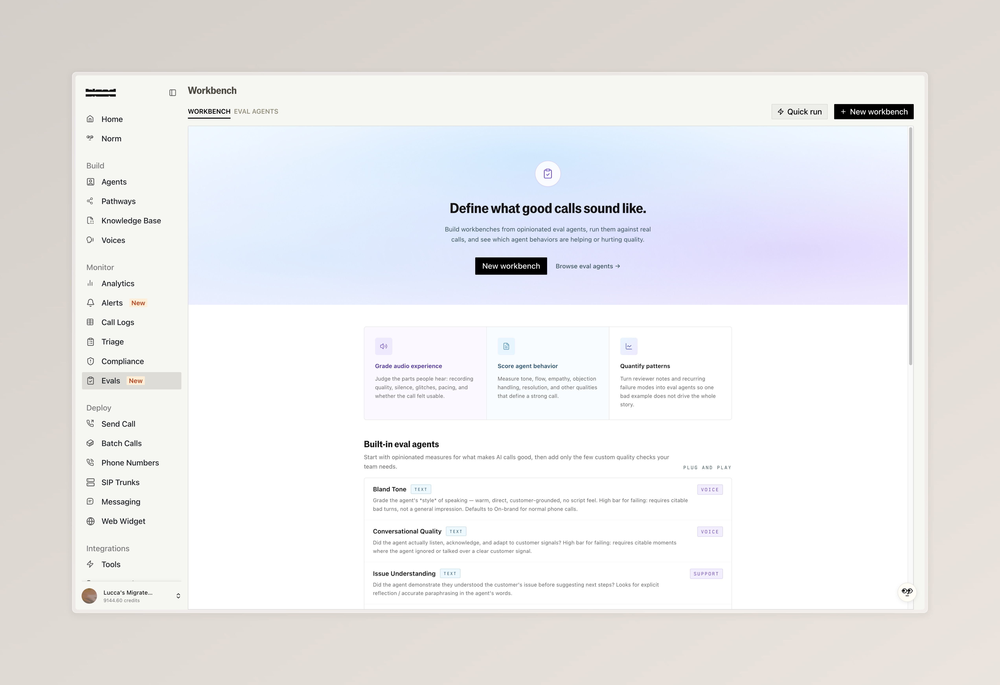
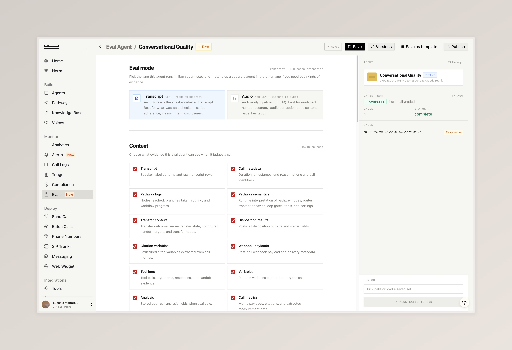
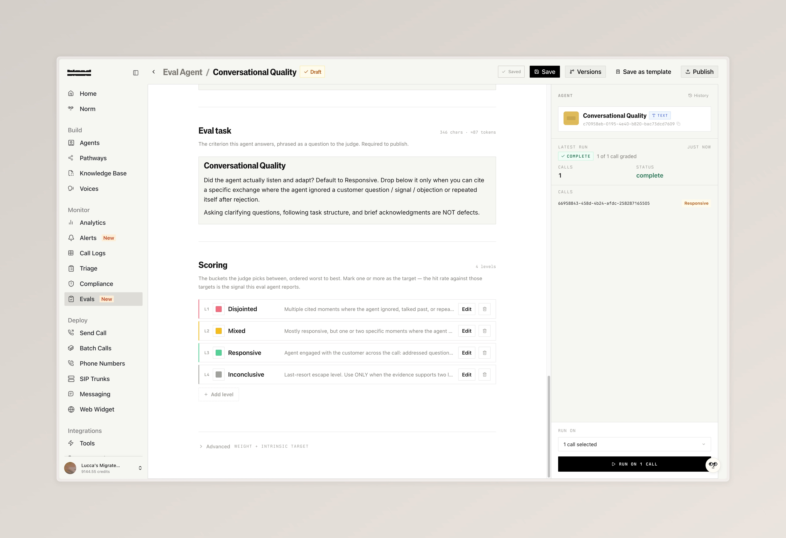
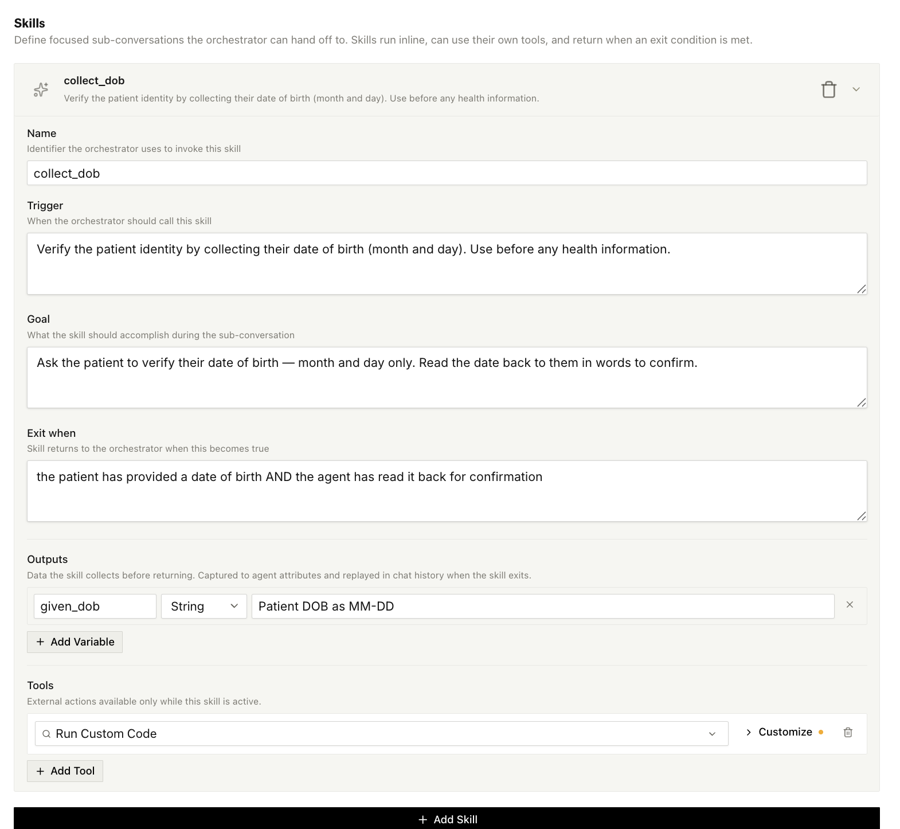

### Evals

Evals run LLM judges against your call history to grade quality dimensions like audio, tone, hallucinations, and resolution. Available at the [Evals page](https://app.bland.ai/dashboard/evals), see the [docs](/tutorials/evals).

- Build a workbench of eval agents, each one grading a single dimension with a custom rubric and configurable evidence sources (transcript, metadata, pathway logs, citations, tool logs, and more)
- Pick Transcript or Audio mode per agent depending on whether you need an LLM to read the transcript or a non-LLM pipeline to listen to the recording
- Score up to 5,000 calls in a single run against a saved benchmark set, and start from a template library covering Bland Tone, Conversational Quality, Issue Understanding, and more

<Tabs>
  <Tab title="Workbench">
    
  </Tab>
  <Tab title="Configure">
    
  </Tab>
  <Tab title="Scoring">
    
  </Tab>
</Tabs>

---

### Flex Mode

Let your agent decide where to go next based on the conversation instead of following hardcoded edges. See the [docs](https://docs.bland.ai/tutorials/flex-mode).

- Toggle pathways between strict and flex execution
- Group nodes on the canvas. Edges between grouped nodes become conditional and the agent picks the next step from context
- Scheduling, IVR, and Orchestrator nodes stay locked to their wired edges and can't be added to a flex group

<iframe
  src="https://www.loom.com/embed/7693feed2bf646ef9c4b9836b50aa905"
  frameBorder="0"
  allowFullScreen
  style={{ width: "100%", aspectRatio: "16 / 9", borderRadius: "0.5rem", marginTop: "1rem", marginBottom: "1rem", display: "block" }}
/>

---

### Components

Wrap a subset of nodes into a reusable Component and Bland compiles it into one graph at agent runtime. A new scope tab bar switches between the main pathway and each Component's own canvas.

<iframe
  src="https://www.loom.com/embed/a21c5b443224407b9425a06946eb0b09"
  frameBorder="0"
  allowFullScreen
  style={{ width: "100%", aspectRatio: "16 / 9", borderRadius: "0.5rem", marginTop: "1rem", marginBottom: "1rem", display: "block" }}
/>

---

### Sentinel [Enterprise]

Sentinel is the newest platform release, joining Sonic, Serenade, and Sync on the [Releases page](https://app.bland.ai/dashboard/settings/releases). Three new investments in call reliability and observability.

- **Proprietary Noise Cancellation.** An in-house engine that isolates the caller's voice in real time, opt-in per agent
- **Resilient Calling at Scale.** Fair-share dispatch keeps calls FIFO under load, and opt-in fallbacks reroute degraded calls before the caller notices
- **Knowledge Base, Now Observable.** See which agents read from each source, how often, and from where, with 30-day query tracing

---

### Improvements

**Translation Studio**
- Try our new [Translation Studio](https://app.bland.ai/dashboard/tts/translation-studio), a sandbox for testing live translation. Pick from your voice clones or record a fresh sample to play translations back in your own voice

**Pathways**
- Pathways with a Transfer Pathway node now show a tab bar at the bottom of the editor for jumping to each transfer target inline

**Personas**
- Personas can now define focused sub-conversations called Skills. Each skill has a trigger, goal, exit condition, output variables, and its own tools, so you can isolate sub-flows like ID verification or payment collection

**Post-Call Automations**
- [Automations](https://app.bland.ai/dashboard/automations) now support a post-call trigger. Fire actions like webhook posts, CRM updates, or follow-up SMS when a call ends, with a live payload preview for picking specific fields to reference

**Alerts**
- [Enterprise] [Custom alerts](https://app.bland.ai/dashboard/alerts) now run over real post-call signals instead of plain-language LLM conditions. Build rules from citation variables, disposition outcomes, or pathway tags via a new typed source picker

**Web Widget**
- Add a scheduling picker to your embeddable web chat widget from the widget's Native Custom Components section. Customers see available times and book a slot directly in the chat instead of being sent to an external calendar

**SMS**
- [Enterprise] Phone number SMS configurations can now disable the conversation timeout. Leave the field blank to keep the conversation open indefinitely

**Billing**
- Norm is now metered per message and requires a non-zero credit balance to use

