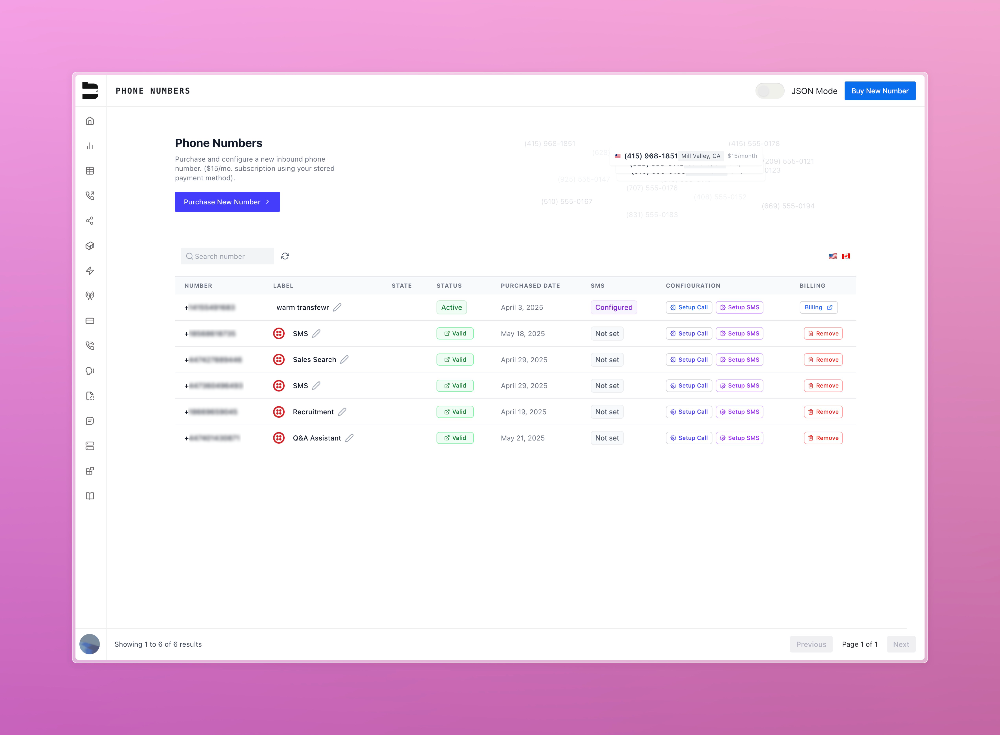

### Voice & Call Handling

**Pause/Resume Agent Speech**  
- Improvements to help prevent the agent from talking over the user.
- Agent speech is paused while the user is speaking, and this supersedes all "block interruptions" logic. Speech is automatically resumed when they finish speaking if the interruption was blocked, or is cancelled and replaced by the new response generation.
- Minor fixes for background_track: "none"

**Transfer Recording Controls**  
Introduces a setting in the org preferences tab that allows you to stop the twilio recording after Bland regular or warm transfers

---

### Call Logs & Admin Tools

**Citation Analytics (Enterprise)**  
Introduced high-level citation tracking within Analytics.

**Call Log Filter Persistence**  
Call log filter configurations can now be saved.

**Fix: Pathway Tag Filtering**  
Unifies logic to include untagged calls when using “does not include” tag filters.

**BYOT Number Management**  
Adds a modal for removing BYOT numbers from your org.

---

### SMS Improvements (Enterprise)

**Pass From Number via Variable**  
Allows passing a variable into the `from_number` field in SMS nodes.

**Fix: SMS Request Data**  
Resolved an issue with request data improperly being saved in phone number configuration.

**Fix: SMS Transfer Pathway Node**  
Corrects execution issues with transfer pathway over SMS conversations.

**SMS Node From Number**  
Displays an informational message in the SMS node when setting a from number.

---

### Editor & Workflow Enhancements

**Pathway Version Deletion Modal**  
Adds a modal to confirm deletion of specific pathway versions.

**Custom Code UI Fixes**  
Resolved UI sync issues in the Custom Code node editor.

**Advanced Option Diffing**  
Advanced node settings now appear in pathway version diffs.

**Fix: Pathway Edge Save Behavior**  
Ensures more reliable and consistent pathway label saving behavior.

<video 
  controls
  style={{ width: "100%", borderRadius: "0.5rem", marginTop: "1rem", marginBottom: "1rem" }}
  src="../changelog_assets/06_02_2025/updated_pathway_edge.mp4"
>
  <track kind="captions" />
</video>

**Pathway Node QoL Improvements**  
- Webhook API details are now open by default when opening the node
- The prompt type now defaults to AI generated text when creating a new node, where it previously defaulted to static text

**Fix: Admin User Removal**  
Resolved an issue preventing admins from removing users of their own org.

---

### API & Infra

**Geospatial Dialing API (Enterprise)**  
Added API endpoints for [geospatial dialing pools](/api-v1/get/geospatial-dialing-pool). 

**Proxy Agent Flag in Transcripts**  
`get transcripts` API now includes whether the call was handled by a proxy agent.