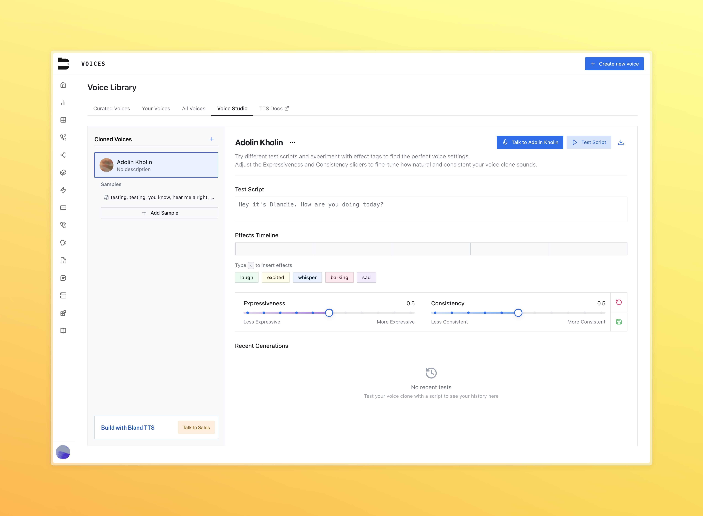
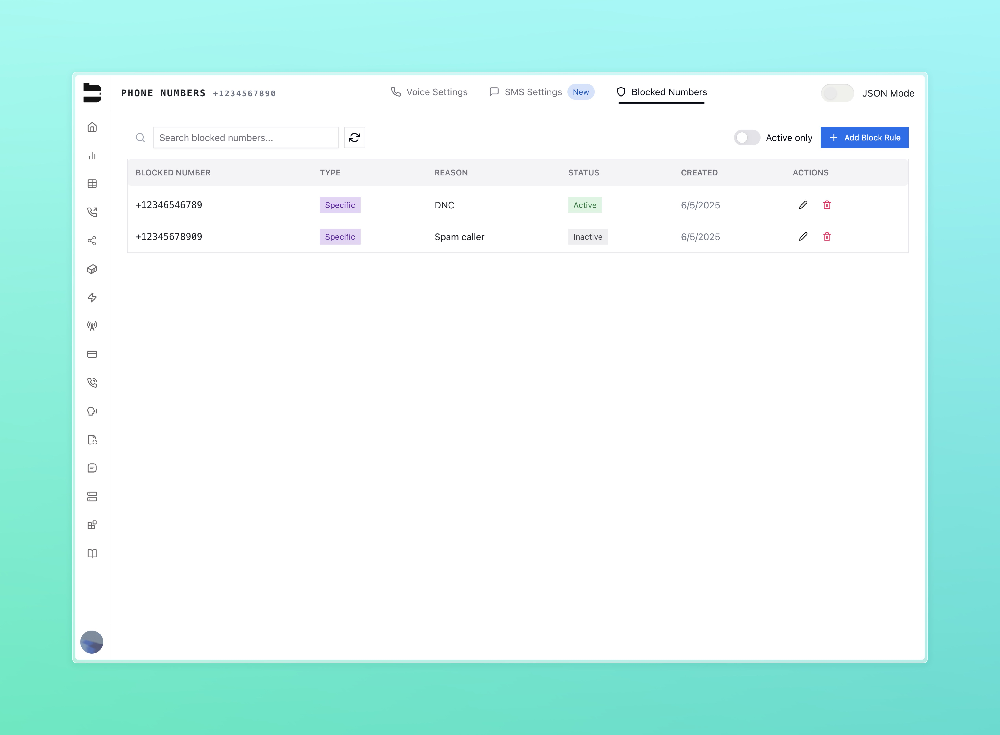
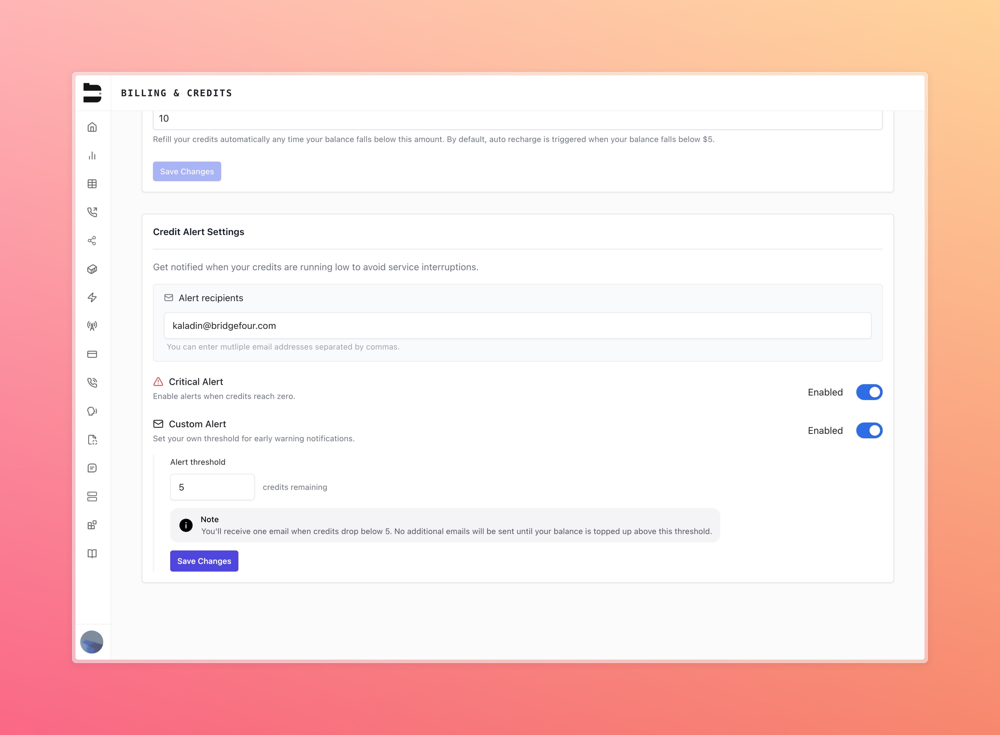

### Billing Update: Outbound Call Pricing
We're updating our billing structure for outbound calls to provide more transparency and consistency.

**What's changing:**

- Calls will continue to cost $0.09 per minute.
- Outbound calls placed using Bland's telephony now have a minimum charge of $0.015 per dispatched call.
- If your call connects and exceeds this minimum (approximately 10 seconds at our per-minute rate), you'll only pay the per-minute rate as usual, and won't be affected by the change.

**Why this change:** This update reflects the actual costs we incur with carriers for each call attempt.

**Example:**

- Call that doesn't connect: $0.015 flat fee
- Call that connects for 1 minute: $0.09 (Standard per-minute rate, minimum charge is absorbed)

**This change takes effect on June 16, 2025.** If you have questions about how this affects your usage, please contact our support team at hello@bland.ai

### Voice Studio

We've created a new Voice Studio dashboard to allow users to create and manage their own cloned voices using Bland's newest TTS models. Check it out [here -> Voice Studio](https://app.bland.ai/dashboard/voices) and read more about the development [here](https://bland.com/blogs/new-tts-announcement).

### Block Inbound Callers

You can now block specific phone numbers from calling your inbound numbers. Read more about it [here](/tutorials/blocked-numbers).

You can manage blocked numbers through our [API endpoints](/api-v1/post/blocked-numbers) or directly in the dashboard.

### Credit Threshold Alerts

Keep your team informed before credits run out.

- Set a critical threshold to avoid service interruptions
- Define a custom threshold for early alerts
- Automatically receive an email alert when your credit balance drops below

### Geo Permissions for BYOT

Organizations using Bring Your Own Twilio (BYOT) can now define their own outbound geo-permissions.

- Full control over where your outbound calls are allowed
- Aligns with your Twilio account’s permissions and risk controls

---

### Warm Transfer Fallback Node (Enterprise)

Warm transfer failures no longer mean dead ends. You can now define a fallback node for warm transfers.

The fallback path returns the agent to the pathway, allowing full customization for scheduling a callback, collecting more info, or dialing another number.

---

### Improvements

- Fixed an error when sending batch calls that included a pronunciation guide
- `noise_cancellation` now defaults to **true** on all sent calls
- Exposes transferred call duration in call logs view
- The `GET /v1/calls` endpoint now returns extracted citations (enterprise)
- Refactored the [transcript correction endpoint](/api-v1/get/calls-corrected-transcript) for faster and more accurate output
- Reduced interruptions from filler words in speech detection
- Fixed a bug where cancelling future scheduled calls with the [stop specific call endpoint](/api-v1/post/calls-id-stop) would not take effect
