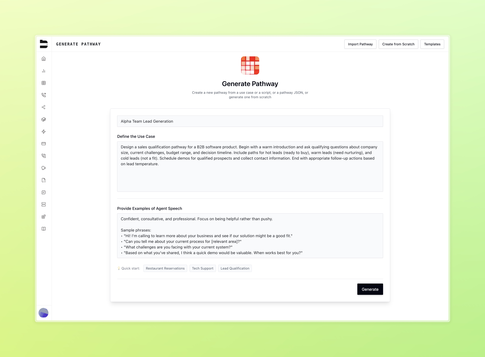

### New Pathway Generation Dashboard

We've introduced a new design for building conversational pathways from within Bland. You can now get a full call flow scaffolded in seconds, with built-in suggestions for structure and logic.

Front and center is pathway generation, where you can provide use cases and examples to create diverse pathways instantly. Just as before, you can also import existing pathways from a JSON file, or start from scratch.

<Tabs>
  <Tab title="Pathway generator">
    
  </Tab>
  <Tab title="Pathway importer">
    
  </Tab>
  <Tab title="Pathway from scratch">
    
  </Tab>
</Tabs>

### SMS Batch Messaging (Enterprise)

You can now send SMS messages as batches from the dashboard! 

- Select an SMS configured number to send your messages.
- Use your prompts or pathways to send messages to recipients from an uploaded csv, just like in our batch calls.
- Use dynamic variables from your csv with optional column mapping, or include global request data directly from the dashboard.
- Take advantage of an optional static message override to send a single message instead of an agent conversation.

### Improvements

- We've made targeted improvements to Maeve, one of our curated voices using our new TTS engine
- **BLA-3031**: Fix where pathway routing after webhook response code wouldn't respect created rule
- **BLA-3010**: Fix where users were not able to properly delete unused voices at times
- **BLA-2990**: Improvements to warm transfer call failure handling
- **BLA-2907**: Added warm transfer hold music dropdown + preview in the dashboard
- **BLA-2919**: Resolved an edge case where "wait for greeting" and "block interruptions" would not work in the start node
- **BLA-2957**: Analysis presets now auto-save after changes
- Added filters for SMS conversations dashboard
- **BLA-3021**: Fixed scrolling issues in pathway UI under test cases

