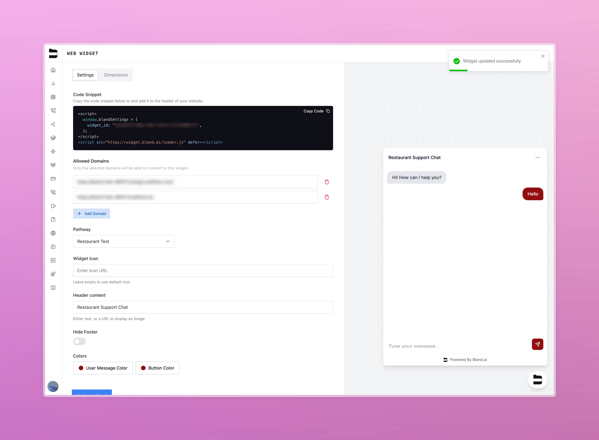
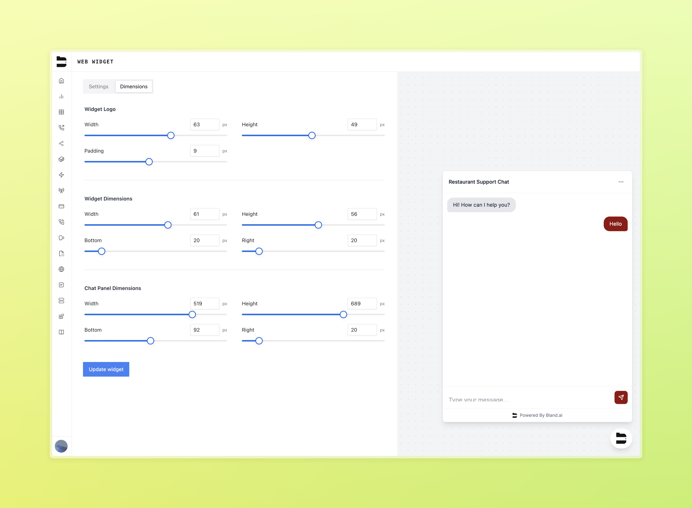

### Web Widget

We're happy to release our new [web widget feature](https://app.bland.ai/dashboard/web-widget), which allows users to embed their pathway chats into their own websites.

- Embed conversational flows directly into your website
- Built on the logic of your voice pathways
- Fully customizable with your own branding from within the Bland dashboard
- Quick and easy to implement

Fully customize your web widget settings from within the Bland dashboard

Set the dimensions of your web widget to match your website's design

Add the embed into your website's HTML code, and you're good to go!

---

### Improvements

- **ADMIN-666**: Large efficiency improvements to dashboard performance
- **BLA-3165**: Replaced the full-screen lockout ("isWayTooSmall") with a modal for small screen warnings in the Pathways Editor
- **BLA-3158**: Fixed an issue where the Forward Node would not trigger correctly if its condition was overridden by a global pathway condition
- **BLA-3098**: Added `skipUserResponse` support to the Press Button Node
- **BLA-3096**: Fixed incorrect batch call behavior when using the `voicemail_sms` parameter
- **BLA-2675**: Improved voicemail behavior when `answered_by` is unknown—better handling of likely human responses
- **Fix**: Ensured call duration (`call_length`) is consistently returned as a number, even when `0`
- **Fix**: Pathways node prompts will only be disabled if node is a global node, and has forwarding enabled
- **BLA-3122**: Added improved documentation in Custom Tool dashboard
- **ADMIN-666**: Improved reliability of user validation in the OTP login/signup flow
