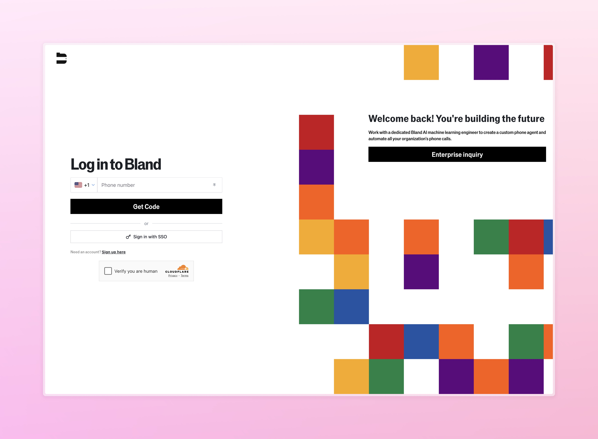
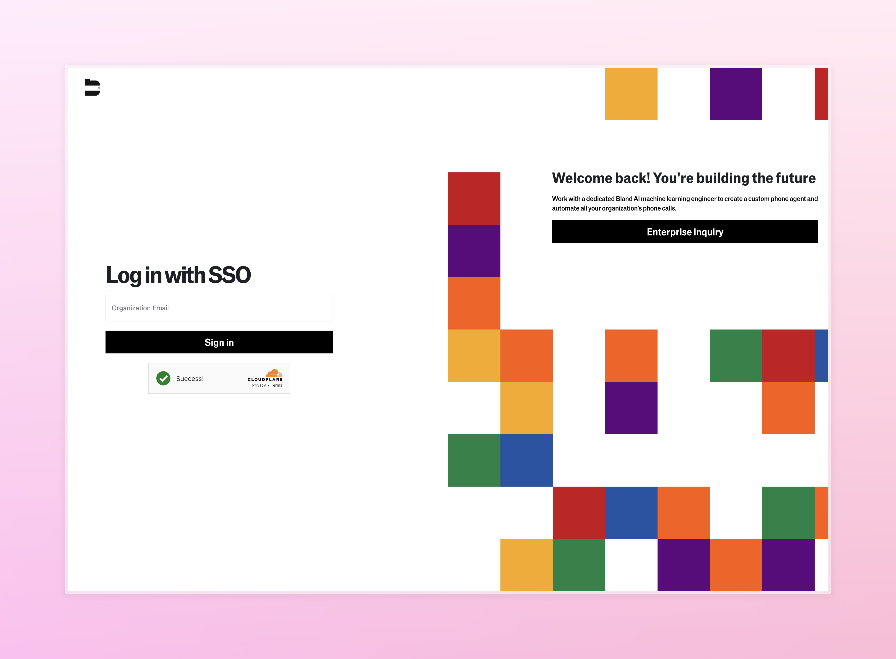
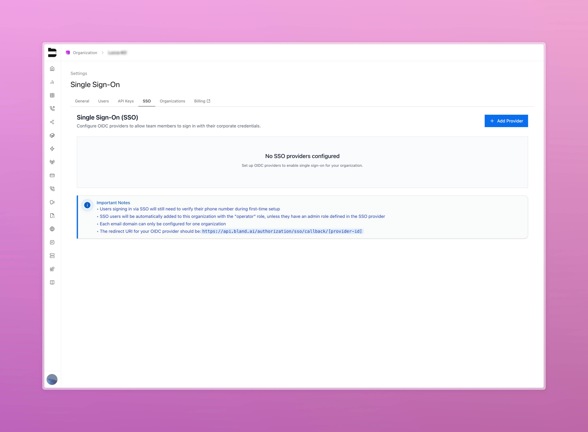
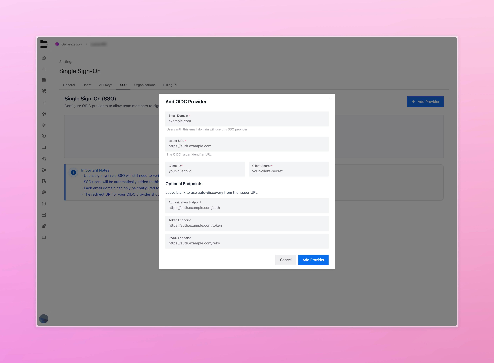
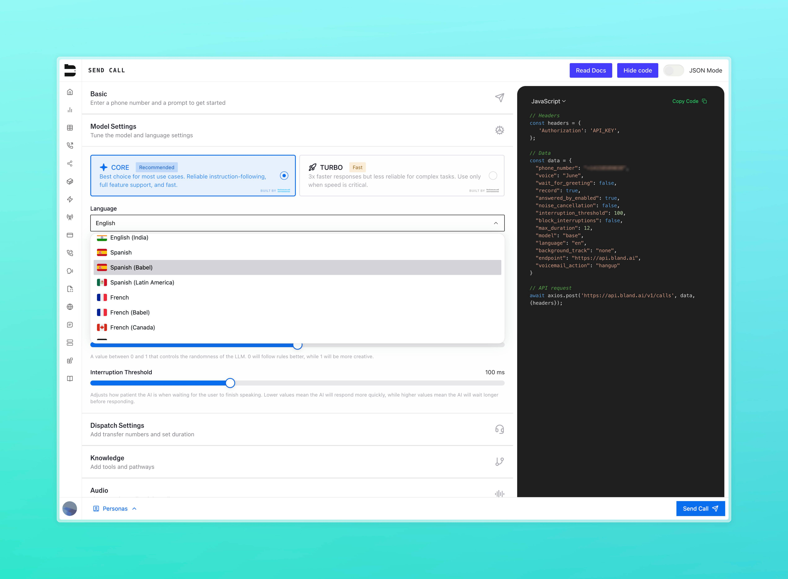
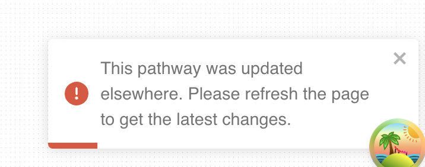

### Voice Chat in Web Widget

You can now enable **voice input** directly in the web chat widget—bringing the full conversational AI experience to the browser.

- Users can now talk with your agents, using the same speech pipeline as our phone calls.
- Perfect for embedded flows that need a faster, more natural interface
- Voice configuration available as an option in widget configuration
- Track all voice interactions through the Call Logs dashboard within Bland

<Tabs>
  <Tab title="Voice Chat">
    
  </Tab>
  <Tab title="Voice Configuration">
    
  </Tab>
</Tabs>

---

### OIDC SSO Support (Enterprise)

We now support **OIDC-based Single Sign-On** for enterprise organizations.

- A new **SSO tab** is available in org settings for configuring OIDC providers
- The login flow has been updated to handle OIDC callback
- Works with identity platforms like Okta, Azure AD, and Google Workspace

<Tabs>
  <Tab title="Login Options">
    
  </Tab>
  <Tab title="SSO Login">
    
  </Tab>
  <Tab title="SSO Configuration">
    
  </Tab>
  <Tab title="Add OIDC Provider">
    
  </Tab>
</Tabs>

---

### Upgraded Babel Model + Single-Language Variants

We’ve rolled out an upgrade to Babel, our in-house transcription engine—along with new single-language variants for better accuracy and stability.

- Improved transcription and interruption handling across noisy or complex environments
- New API options for specific languages (e.g. `babel-en`, `babel-es`, `babel-fr`, etc.)
- Frontend support now includes English, Spanish, French, and German
- Low-confidence speech is now returned with [inaudible] + best guess, allowing your agent to respond more naturally
- Babel continues to improve throughout the call using contextual feedback, and single-language variants offer stronger accuracy when you know what language your callers will be using

---

### Improvements

- **BLA-3098**: You can now configure a **"Go to Node"** action inside the **Press Button Node**
- **BLA-3061**: Adds `isRetry: true` support in post call webhooks to determine if the call was retried
- **BLA-3142**: Improved JSON validation when uploading conversational pathways to an organization
- **BLA-3173**: Fixes test case issues affecting test coverage stability
- **BLA-3210**: Fixes bug where if proxy agent presses button, primary call would go into end state (leave voicemail, or go to a node)
- **ADMIN-666**: Fixes a bug in pathway duplication logic
- **BLA-2951**: Adds version tracking to pathway editor, so when a customer updates an old system of a pathway, it will error:

- **BLA-3169**: Fixes a crash that could occur when referencing undefined variables in execution
