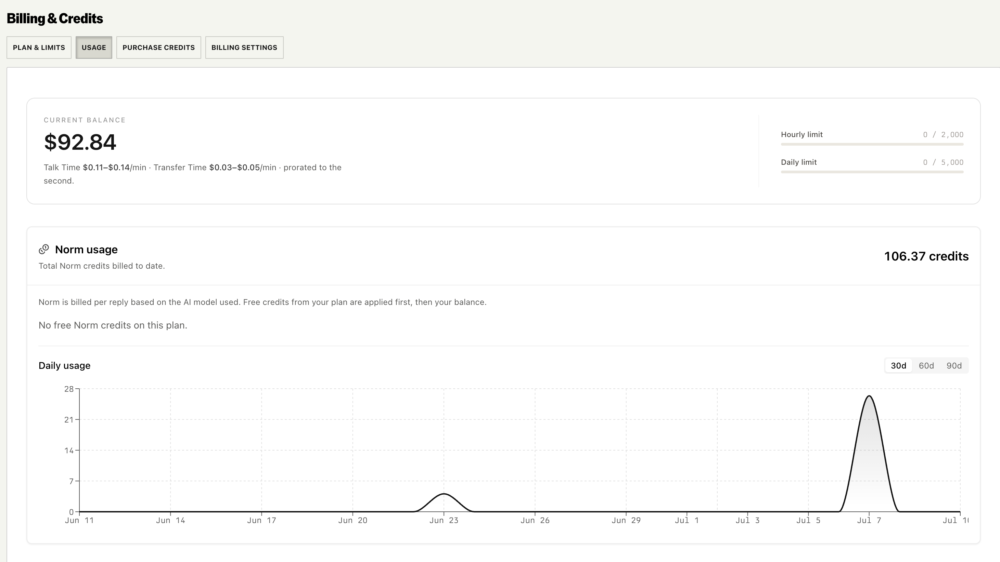

### Contact Memory Sync to HubSpot & Salesforce

Bland's memory now syncs to your CRM at the contact level after every call and message, with no tool setup or per-call request data required. Connect HubSpot or Salesforce through a single OAuth modal and sync turns on automatically, pushing each contact's identity, rolling conversation summary, memory entities (bookings, orders, tickets), and deals/opportunities straight onto the contact record.

- Every conversation automatically creates or updates the CRM contact with notes and summaries, and keeps open items like appointments and deals up to date across their lifecycle
- Bland can also pull context back in from your CRM to enrich its own contact memory, so agents reference it without any extra configuration
- A redesigned Contacts view shows per-contact sync status inline (synced / partial / failed), with **Sync now** on each contact and a **Sync all** backfill to push everything Bland already knows when you first connect

<iframe src="https://www.loom.com/embed/335456b139cd41f6ae12f3b49c2439d5" frameBorder="0" allowFullScreen
  style={{ width: "100%", aspectRatio: "16 / 9", borderRadius: "0.5rem", marginTop: "1rem", marginBottom: "1rem", display: "block" }} />

{/* TODO(media): optional still → changelog_assets/07_06_2026/crm_sync.jpeg
    Loom from #product-demos embedded above: https://www.loom.com/share/335456b139cd41f6ae12f3b49c2439d5 */}

---

### Agent Testing & Simulations

Your [eval agents](https://app.bland.ai/dashboard/evals) can now grade fully simulated conversations, not just real call history, so you can catch regressions before an agent ever touches a live customer. Attach a roster of eval agents to a scenario, generate a batch of simulated runs, and each conversation is scored inline against your rubrics.

- Attach eval agents directly to a scenario and score every simulated run with the same rubric-based engine that grades your real calls
- Kick off a simulation and get results back asynchronously: large runs no longer block or time out, and each run reports its status and score in the new runs panel
- Reworked evals call-picker and filter bar: a single-row filter with add-filter predicates, removable chips, a time-range selector, and one-click auto-sampling

<iframe src="https://www.loom.com/embed/8175611bbc3d4b0882a6d5aeb6760372" frameBorder="0" allowFullScreen
  style={{ width: "100%", aspectRatio: "16 / 9", borderRadius: "0.5rem", marginTop: "1rem", marginBottom: "1rem", display: "block" }} />

{/* TODO(media): optional still → changelog_assets/07_06_2026/agent_testing.jpeg
    Loom from #product-demos embedded above: https://www.loom.com/share/8175611bbc3d4b0882a6d5aeb6760372 */}

---

### SIP Outbound: Bring-Your-Own DIDs & Trunk-to-Trunk

Outbound SIP calls can now use your own internal identities (DIDs and extensions) instead of being forced onto an E.164, enabling true trunk-to-trunk hand-off where Bland passes the call to your system and you take it from there.

- Identities are stored exactly as you enter them: only `+`-prefixed inputs are parsed as E.164, while DIDs and extensions are kept verbatim and no longer coerced into duplicate rows
- Custom headers and Bland variables set on a call are now correctly carried through on the outbound INVITE, with static-vs-variable header round-tripping preserved end to end
- Fixed the outbound INVITE so it carries the correct FROM and TO instead of duplicating the source number

{/* TODO(media): add screenshot → changelog_assets/07_06_2026/sip_outbound.jpeg
    No Loom found in #product-demos for this topic. */}

---

### Knowledge Base: Retrieval Boost for Web & JSON Sources

Retrieval boosting (previously CSV-only) now works for Web and JSON knowledge sources, so you can steer which fields and paths carry the most weight during retrieval.

- JSON sources get dedicated boost/ignore JSONPath inputs plus a list-path field, all validated as you type
- Web sources can boost on page title and meta description with a single toggle
- Saving now runs an automatic save-then-reindex, with the retrieval settings locked while the update is in flight

{/* TODO(media): add screenshot → changelog_assets/07_06_2026/kb_boost.jpeg
    No Loom found in #product-demos for this topic. */}

---

### Improvements

**Billing**
- A new Usage tab surfaces usage-based billing for eligible orgs, with a Norm usage chart (30/60/90-day toggle) and a free-credit panel. Usage-based orgs see "Usage-based billing" in the account selector, and Norm usage is now pulled from Metronome into the org billing summary

**Pathways**
- The per-node tool-call cap is now configurable with a new **Max calls** control, so iterative tools that need more than 3 calls per node can run to completion
- Export to GitHub is now lossless on round-trip (node configuration is preserved on export and restored on import) and handles bulk exports gracefully with proper rate-limit responses instead of intermittent 500s
- Loop condition prompt logs now preserve the original prompt used at call time instead of showing later edits

**Messaging**
- SMS conversations can now be exported from the logs UI as CSV, matching the call-logs export format
- Messaging/SMS webhook log entries now support **Resend**, matching the post-call webhook resend in call logs
- SMS automation variables now persist until explicitly replaced
