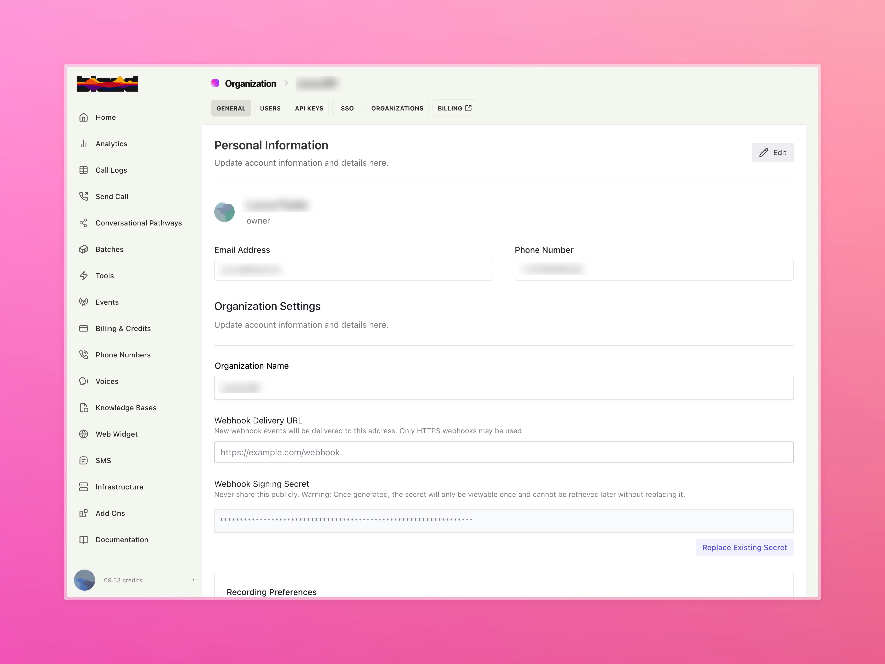
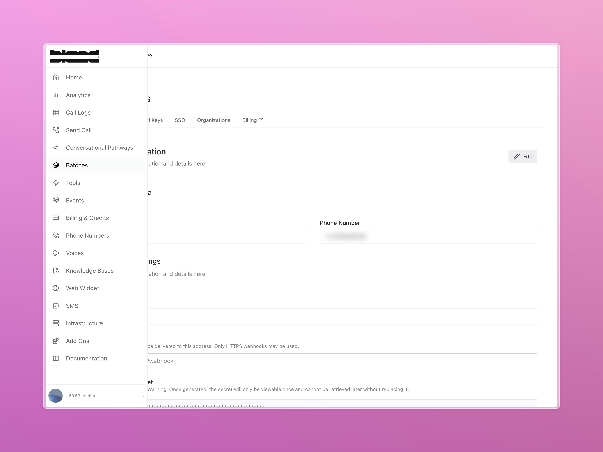
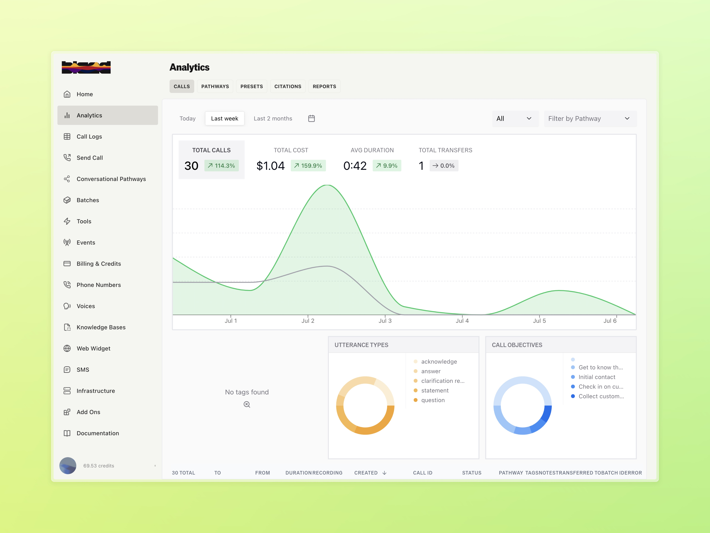
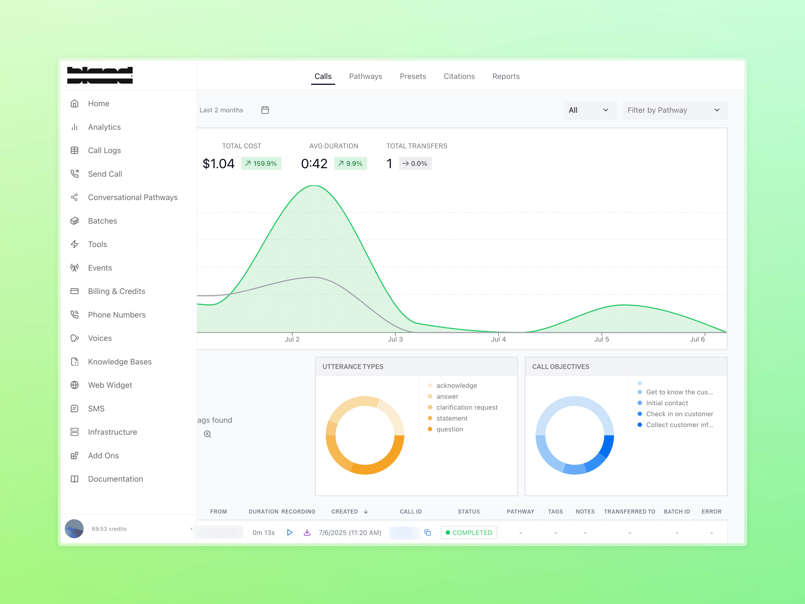

### SIP Outbound Calling (Enterprise)

Bland now supports outbound SIP, allowing you to route outbound calls through your own SIP provider.

- Configure routes using our `/sip` API endpoints
- Works with standard SIP providers and enterprise telephony systems
- Available to Enterprise customers only — contact support to enable access

Use our API to attach, verify, update, and detach SIP routes. Full details—including schema definitions, security requirements, and usage patterns—are available in our [SIP setup guide](/enterprise-features/SIP-integration).

---

### Global Navigation Redesign

We’ve begun rolling out a visual and structural update to Bland's global UI.

- New sidebar, top bar, and bottom bar components
- Updated buttons, tabs, and layout patterns with our refreshed designs
- Not final! More polish, hierarchy work, and tokenization is coming

This is a **foundational update**—setting the stage for a more modern and unified design experience across the platform.

<Tabs>
  <Tab title="After - Settings">

  </Tab>
  <Tab title="Before - Settings">
    
  </Tab>
  <Tab title="After - Analytics">
    
  </Tab>
  <Tab title="Before - Analytics">
    
  </Tab>
</Tabs>
---

### Improvements

- Fixes issue with phone number drift in OTP auth for international numbers
- Adds call status to the CSV export from the calls page
- Fixes voice name mismatch between FE and actual call voice
- Enforces personal BYOT geo-permissions for blocking inbound/outbound calls from banned countries
- Fixes test case error where status was not being updated on failed tests
- Adds "..." silence markers to chat history to support better prompting UX
- Fixes to improve OTP submission success rate on login
