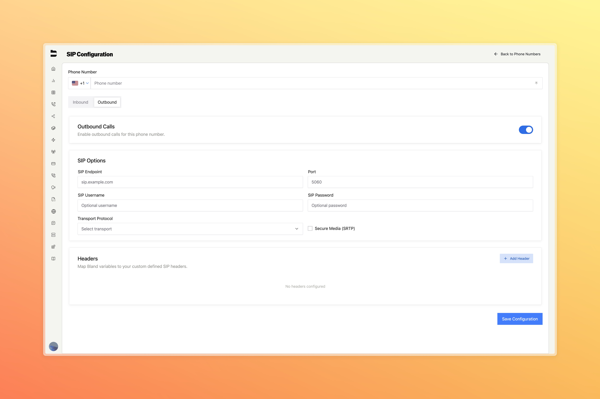

### SIP Configuration UI (Enterprise)

A new interface is now available under **Phone Numbers → Add Existing Phone Number** for managing SIP numbers directly from the dashboard.

- View and edit SIP routes without using the API
- Configure SIP endpoint, port, transport protocol, and credentials
- Enable Secure Media (SRTP) and add custom SIP headers mapped to Bland variables

This dashboard simplifies outbound SIP configuration for Enterprise users.

If you are an Enterprise customer and you would like to use this feature, contact support to enable access.

---

### Citations Enhancements (Enterprise)

Enterprise orgs can now:
- Attach multiple citation schemas to a call
- Run citation backfills on historical calls
- Add descriptions to categorical variables for better clarity

These updates make it easier to manage and interpret insights from your enterprise calls.

---

### Improvements

- Fixed an issue where selecting a citation schema on the phone number UI did not include the schema ID in the post-call webhook payload.
- You can now filter and search for Twilio numbers when adding or managing them in the Add-Ons page.
- Fixes edge case where certain outbound calls were exceeding their preset maximum duration.
- Fixes error preventing background audio from being attached to inbound phone numbers.
- A new Copy Link button has been added to the Selected Call view for quickly sharing call URLs from the logs page.
