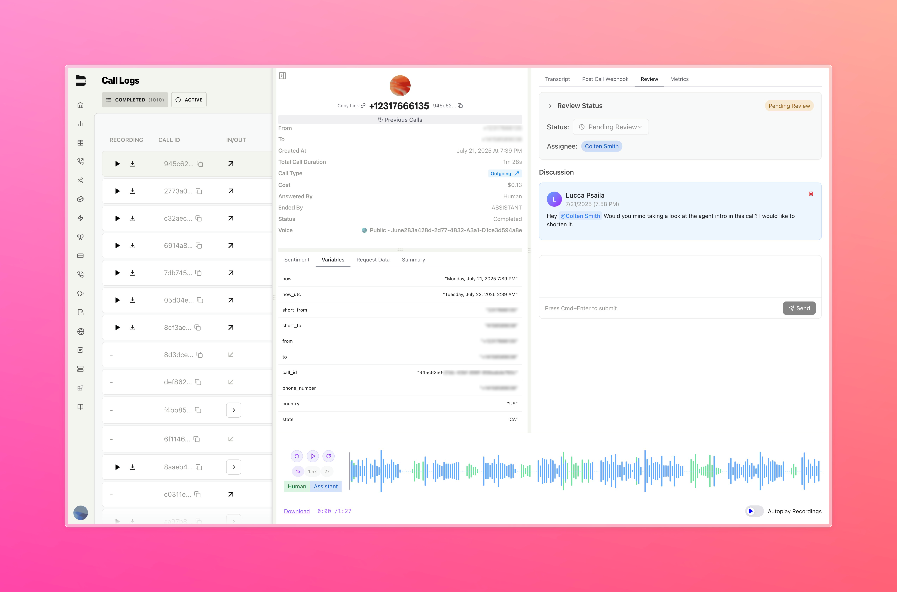
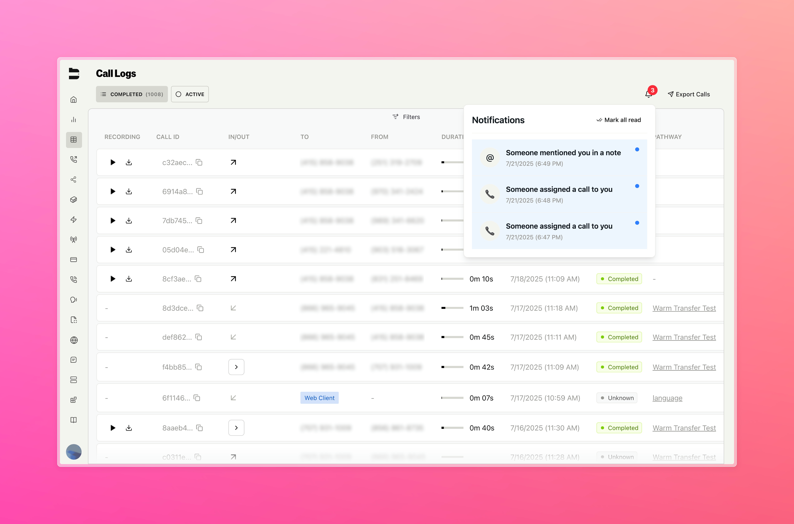
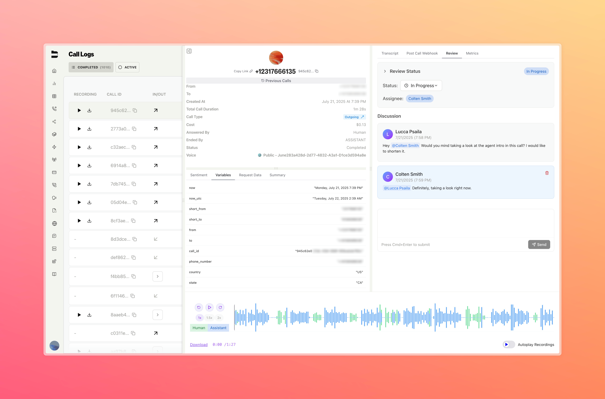
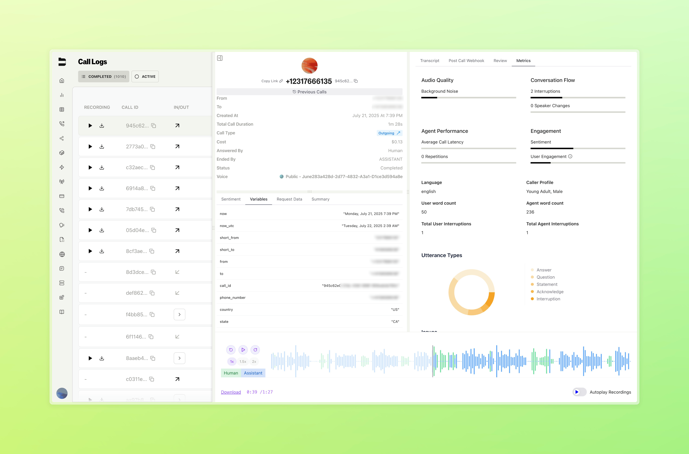
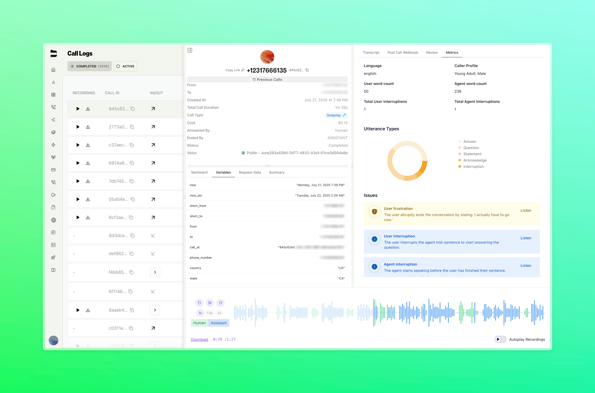

### Call Reviewing System (BLA-3413)

You can now review calls directly in the Bland call logs, making it easier for teams to work together on call analysis and uphold quality standards.

**Key Features:**
- **Review Status**: Mark each call with a status like "Pending Review," "In Progress," "Completed," or "Not Needed" to keep track of progress.
- **Review Assignments**: Assign calls to specific team members to keep the quality control process organized and efficient.
- **Discussions**: Start or join a discussion thread on any call to add notes and share feedback.
- **Mentions**: Tag teammates using @mentions to bring them into call reviews and discussions. Assigned calls and mentions show up as notifications on the call logs page for the relevant user.

<Tabs>
  <Tab title="Assigning a Review">

  </Tab>
  <Tab title="Notifications">

  </Tab>
  <Tab title="In Progress">

  </Tab>
</Tabs>

---

### Call Metrics Dashboard (BLA-3448)

We’ve added a new tab in the call logs that gives you deeper insights into call performance and quality.

Now you can easily access detailed metrics on audio quality, conversation flow, engagement, and any call issues—all in one place. These insights help you better understand and optimize your agents’ interactions.

It’s simple to spot calls that need attention, jump right into the recordings, and dig into the details to help your team improve.

<Tabs>
  <Tab title="Call Metrics">

  </Tab>
  <Tab title="Call Metrics">

  </Tab>
</Tabs>

---

### Improvements

- (BLA-3295) A [new PATCH endpoint](/api-v1/patch/sms-conversations-id) allows you to update SMS conversation properties, including the ability to activate or deactivate conversations programmatically.
- (BLA-3261) Phone number labels now extend to the SMS dashboard for easier use case organization.
- (BLA-2480) Enterprise organization owners can now bypass the standard 3-organization limit, allowing greater flexibility in managing multiple organizations.
- (Calvin/list call limit #5758) The [list calls endpoint](/api-v1/get/calls) now has a maximum limit of 1000 calls.
- (ADMIN-666) Temporarily removed the live listen feature while we implement significant improvements to enhance reliability and user experience.