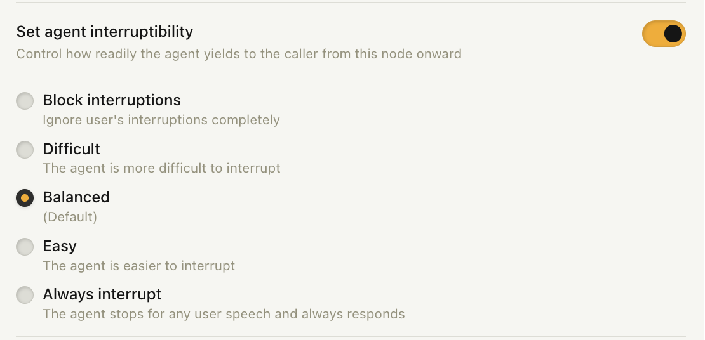
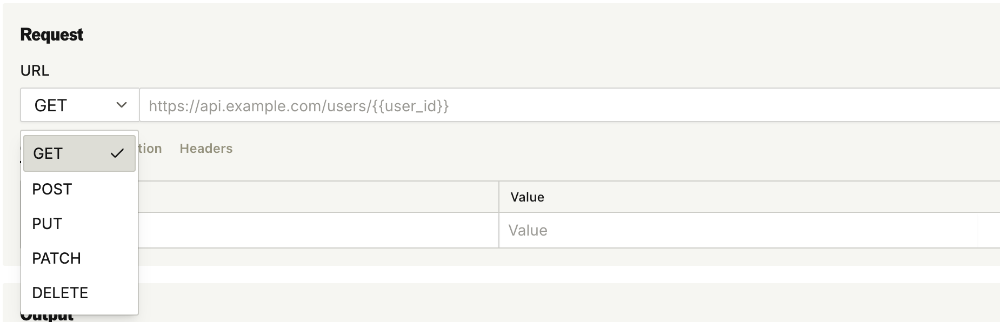

### Agent Speech Timing: Interruptibility & Resumption Speed

Two controls now shape your agent's conversational timing: how readily it yields when a caller talks over it, and how quickly it responds once the caller stops. Set them per node, on inbound numbers, or in the [Send Call API](https://docs.bland.ai/api-v1/post/calls); see the [Agent Speech docs](/tutorials/agent-speech) for a full guide.

- Interruptibility now spans five levels, from "Block interruptions" up to a new "Always interrupt", with the middle levels relabeled Easy, Balanced, and Difficult
- The new Resumption Speed setting (Slow, Medium, Fast) sets how long the agent waits after the caller finishes before responding
- Node-level settings persist for the rest of the call unless overridden; defaults are unchanged

---

### Status Code Routing on the Scheduling Node

Scheduling nodes now support the same deterministic "Pathway After API Request Response" routing as Webhook nodes.

- Route to a specific node based on the response status code or extracted response fields
- Unmatched responses keep the caller in the node, so the booking flow continues

---

### Custom API Tools: PUT, PATCH, and DELETE

The Custom API tool builder now supports all five REST verbs, so tools can update and delete records in external systems, not just read and create them.

- PUT, PATCH, and DELETE work across tool creation, editing, test runs, and cURL import
- JSON body validation errors surface before you save instead of failing on a live call

---

### Improvements

**Pathways**
- Pathway logs label node tool calls as "Tool Call" with the tool's name instead of a generic "Webhook" entry, and unmet loop conditions show "Condition not met" instead of a red failure
- Node tools trigger reliably when the agent drops a tool's trailing annotation tag, and unmatched tool calls are logged as clear errors instead of failing silently
- The Reset STT Language node is now available to all organizations

**Evals**
- Large [eval](https://app.bland.ai/dashboard/evals) runs now complete reliably at any size, and verdicts display for every call in runs larger than 100 calls

**Telephony**
- [Enterprise] Talkdesk and NICE CXone are now supported BYOC SIP providers

**Organization & Security**
- Invite teammates by email as well as phone; invitees get a sign-up link and join your organization automatically
- [Enterprise] SSO providers can now be edited in place, so you can rotate an expiring client secret or certificate without recreating the provider.

**Billing**
- Checkout on the [billing page](https://app.bland.ai/dashboard/pay) now runs inline with clearer purchase errors, you can manage or cancel individual phone number subscriptions directly, and double-clicks can no longer trigger duplicate purchases

**Personas**
- Personas can now define voicemail behavior: hang up, ignore, leave a message, or send an SMS

**Automations**
- The Send Call action within automations can attach custom metadata to calls, included in the post-call webhook for every status (including no-answer) so you can correlate webhooks to your records

**Messaging**
- SMS log exports now include a metadata column

**Agent Testing**
- Run a scenario N times to see a success rate, and runs that fail before the first turn get a "Failed to start" badge
