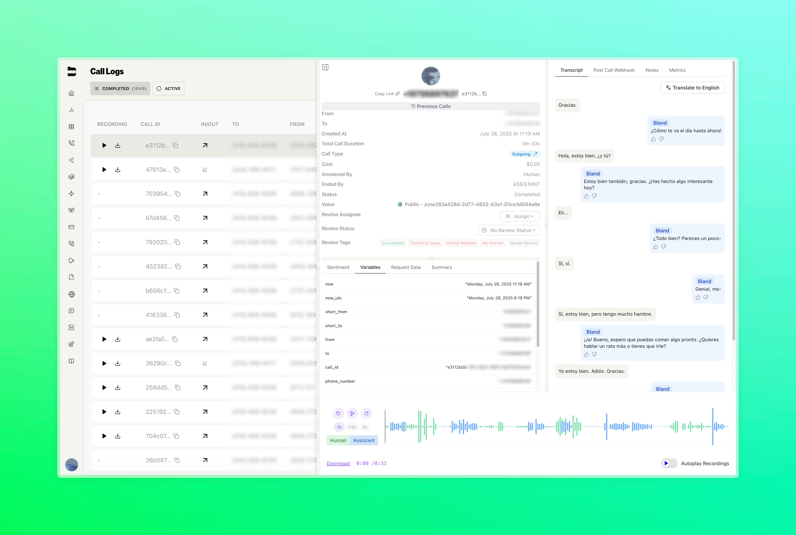

### PCI Compliance Recording Controls

You can now disable recording and logging at the node level within your conversation pathways for PCI compliance scenarios.

**Key Features:**
- **Node-Level Control**: Configure specific nodes to automatically disable recording when handling sensitive data
- **Automatic Toggle**: Recording and logging automatically resume when conversations exit protected nodes

---

### Translate Button

Call transcripts can now be translated to English with a single click in your call logs.

**Key Features:**
- **Auto-Detection**: Automatically detects when call transcripts contain non-English content
- **One-Click Translation**: Simple translate button appears in transcript views when needed

<Tabs>
  <Tab title="Before">
    
  </Tab>
  <Tab title="After">
    
  </Tab>
</Tabs>

---

### Improvements

- Added the ability to backfill existing calls with updated citation schemas, allowing you to apply new data extraction rules to historical conversations
- Improved general settings page, specifically recording preferences and quality control tags
- Improved web widget, preventing CSS and JavaScript conflicts with customer websites for more reliable integrations
- General improvements to the secrets interface design