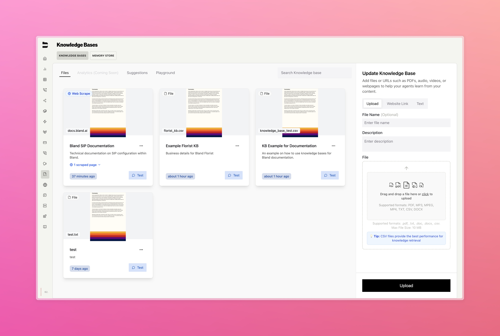
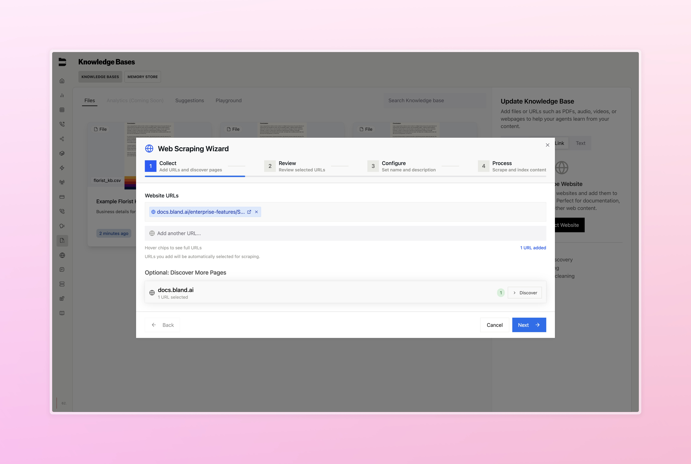
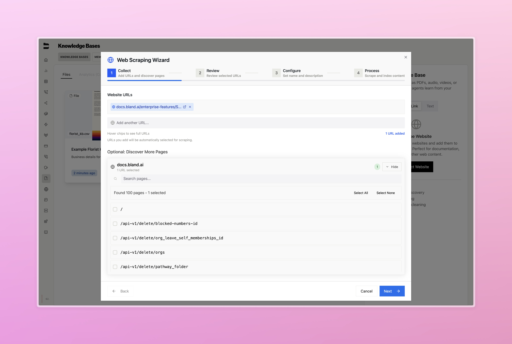
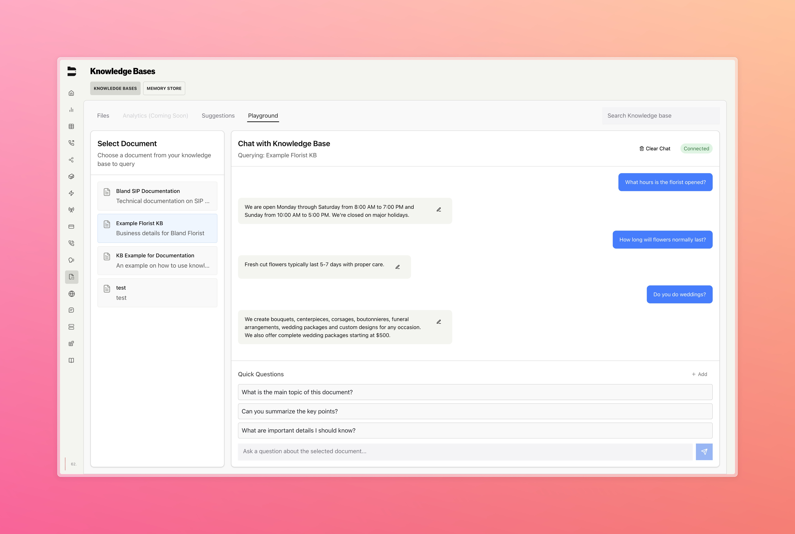
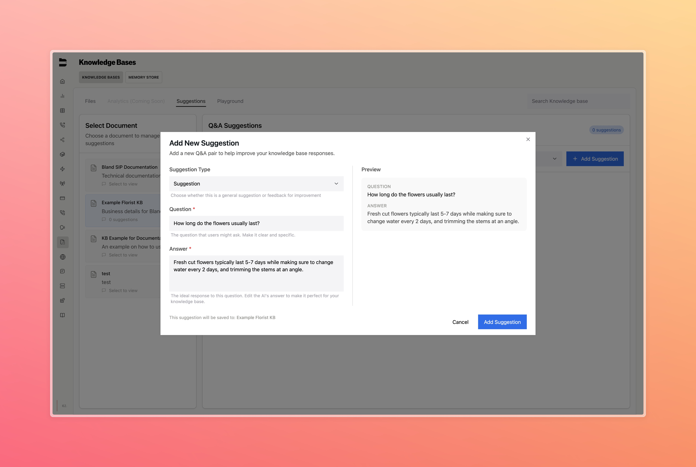

### Knowledge Base Overhaul

We've completely redesigned our knowledge base experience with a modern interface and powerful new capabilities for managing your AI agent's knowledge.

**Key Features:**
- **Redesigned Interface**: Clean, intuitive UI that makes knowledge base management effortless
- **Web Scraping**: Automatically collect content from websites and domains to build comprehensive knowledge bases
    - **Discover URLs**: Automatically scrape additional pages found nested with the same base URL
- **Playground Mode**: Test and understand your knowledge base queries in real-time before deployment
- **Suggestions System**: Add suggestions and feedback to your knowledge base to help optimize your agent's responses

<Tabs>
  <Tab title="Knowledge Bases">
    
  </Tab>
  <Tab title="Web Scraping">
    
     
  </Tab>
  <Tab title="Playground">
     
  </Tab>
  <Tab title="Suggestions">
     
  </Tab>
</Tabs>

[Example CSV used above](../changelog_assets/08_04_2025/florist_kb.csv)

---

### Improvements

- Resolved warm transfer proxy agent testing issues, including fixes to the input dropdown and improved call experience
- Enhanced call logs interface with a wider display, improved table design, and better status indicators for easier call management
- Added indicator to test pathway chat to show when testing in a pathway version other than the one you are currently viewing
- Fixed web widget reset functionality, resolving issues where widgets were unable to reset properly
- Added post-dial DTMF support for warm transfer scenarios, improving integration with phone systems that require dial-through codes

---

### Model Context Protocol Integration

We are excited to share that our documentation is now available through AI systems using Mintlify's new Model Context Protocol (MCP) integration. This makes it easier than ever to get help with Bland AI right from your favorite AI tools.

With this integration, you can ask AI assistants questions about Bland AI's features, API endpoints, or implementation details, and they will have real-time access to our full documentation to give you accurate and current answers.

**Key Features:**
- **AI-Accessible Documentation**: All public Bland AI documentation is now available through MCP at `https://docs.bland.ai/mcp`
- **Intelligent Search**: AI systems can search and query our documentation in real-time
- **Cross-Platform Support**: Works with Claude, Cursor, and other MCP-compatible AI tools

**How to Use:**
1. **In Claude**: Add our MCP server by configuring `https://docs.bland.ai/mcp` in your connectors settings
2. **In Cursor or Other Tools**: Look for MCP settings, where you can add a custom configuration
3. **Direct Access**: AI systems can now search our docs, explain concepts, and help with implementation directly

See more details [here](https://mintlify.com/docs/ai/model-context-protocol).