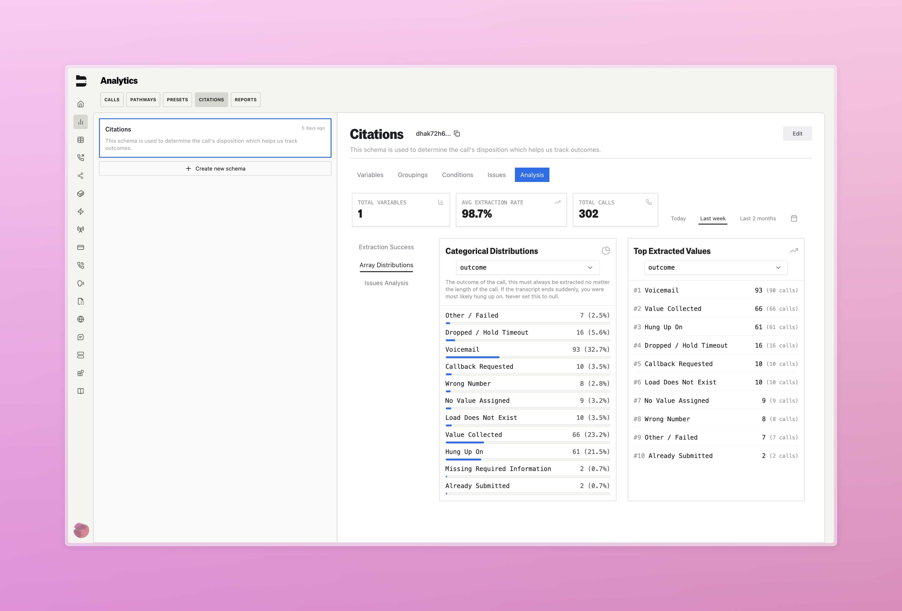

### Citations Enhancements (Enterprise)

Citations now offer a broader range of capabilities, making them a far more effective resource for analyzing call quality and detecting issues automatically.

**Key Features:**
- **Subjective QA Support**: Ask broader, subjective questions like "Did the agent remain polite throughout the call?" with confidence-based answers
- **Audio-Aware Analysis**: Citations now use the actual call audio, not just transcripts, to analyze tone, sentiment, background noise, and other audio-specific details
- **Automatic Issue Flagging**: New Call Metrics automatically flag calls with varying degrees of issues. You can now hook up your citations to this flagging system under the new Issues tab in the Citations page, where you can configure issue flags depending on citation variable results
- **Enhanced Filtering**: Filter call logs by citation outcomes and issue severity levels for better call management
- **Refreshed Analytics**: Updated citations analysis interface and issue trends integrated into Call Analytics timeseries charts
- **Export Citations**: Citation details now included in call log exporting

---

### Improvements

- Improvements to accuracy of warm transfer hold timeout
- Improved multi-lingual translation scenarios in call transcipts
- Improved fine tuning UI in pathways
- Fixed UI bug that allowed creation of duplicate pathways
- Extended button press node to allow for pathway variable handling