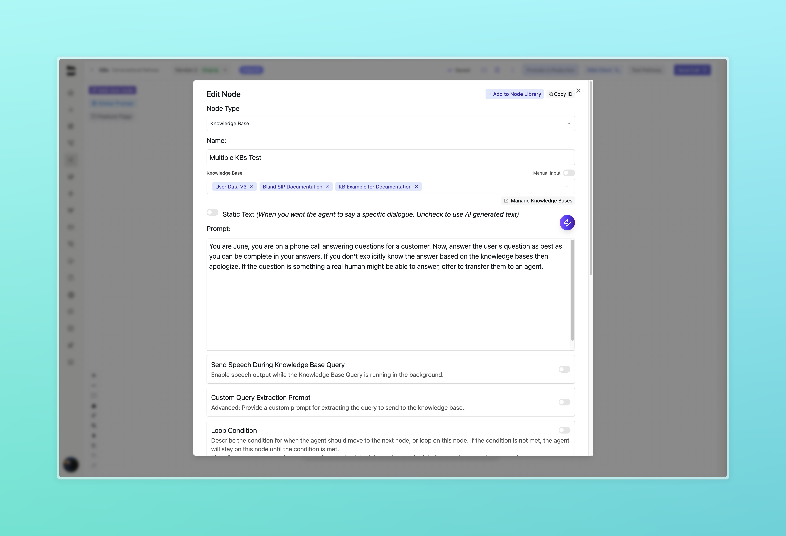

### Live Translation for Warm Transfers [Enterprise]

With live translation enabled, Bland agents stay in warm transfer calls and act as real-time translators between both parties. 

For example, when User A speaks Spanish, it's played through User B's phone while the Bland agent simultaneously translates it to English for User B. When User B responds in English, the agent translates it back to Spanish for User A, creating seamless cross-language communication.

<video 
  controls
  style={{ width: "100%", borderRadius: "0.5rem", marginTop: "1rem", marginBottom: "1rem" }}
  src="../changelog_assets/09_02_2025/live_translate_demo2.mov"
>
  <track kind="captions" />
</video>

We currently support 23 languages:
- Spanish (es)
- English (en)
- Arabic (ar)
- Hindi (hi)
- German (de)
- Italian (it)
- Czech (cs)
- French (fr)
- Romanian (ro)
- Tagalog / Filipino (tl)
- Portuguese (pt)
- Polish (pl)
- Swedish (sv)
- Finnish (fi)
- Russian (ru)
- Danish (da)
- Greek (el)
- Mandarin Chinese (zh)
- Indonesian (id)
- Japanese (ja)
- Korean (ko)
- Dutch (nl)
- Turkish (tr)

Feel free to try it out for youself in your transfer node configuration!

---

### Multiple Knowledge Bases

Pathway nodes now support attaching multiple knowledge bases simultaneously. This enables agents to leverage different knowledge sources that apply to specific conversation points, or dynamically shift the number of KBs based on conversation context. Your agent will use the combined context from all attached knowledge bases when generating responses, providing more comprehensive and accurate information.

---

### Improvements

- Re-implemented live listen functionality for real-time call monitoring
- Improved reliability when stopping live Bland calls
- Added SAML support for SSO authentication, providing enterprise-grade single sign-on capabilities [Enterprise]
- Enhanced warm transfer proxy agent handling for failed connections [Enterprise]
- Route selection latency optimizations for longer route names (4+ words)
- Improved SMS conversation timeout reliability [Enterprise]
- Knowledge Bases:
  - Improved web scraping reliability and efficiency
  - Enhanced KB creation wizard
  - Updated styling and animations across interfaces
  - Fixed playground UI issues
- Added soft validation for webhook response variables to warn users about syntax errors
- Fixed broken styling on route node dropdowns
