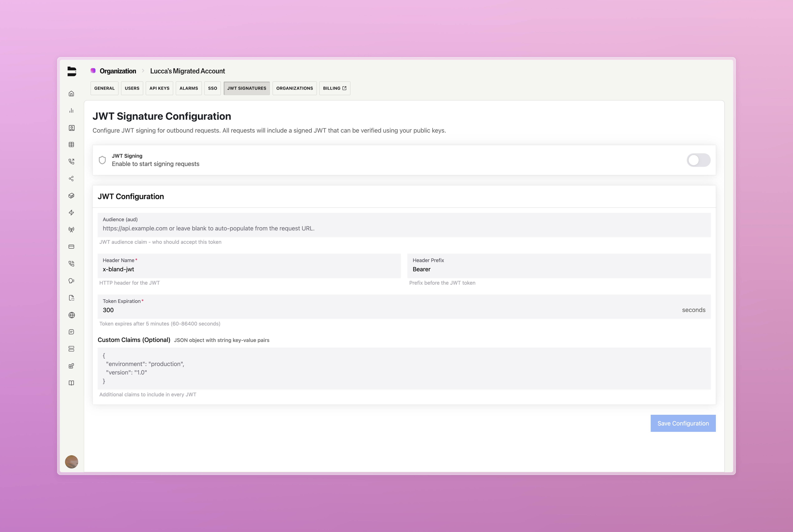
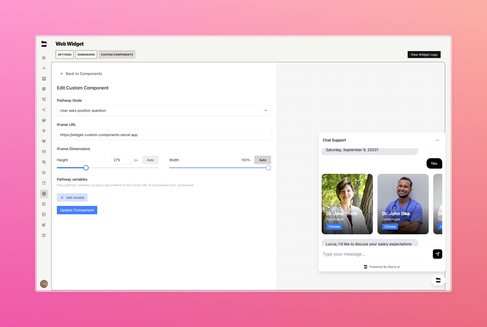

### JWT Signature Configuration [Enterprise]

Protect your webhook and API integrations with JWT authentication. Our new asymmetric JWT signing gives you cryptographic proof that requests are genuine, helping keep out unauthorized access and block replay attacks.

**Key Benefits:**
- **Zero-trust security**: Eliminates shared secret vulnerabilities with public key verification
- **Automatic protection**: Built-in token expiration and unique identifiers prevent replay attacks  
- **Seamless rotation**: Update keys without service disruption
- **Enterprise ready**: Minimal configuration for maximum security

All outbound requests now include signed JWTs that you can verify using your public keys through our JWKS endpoint, so you can be confident in request integrity.

Learn more about implementation in our [JWT Authentication documentation](https://docs.bland.ai/enterprise-features/jwt-authentication).

---

### Custom Widget Components

Now you can easily build custom, interactive components into your web widget agents. These can be tweaked for any use case, giving your users a more lively and personalized experience every time.

  <iframe 
    src="https://www.youtube.com/embed/TpckZwdnCRQ" 
    title="Web Widget Components Demo"
    frameborder="0" 
    allow="accelerometer; autoplay; clipboard-write; encrypted-media; gyroscope; picture-in-picture; web-share" 
    allowfullscreen
    style={{ position: "absolute", top: 0, left: 0, width: "100%", height: "100%", borderRadius: "0.5rem" }}
  ></iframe>

---

### Improvements

- Fixed pathway showcase functionality when submitting new pathways  
- Resolved issue preventing secret deletion in settings
- Implemented start node fallback handling for missing nodes
- Enhanced custom code node UI for better user experience [Enterprise]
- SMS platform improvements:
  - Fixed sorting for last_message_at timestamps
  - Added pathway tags to SMS sidebar
  - Improved dashboard timestamp display accuracy