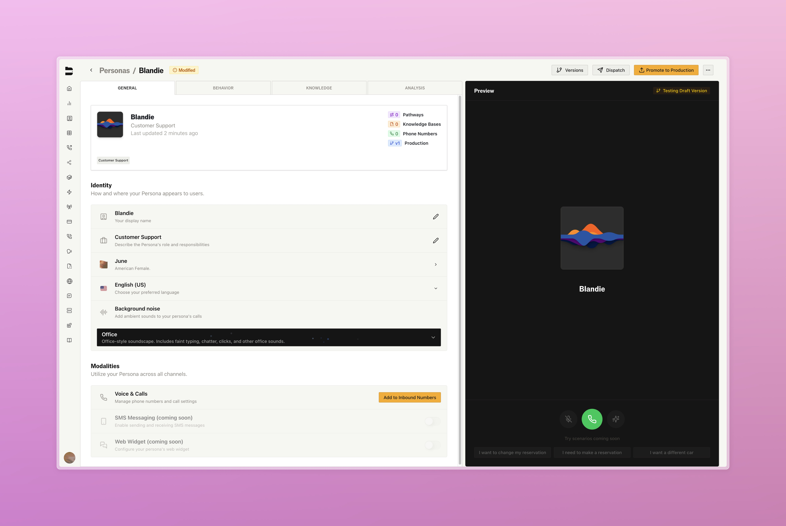
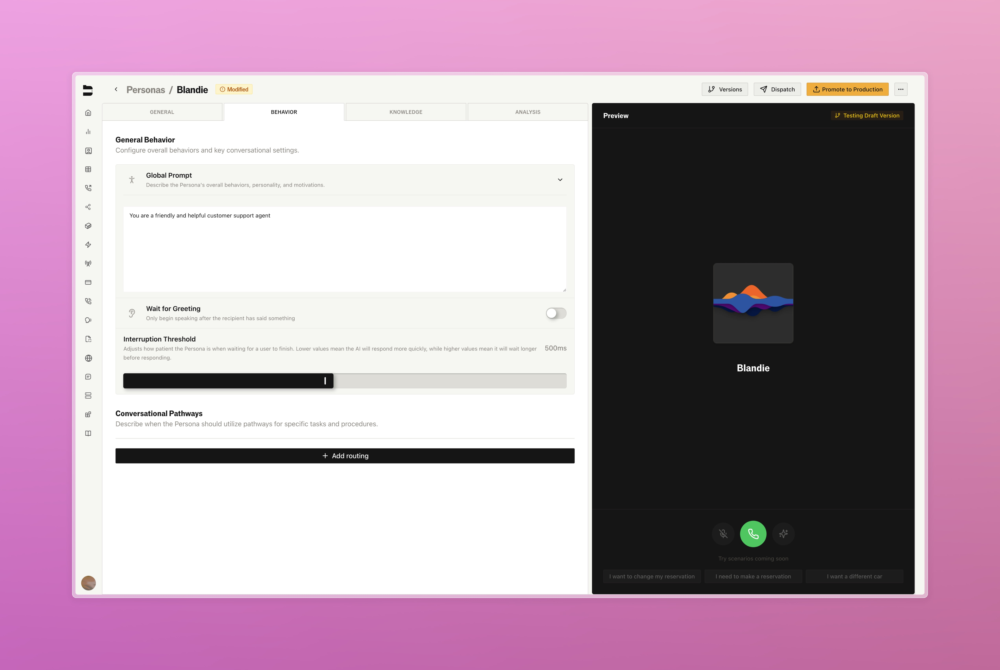
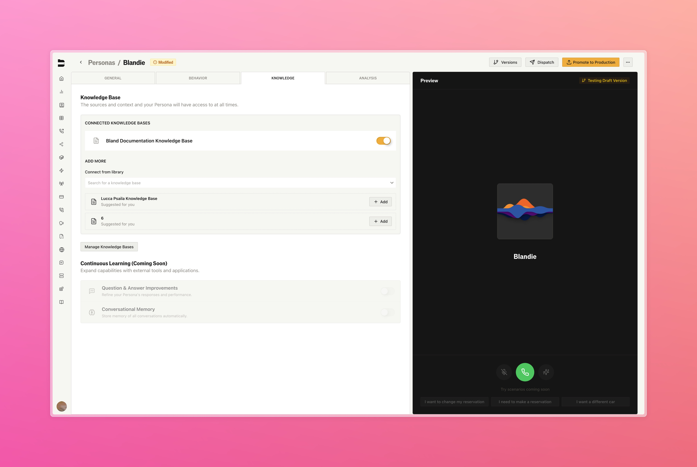
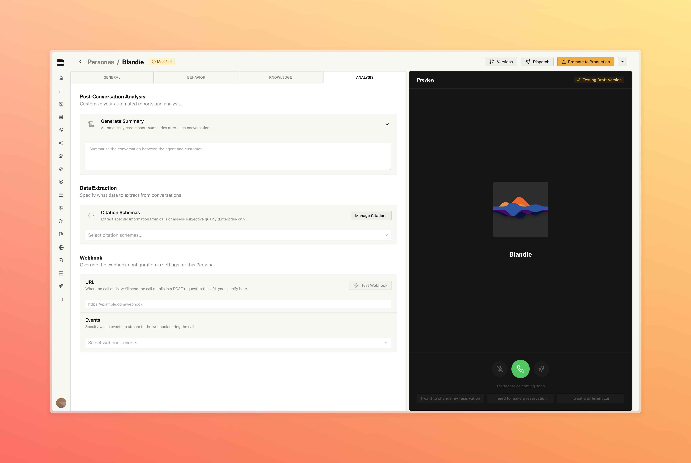
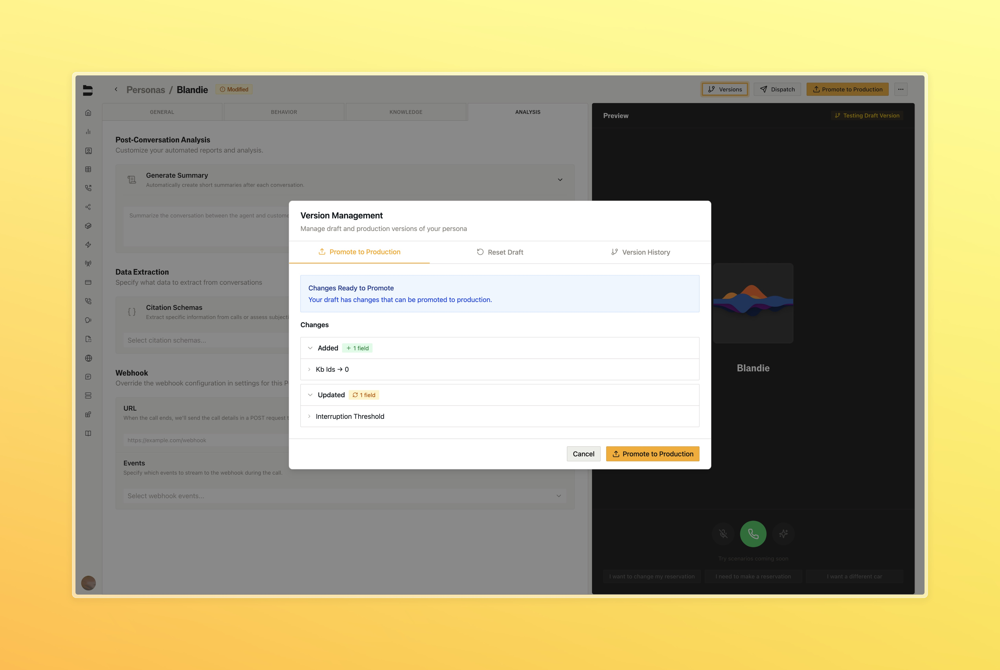

### Personas Builder & Gallery

Create a single intelligent agent that manages all your phone numbers and use cases. Instead of configuring each phone number separately, build one persona that handles everything, from routing calls to maintaining consistent personality.

**Key Features:**
- **Smart Routing**: Personas automatically direct calls to the right pathway based on what customers say
- **Visual Builder**: Design your agent's identity, voice, and behavior in one place
- **Live Testing**: Chat with your persona before going live to test changes
- **One Agent, Multiple Numbers**: Use the same persona across all your phone numbers

**Why It Matters:**
No more setting up the same prompts and settings repeatedly. Your persona learns context - when someone mentions billing, it routes to your billing pathway automatically. Build once, use everywhere.

<Tabs>
  <Tab title="General">
    
  </Tab>
  <Tab title="Behavior">
    
  </Tab>
  <Tab title="Knowledge">
    
  </Tab>
  <Tab title="Analysis">
    
  </Tab>
  <Tab title="Versioning">
    
  </Tab>
</Tabs>

  <iframe 
    src="https://www.loom.com/embed/d3d9a4473c6f48f88fd067a6e33f8619" 
    title="Personas Demo"
    frameborder="0" 
    allowfullscreen
    style={{ position: "absolute", top: 0, left: 0, width: "100%", height: "100%", borderRadius: "0.5rem" }}
  ></iframe>

---

### Improvements

- Added new [SMS analyze endpoint](/api-v1/post/sms-analyze#body) for conversation insights [Enterprise]
- Enhanced SMS conversation creation and handoff from previous SMS conversations [Enterprise]  
- Support for pathway positioning with `curr_pathway_id`, `curr_pathway_version`, and `current_node_id` in the [SMS create endpoint](/api-v1/post/sms-create#body-parameters) [Enterprise]
- [Pathway chat endpoints](/api-v1/post/pathway-chat#body) now support dynamic variables and request data for more flexible conversations
- Adjust error handling for minimum transcript length requirements with [corrected transcript endpoint](/api-v1/get/calls-corrected-transcript) (1.5 seconds minimum)
- Post cal webhooks can now be delayed to include citation responses and corrected transcripts. See citations dashboard for configuration. [Enterprise]
- Adding `transfer_time` value in post call webhook to show how long agent spoke before transferring calls  
- Press '0' during agent calls to toggle live translation on/off [Enterprise]
- Lowered speech-over-speech volume during live translation for clearer communication [Enterprise]
- Improved initial dialogue generaion for proxy agents during agent briefings in warm transfer to have more consistent context on original call [Enterprise]
- Resolved minor bug with stop call API endpoint requirements
- UI now properly reflects default production pathway version when no version is specified
- Resolved text box issues with custom knowledge base query string handling in KB nodes

