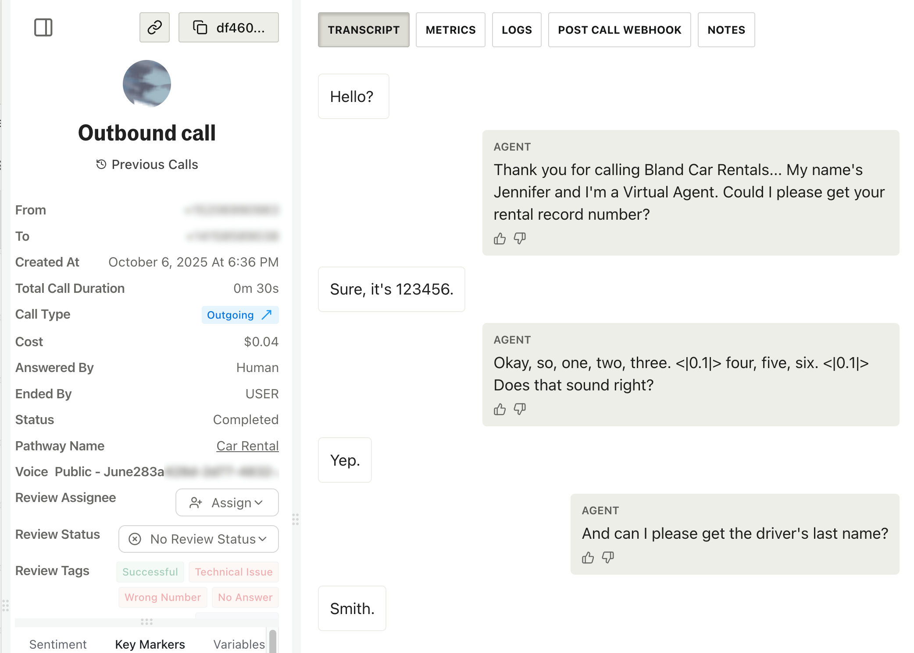
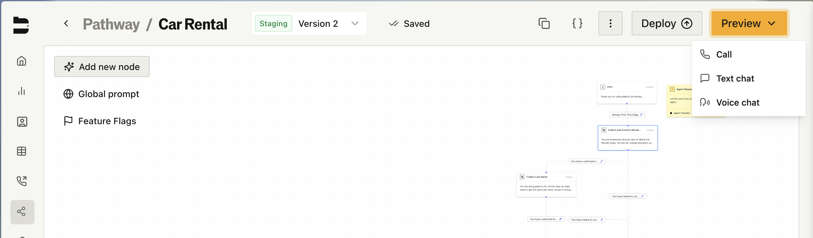
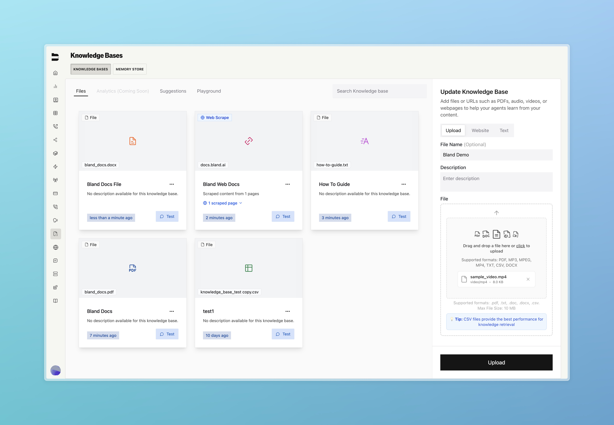

### Improvements

**Voice & Audio**
- [Enterprise] Enhanced voice pronunciation with automatic currency conversion for more natural speech patterns. Read more about it [here](https://www.bland.ai/blogs/how-bland-is-fixing-the-biggest-flaw-in-ai-voices)! ([GitHub #6920](https://github.com/CINTELLILABS/SERVER/pull/6920))
- Enabled audio-based variable extraction to capture voice qualities, tonal variations, and audio characteristics during calls. Audio extraction uses a model that can understand audio directly. Instead of going through an intermediate text-to-speech step, it can use the much more information-dense audio in order to extract variables ([GitHub #6855](https://github.com/CINTELLILABS/SERVER/pull/6855))

**Call Logs & Filtering**
- Fixed call filtering to include calls not linked to any pathway when using "NOT" operator filters ([GitHub #6805](https://github.com/CINTELLILABS/SERVER/pull/6805))
- Enhanced call log export functionality with support for additional filtering options and improved reliability ([GitHub #6966](https://github.com/CINTELLILABS/SERVER/pull/6966))
- Added pre and post transfer duration fields to call export data for better call analytics ([GitHub #6963](https://github.com/CINTELLILABS/SERVER/pull/6963))
- Refreshed call logs interface with improved visual design for better user experience ([GitHub #1656](https://github.com/CINTELLILABS/FRONTEND/pull/1656))

<Accordion title="View call logs interface improvements">
  
</Accordion>

**Pathways & Routing**
- Improved route condition handling with automatic parsing of boolean and null values for more reliable pathway logic ([GitHub #6933](https://github.com/CINTELLILABS/SERVER/pull/6933))
- Improved custom components visibility on web widget start nodes for consistent display ([GitHub #6953](https://github.com/CINTELLILABS/SERVER/pull/6953))
- Resolved Pathway topbar overflow issues for a cleaner, more consistent interface ([GitHub #1651](https://github.com/CINTELLILABS/FRONTEND/pull/1651))

<Accordion title="View pathway topbar improvements">
  
</Accordion>
- Resolved voice overlay display issues in pathway chat interface ([GitHub #1649](https://github.com/CINTELLILABS/FRONTEND/pull/1649))
- Improved error handling when deleting pathways to prevent unexpected failures ([GitHub #1642](https://github.com/CINTELLILABS/FRONTEND/pull/1642))

**Personas & Settings**
- Added maximum call duration configuration in persona settings for better call management ([GitHub #1653](https://github.com/CINTELLILABS/FRONTEND/pull/1653))

**Knowledge Base**
- Clearer visuals for uploaded files in the knowledge base, including better file type identification ([GitHub #1638](https://github.com/CINTELLILABS/FRONTEND/pull/1638))

<Accordion title="View knowledge base file type improvements">
  
</Accordion>

**SMS Features**
- Resolved issues with SMS number configuration updates across Pathway and Objective settings ([GitHub #1659](https://github.com/CINTELLILABS/FRONTEND/pull/1659))
- Added request data variable support to SMS testing for more comprehensive coverage ([GitHub #1634](https://github.com/CINTELLILABS/FRONTEND/pull/1634))
- Enhanced SMS filtering with "last message at" timestamp filtering ([GitHub #1631](https://github.com/CINTELLILABS/FRONTEND/pull/1631))
