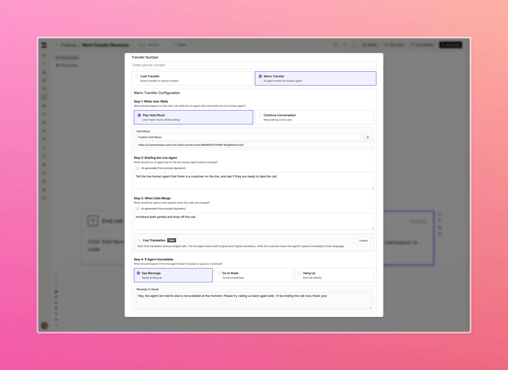

### Improvements

**Voice & Audio**
- Improved voice cloning UI with enhanced form validation and loading indicators
- Changed the default call interruption threshold to 500ms. Our Solutions and Core Engineering teams have tested this over months and found 500 ms to be a more appropriate default, leading to more natural pauses and improved handling of speech delays.

**Knowledge Base & Web Scraping**
- Added animated loading indicators for web scraping in knowledge base UI

**SMS Features**
- Added candidate model support for SMS conversations
- Introduced message IDs for SMS conversations

**Web Agents**
- Added [webhook events](/api-v1/post/calls#param-webhook-events) support to web agents

**Personas**
- Improved persona UI and animations with new avatars
- Fixed max call duration slider in personas view

**Call Logs**
- Fixed bug where call log filters reset after playing recordings
- Added draggable columns to call logs

**Pathways**
- Improved warm transfer node configuration UI

<Accordion title="View warm transfer UI improvements">
  
</Accordion>

- Removed block interruptions option for prompt-based calls
- Fixed custom tool dropdown overflow in pathway UI

**API & Development**
- Improved typing for custom tool API variable and response extraction

**Call Management**
- Improved error handling when starting calls with negative credit balance