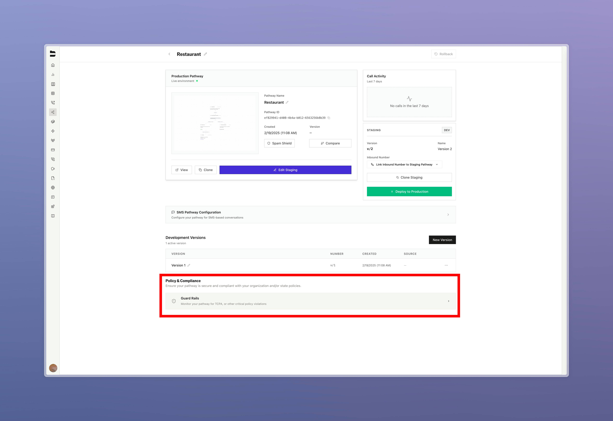
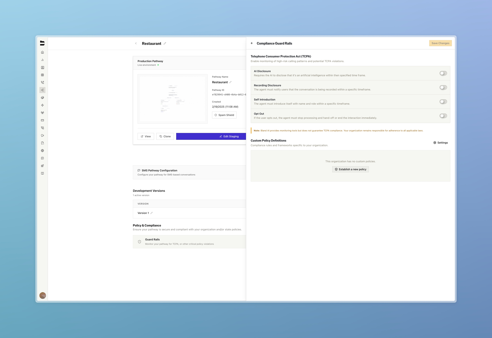
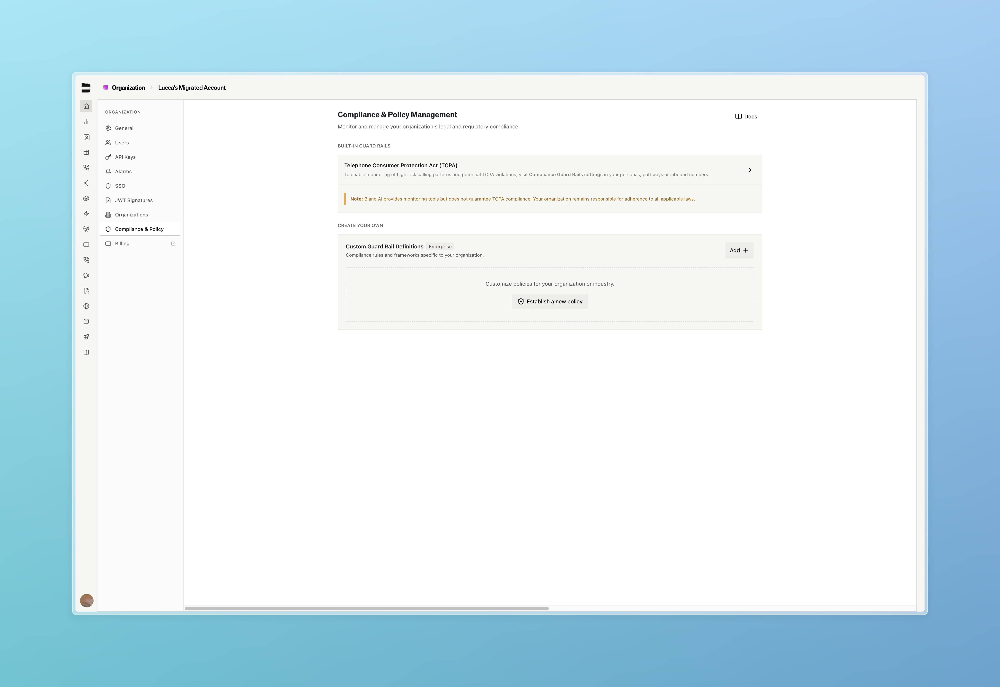
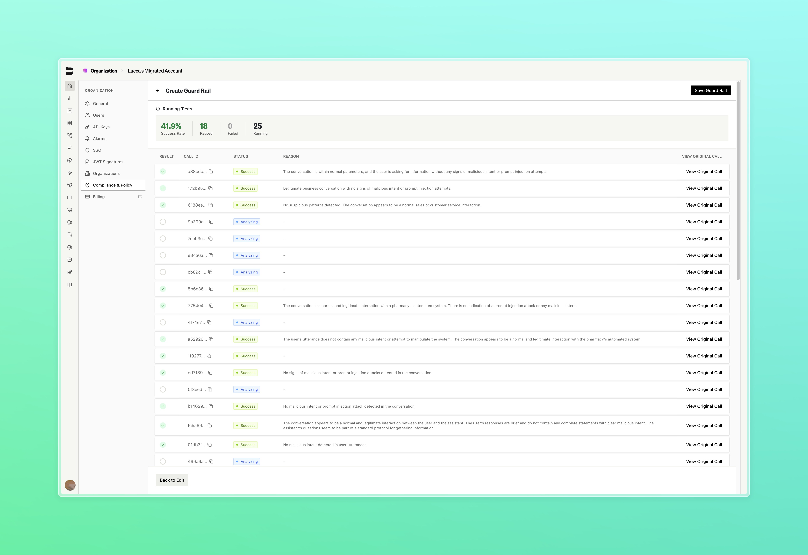

### Guard Rails [Enterprise]

Automatically monitor calls for non-compliant content

**Key Features:**
- **Automated Monitoring**: Detect and flag unwanted language or discriminatory content during calls in real-time
- **Compliance Protection**: Prevent potential compliance violations before they impact your business
- **Customizable Standards**: Set your own guidelines for what content should be flagged or blocked

Enterprise customers can now maintain consistent call quality and protect their brand reputation with automated monitoring that works behind the scenes.

<Tabs>
  <Tab title="Pathway Config">
    
    Configure guard rails directly form the pathway configuration page
  </Tab>
  <Tab title="Panel">
    
  </Tab>
  <Tab title="Management">
    
    Manage your guard rails from your settings page
  </Tab>
  <Tab title="Historical">
    
    Test guard rails against historical calls and view detailed output with trigger explanations
  </Tab>
</Tabs>

---

### Enhanced Voicemail Detection

We have made considerable improvements to our voicemail detection model, delivering enhanced accuracy and reduced false positives across calls.

**Key Features:**
- **Improved Accuracy**: Enhanced sensitivity for detecting frequent voicemail patterns with greater precision
- **Better Classification**: More reliable distinction between human answers and voicemail systems
- **Demo Portal**: Interactive testing portal at [evals.bland.ai](https://evals.bland.ai/) showcasing 98.7% detection accuracy, give it a try!

---

### Improvements

**Voice & Audio**
- Bug fixes and stability improvements to the voice studio and voice cloning process
- New and improved voices added to the Bland curated voice library, take a look [here](https://app.bland.ai/dashboard/voices)!

**Call Logs & Management**
- Added timezone selection for Created At date filters to improve filtering accuracy across different time zones

**Pathways & Routing**
- Enhanced pathway versioning with paginated archived versions view on pathway details page
- Added phone number extension support for cold transfer functionality. From the transfer node, you can now specify an extension to be used when transferring.

**API & Development**
- Fixed null disposition tag bug in post-call webhooks 
- Enhanced sidebar navigation with proper anchor tag rendering