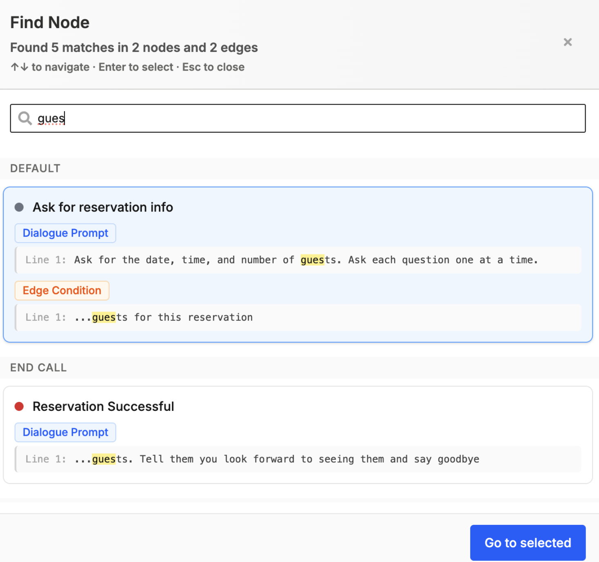

### [Knowledge Base Gaps](https://app.bland.ai/dashboard/knowledge-bases?tab=home)

Automatically detect when customers ask questions your current knowledge base can't answer, so your team can quickly find and fix the gaps

Key Features
- **Intelligent Gap Detection**: Automatically identifies unanswered questions during your calls and surfaces the specific scenarios and questions where your knowledge base falls short
- **Seamless Resolution Workflow**: Add missing information directly to your knowledge base through an integrated UI
- **Performance Analytics**: Metrics and reporting (coming soon) to track coverage improvements and agent effectiveness over time

This feature lifts agent performance by continuously sharpening the knowledge base. Agents start strong and, through ongoing gap detection and fixes, quickly handle a broader range of customer questions with more confidence

<iframe
  src="https://www.loom.com/embed/ed8e163d051c4f718a2525d06c8d0dca"
  frameBorder="0"
  webkitAllowFullScreen
  mozAllowFullScreen
  allowFullScreen
  style={{
    position: 'relative',
    top: 0,
    left: 0,
    width: '100%',
    height: '400px'
  }}
></iframe>

---

### Improvements

**Pathways & Routing**
- Added keyword search across pathway nodes to quickly find specific prompts, conditions, and content. Use Cmd+K to open the search modal in your pathway
  
- Fixed clone pathway version button that wasn't responding to clicks
- [Enterprise] Resolved dropdown issue in custom code modals that prevented changing node types

**Call Logs & Management**
- [Enterprise] Citations now display in call log details with line breaks for better readability
- [Enterprise] Improved citation reliability in list calls API endpoint
- Fixed scrolling issue when opening proxy calls from transferred calls
- Fixed UI error that would occur when filtering for "created at" timing in call logs
- Resolved pathway filtering issue that prevented selecting specific pathways when using the "in" operator

**Personas**
- Improvements to Personas, specifically phone attachment UX and webhook fix

**SMS Features**
- [Enterprise] Fixed bugs with the [SMS conversation analysis](/api-v1/post/sms-analyze) endpoint

**API & Development**
- Added support for `use_candidate_model` and `pathway_version` fields in [pathway chat creation](/api-v1/post/pathway-chat-create)
- Adds a retry for sensitive voicemail detection if no transcripts are found and increases SVD timer to 10 seconds instead of 5

**Voice & Audio**
- Added additional support for noise cancellation on babel