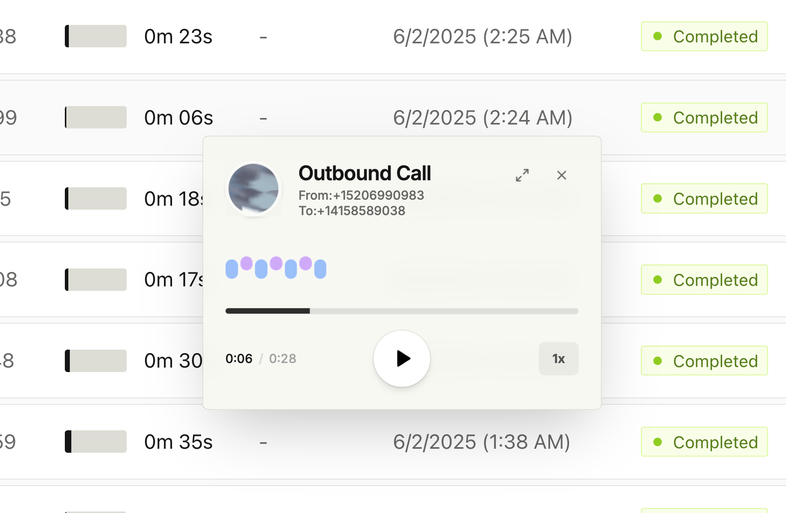
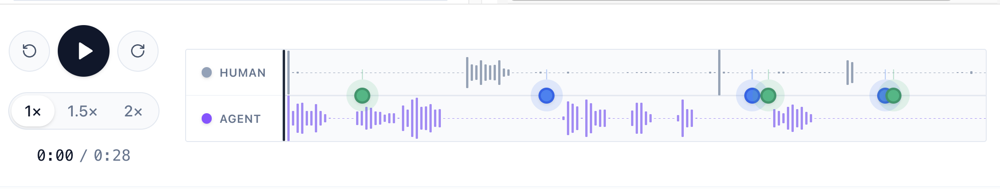
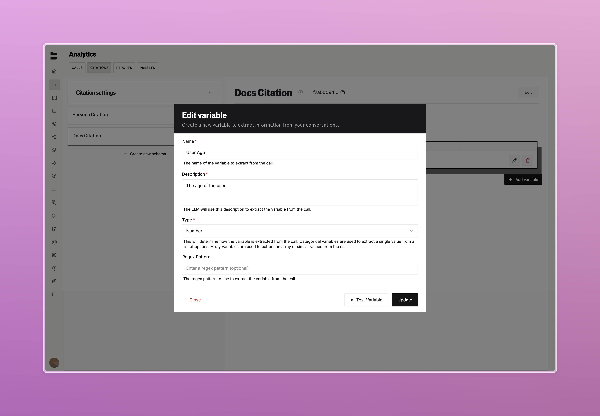
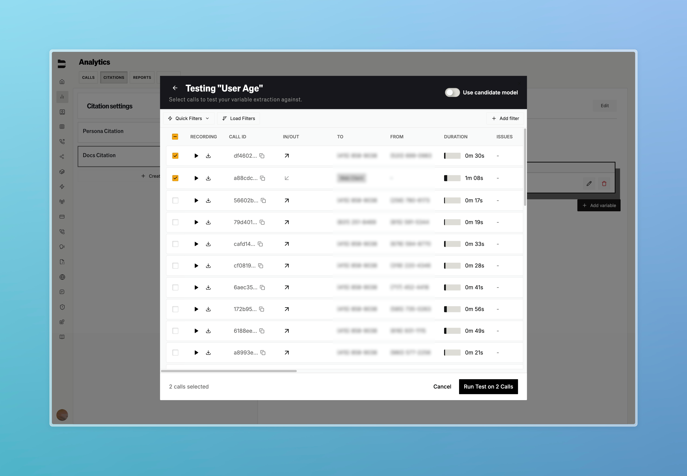
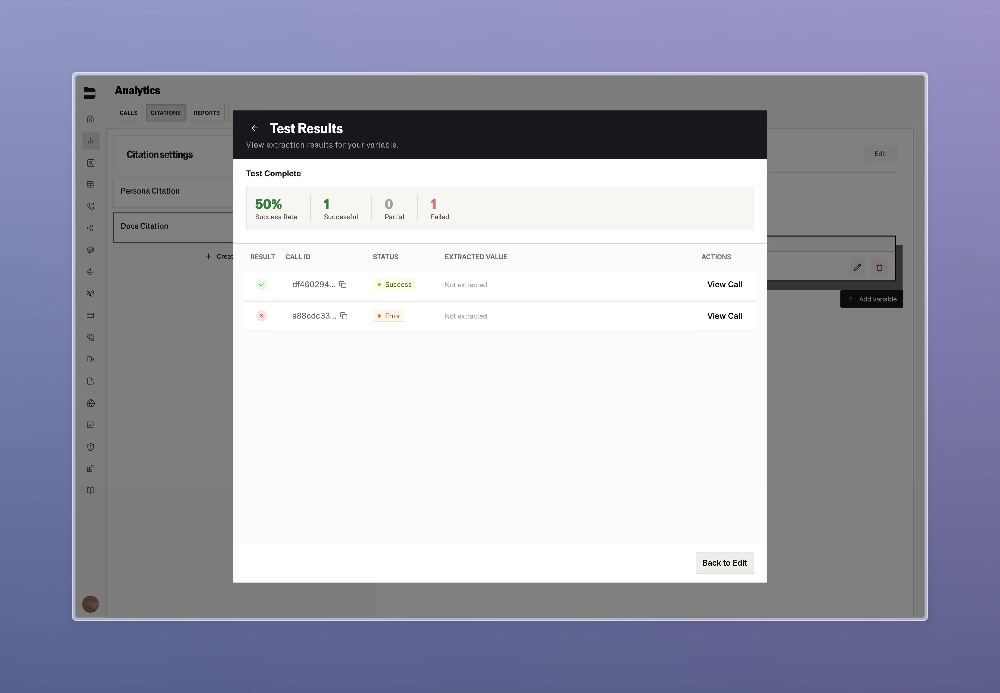

### Node Level Testing

Comprehensive testing suite for individual pathway nodes using historical call data to validate dialogue prompts, variables, and looping logic.

**Key Features:**
- **Historical Call Testing**: Select from past calls to test node prompts against real customer interactions
- **User Input Permutations**: Generate semantic variations of customer inputs using different communication styles to stress-test your prompts
- **Pinned Call Features**: Select your most useful calls that automatically run with every test

Test individual nodes before deploying full pathways to catch issues early and ensure reliable customer experiences. Take a look at an early demo of the feature below.

<iframe
  src="https://www.youtube.com/embed/2wRDbe3L28g"
  frameBorder="0"
  allowFullScreen
  style={{
    position: 'relative',
    top: 0,
    left: 0,
    width: '100%',
    height: '400px'
  }}
></iframe>

Any questions or feedback? Feel free to reach out to us at hello@bland.ai

---

### Improvements

**Call Logs & Management**
- Added a call log mini player, removed the line overlay from the audio player for split human and agent audio, and improved key marker navigation.

<Tabs>
  <Tab title="Miniplayer">
    
  </Tab>
  <Tab title="Recordings">
    
  </Tab>
</Tabs>

**Citation & Analysis**
- [Enterprise] You can now run past calls against new citation variables during development to test citation quality

<Tabs>
  <Tab title="Test Setup">
    
  </Tab>
  <Tab title="Variable Testing">
    
  </Tab>
  <Tab title="Test Results">
    
  </Tab>
</Tabs>

**Web Widget**
- Added pathway logs to web widget dashboard

**API & Development**
- [Enterprise] Enabled Node.js compatibility for Custom Code nodes
- Fixed Bland Secrets to handle empty JSON bodies in POST requests for URL encoded refresh tokens