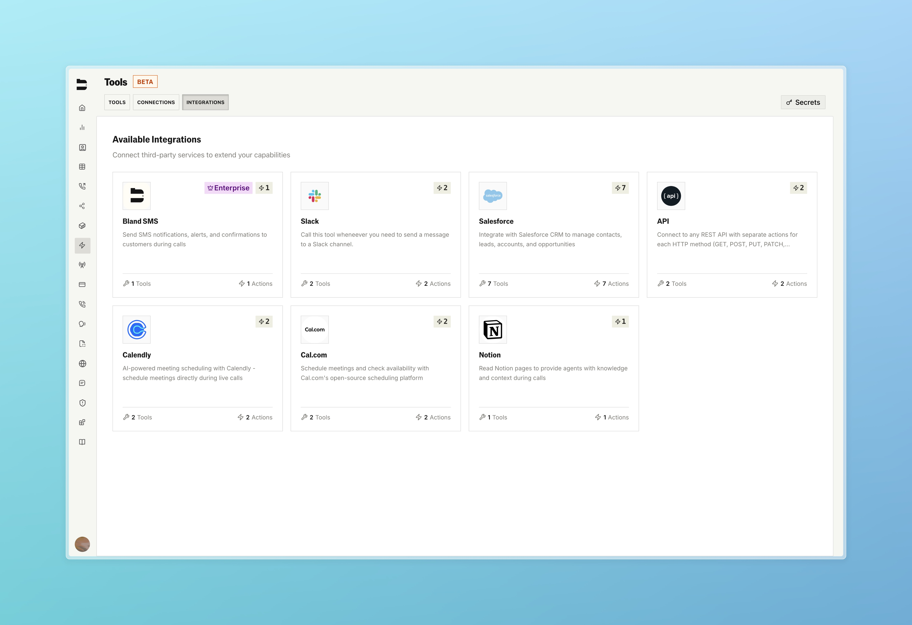
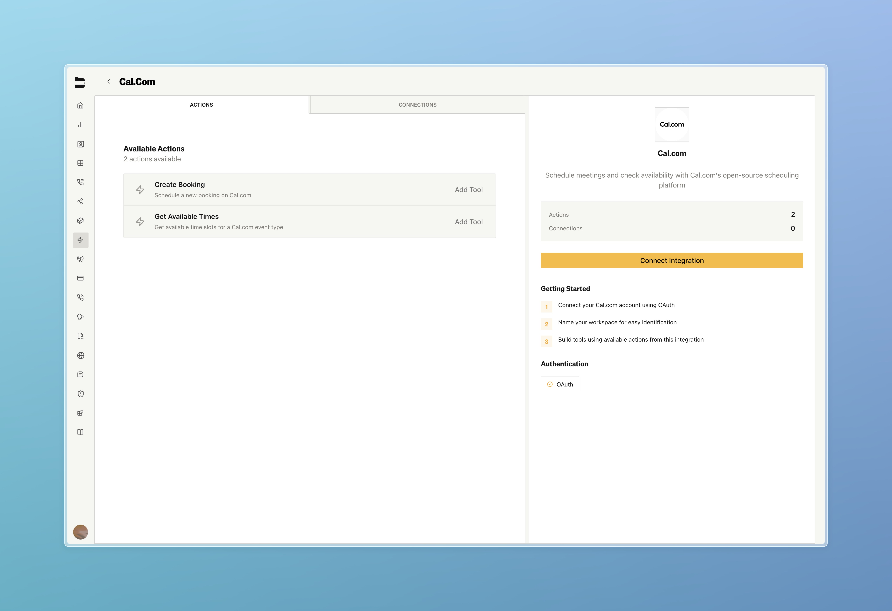
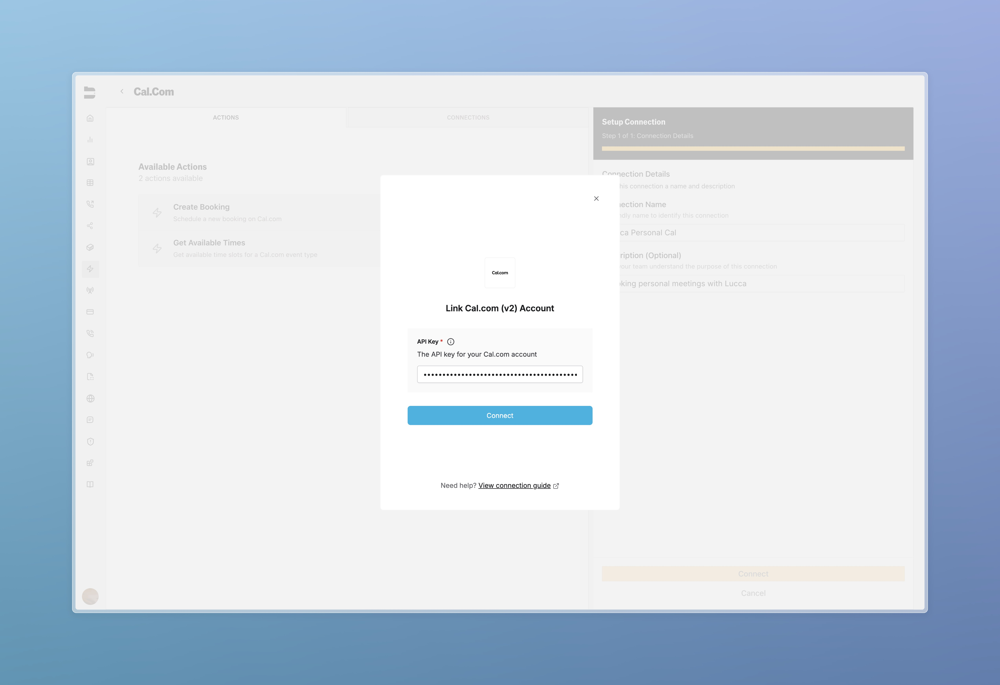
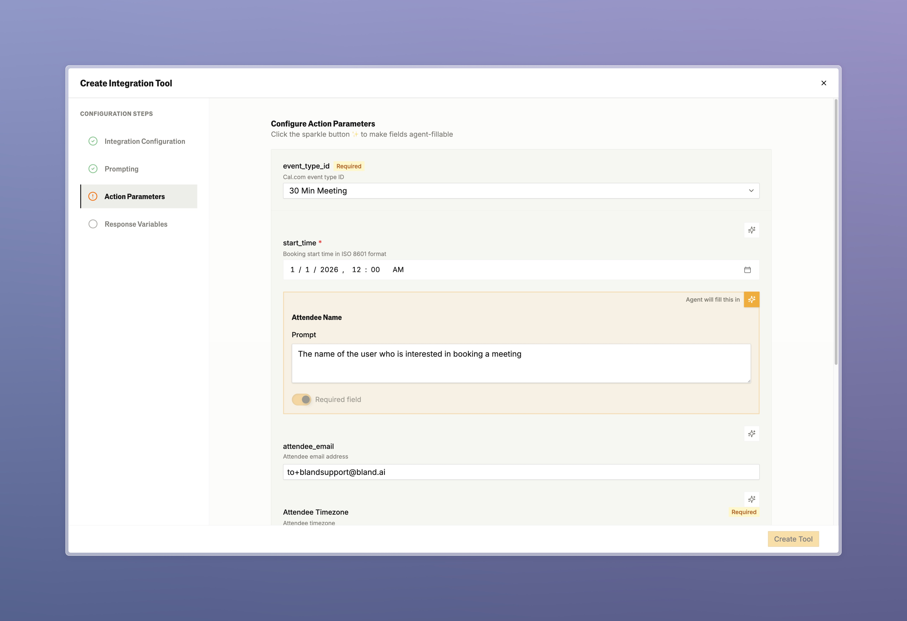
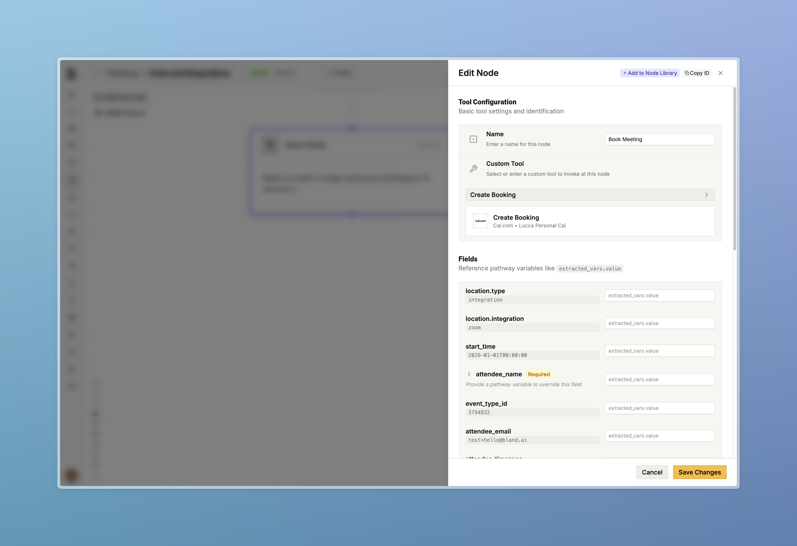

### [Integrations Platform](https://app.bland.ai/dashboard/tools)

Connect Bland to tools like Salesforce, Notion, and scheduling tools so AI calls automatically create leads, book meetings, update records, and trigger workflows without manual effort.

Complete shift from a legacy tool setup to an enterprise grade integrations platform, fundamentally changing how AI phone calls connect to your business systems
- Authentication is now automatic through OAuth and forms auto-populate from connected accounts instead of requiring manual setup
- Tool configurations are reusable resources that scale across unlimited use cases rather than one-off setups
- Enterprise-grade architecture supports the most popular services, with custom UI/UX for each integration instead of generic interfaces

**Live Integrations:**
- **Salesforce CRM**: Complete customer lifecycle management with accounts, contacts, leads, opportunities, tasks, events, and custom SOQL queries
- **Cal.com & Calendly**: Comprehensive scheduling automation with booking creation and availability management
- **Notion**: Read from your Notion knowledge bases and use them directly in your calls
- **SMS Integration**: Native outbound SMS messaging through Bland for enterprise customers

We will continue to add more tools and integrations here, so stay tuned for updates!

<Tabs>
  <Tab title="Integrations">
    
  </Tab>
  <Tab title="Actions">
    
  </Tab>
  <Tab title="Authentication">
    
  </Tab>
  <Tab title="Configuration">
    
  </Tab>
  <Tab title="Pathway Node">
    
  </Tab>
</Tabs>

---

### Improvements

**Call Logs & Management**
- Fixed calls displaying with missing duration, price, and webhook data in dashboard
- Guard rail triggers now show content badges in call logs
- Guard rail trigger content is now visible in detailed logs
- Added historical guard rail filtering and call selection

**Pathways & Routing**
- Added pathway minimap for better navigation
- IVR nodes now support individual node testing
- Enhanced scheduling node prompting and behavior
- [Enterprise] Warm transfer messages no longer skip when interrupted during playback

**Knowledge Base**
- [Enterprise] Added citation templates
- [Enterprise] Enhanced citation error and failure logging in UI
- [Enterprise] Citation schemas can now be deleted or archived

**UI/UX Improvements**
- Personas now support custom picture uploads
- Web widget is now draggable

**Billing & Account Management**
- Self serve [billing rates](/platform/billing#pricing-changes) now align with user's Bland plan

**API & Development**
- [List calls endpoint](/api-v1/get/calls#param-update-start-date) now supports date range filtering with update_start_date and update_end_date parameters