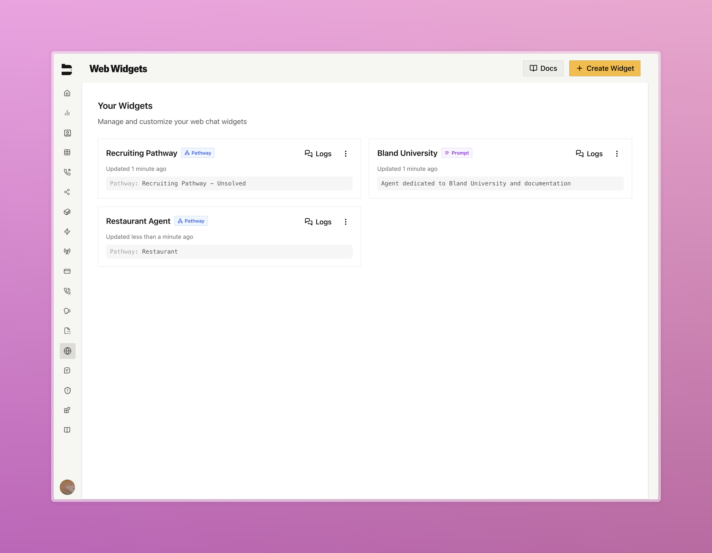

### Improvements

**SMS Features**
- [Enterprise] Added agent guard rails to SMS conversations
- [Enterprise] Fixed bug where incorrect pathway and version was being used during send SMS API when SMS configuration already exists
- [Enterprise] Aligned pathway ID in SMS dashboard to reflect conversation rather than inbound pathway configured
- [Enterprise] Added save filter feature in SMS logs

**Citations**
- [Enterprise] Added new "Test Variables" button at the top level of citation variables UI

**Web Widget**
- Added post conversation webhook to web widget configuration
- Added new "Timeout Settings" section to web widget configuration
- Added widget gallery with renaming and deleting capabilities from the UI

