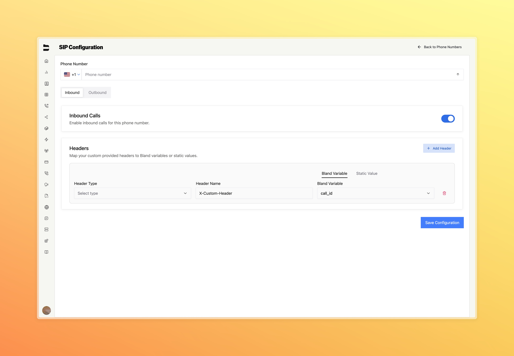
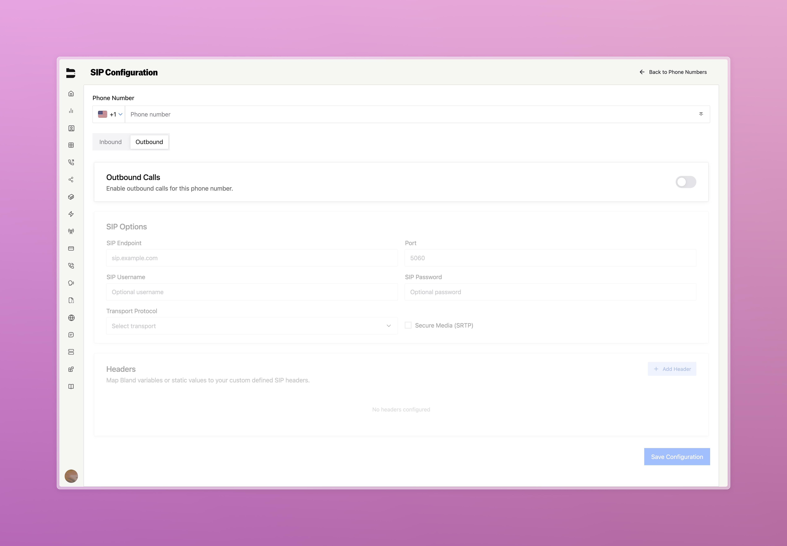
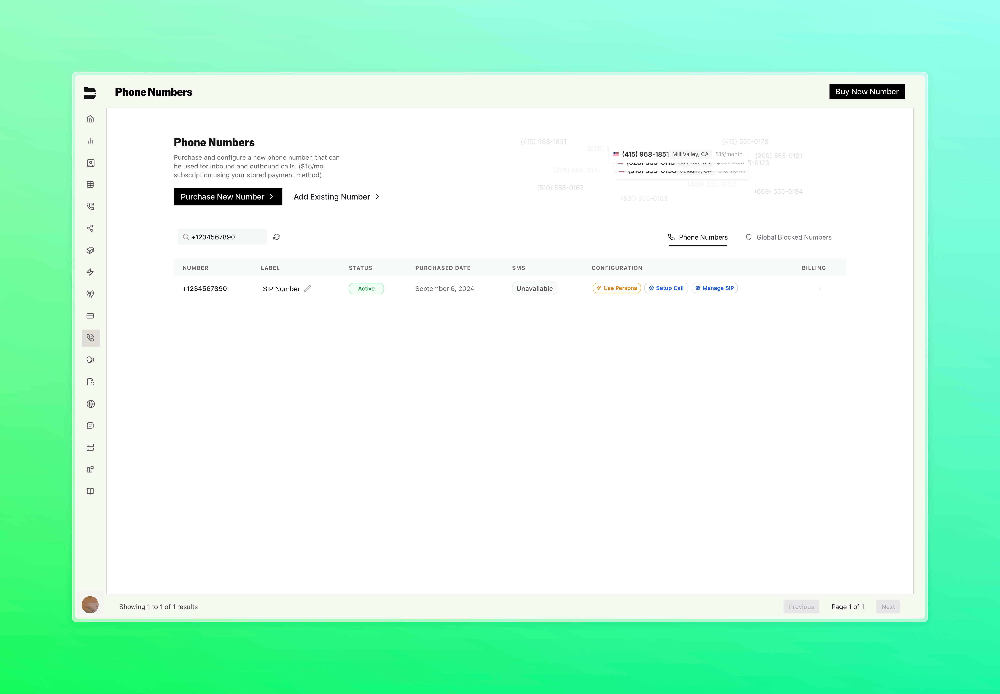

---

title: "SIP Integration"
description: "Configure and manage SIP for call routing to and from Bland."

---

## Overview

Bland supports **inbound and outbound SIP**, allowing customers to direct calls from their SIP provider to Bland for handling - or to direct Bland to make contact with their SIP provider.

This guide provides:

* Instructions for attaching, verifying, updating, and detaching SIP routes via Bland's API
* SIP connection details
* Requirements and security settings
* Schema definitions and usage patterns

---

## Quick Start

Intergrating SIP with Bland requires both sides (you or your provider, and Bland) to perform a set of steps in the correct order to minimize the time taken to get your calls flowing.

**[1] Enabling SIP**

You'll need to to contact support to have `SIP` enabled for your Organization. Without this, you won't be able to continue.

**[2] Identifying your Numbers**

Bland needs to know ahead of time, the numbers that will be used in either an Outbound (also known as Origination) direction, or an Inbound (also known as Termination) direction.

You should work with your SIP Provider to identify these, for your business use case and purpose.

To be explicit, this phone number should not be a bland number, but rather the phone number that you want to SIP into. Your SIP "provider" should provider/own this number, and should tell you which one to use (not Bland).

**[3] Declare these Numbers with Bland**

You do not need to port, or transfer numbers to Bland. You just need to simply let us know about them ahead of time.

This can be accomplished in two ways:
- [Configure them visually, on the dashboard](https://app.bland.ai/dashboard/sip) (see [Getting Started](#getting-started) section below for detailed instructions)
- [Configure them using our API](https://docs.bland.ai/enterprise-features/SIP-integration#attach-sip-endpoint)

**[4] (Inbound Only) Configure the Number**

Numbers declared to Bland as numbers that will be inbounded to Bland over SIP, behave like a regular inbound number. Configure them exactly as you would a normal inbound number (for example: setting your pathway, persona, or voice!)

**[5] (Outbound Only) Calling Outbound**

To make an outbound call with a SIP number, you simply use them like a regular `from` number. We'll automatically use your SIP information to connect to your chosen SIP endpoint, and we'll make the call.

This also applies to warm transfers.

---

## Getting Started

For users who prefer a visual interface over API calls, Bland provides a comprehensive dashboard for managing SIP configurations on a per-number basis. This section walks you through configuring SIP for individual phone numbers using the dashboard.

### Accessing SIP Configuration

To configure SIP for a phone number:

1. Go to your "Phone Numbers" page in the dashboard
2. Click "Add Existing Number" 
3. This will take you to the SIP configuration interface at [https://app.bland.ai/dashboard/sip](https://app.bland.ai/dashboard/sip)

Once you've configured a number for SIP, it will appear in your Phone Numbers page with a "Manage SIP" button that allows you to modify the SIP configuration settings.

### SIP Configuration Interface

The SIP configuration page is organized per phone number with two main tabs:

- **Phone Number**: Enter or view the number you're configuring (E.164 format like +14150000000)
- **Inbound Tab**: Configure how calls coming TO your number via SIP are handled
- **Outbound Tab**: Configure how calls FROM your number go through your SIP provider (requires [SIP connection details](#sip-connection-details))

### Configuring Inbound SIP

The Inbound tab allows your SIP provider to route calls to Bland for handling.



**Step 1: Enable Inbound**
- Toggle the "Enable Inbound" switch to activate inbound SIP for this number

**Step 2: Configure Headers (Optional)**
If your SIP provider sends custom headers you want to use in your pathways:

- **Header Type**: Choose between "Custom Header" or "UUI Header"
- **Header Value**: Select either:
  - **Bland Variable**: Choose from predefined variables (`call_id`, `caller_id`, `destination_number`, `call_duration`, `call_status`)
  - **Static Value**: Enter a fixed text value
- **Add/Remove**: Use the "+" button to add headers, trash icon to remove them

**Step 3: Save**
Click "Save Configuration" to enable inbound SIP for this number.

### Configuring Outbound SIP

The Outbound tab configures calls made FROM your number through your SIP provider.



**Step 1: Enable Outbound**
- Toggle the "Enable Outbound" switch to activate outbound SIP for this number

**Step 2: Configure SIP Connection**
When outbound is enabled, configure your SIP provider details:

- **SIP Endpoint**: Your provider's endpoint (e.g., "sip.example.com") - see [SIP connection details](#sip-connection-details) for requirements
- **Port**: Port number (default: 5060)
- **SIP Username**: Authentication username (if required by provider)
- **SIP Password**: Authentication password (if required by provider)  
- **Transport Protocol**: Choose UDP, TCP, or TLS (see [requirements](#requirements-and-security-settings) for supported options)
- **Secure Media (SRTP)**: Check this box for encrypted media streams

**Step 3: Configure Headers (Optional)**
Same header configuration as inbound - map Bland variables to SIP headers or use static values.

**Step 4: Save**
Click "Save Configuration" to enable outbound SIP for this number.

### Managing SIP Numbers

Once configured, you can manage SIP numbers from your main Phone Numbers page:



- Numbers with SIP configuration will show a "Manage SIP" button
- Click this button to return to the SIP configuration interface for that number
- You can enable/disable inbound or outbound directions, or modify connection details

### Key Configuration Notes

- **Inbound** only requires enabling the toggle and optional header mapping. Numbers behave like regular inbound numbers (configure pathway, persona, voice, etc in the main dashboard)
- **Outbound** requires SIP provider endpoint and connection details. Numbers behave like regular outbound numbers which you can use as the "from" value for outbound calls  
- **Headers** are supported in both directions with custom headers and UUI (User-to-User Information). Map dynamic Bland variables like `caller_id` or use static values to bridge data between Bland pathways and your SIP infrastructure. For detailed header configuration examples, see the [API reference](#api-reference) section

---

## SIP Connection Details

**SIP Signaling Endpoint FQDN(s):**

- You **must** use TCP over TLS for all SIP signaling.
- You **must** use Secure Media / SRTP for all media streams.
- Bland **does not** accept UDP for SIP signaling. 
- You **must** whitelist all IP addresses listed below in your firewall to allow inbound and outbound SIP traffic.
- If required, we provide which IP addresses are used for incoming SIP messages, and which are used for outgoing SIP messages.

```
US1 (Oregon):

us1.sip.bland.ai:5061;transport=tls

--
EU1 (Ireland):

eu1.sip.bland.ai:5061;transport=tls

--
ASIA1 (Sydney):

asia1.sip.bland.ai:5061;transport=tls
```

**Static IP Addresses of the SIP Signalling Server(s):**

You must whitelist **all** IP addresses for your region. Failure to do so can lead to connectivity issues.

```
US1 (Oregon):

35.80.235.26
54.189.4.67
100.20.173.20
35.161.106.231
35.81.41.38
35.82.125.138
35.82.184.232
35.84.252.131
44.224.206.111
44.224.67.132
44.225.32.9
44.235.59.237
44.240.150.132
44.252.152.176
52.27.109.95
52.38.0.204
52.41.242.206
52.42.27.92
54.172.60.0
54.172.60.1
54.172.60.2
54.172.60.3
54.244.51.0
54.244.51.1
54.244.51.2
54.244.51.3
```

```
EU1 (Ireland):

52.17.69.204
52.210.181.150
54.171.127.192
54.171.127.193
54.171.127.194
54.171.127.195
35.156.191.128
35.156.191.129
35.156.191.130
35.156.191.131
```

```
ASIA1 (Sydney):

13.237.152.149
3.104.178.155
54.252.254.64
54.252.254.65
54.252.254.66
54.252.254.67
```

**Static IP Addresses of the Media Stream Server(s):**

IP Addresses listed above for SIP Signalling are used equivocally for Media Stream Servers. These connections will be opened between ports `16384` and `32768`.

## Requirements and Security Settings

**Supported Codecs:**

* Currently Supported: PCMU, PCMA, Opus

**Security Requirements:**

* SIP Signaling: TLS 1.2 or higher
* RTP Media: SRTP using AES_CM_128_HMAC_SHA1_80
* `From` Header FQDN: Bland will enforce validity of the FQDN provided for in your `From` header. If this should be the same as the signaling endpoint, or a non-valid FQDN, we may reject your request(s) in the future.

**Other Configurations:**

* RTCP: Uses port RTP + 1
* DTMF: RFC 2833 (Out-of-band via RTP payload)
* Transport: TCP over TLS
* Methods: INVITE, ACK, BYE, CANCEL, OPTIONS, REFER

* Number Format: +E.164 or E.164 (both supported for origination and termination)
* SIP Registration: Not required (Bland determines routing based on predefined configurations configurable below.)

---

## Entitlement Requirement

All `/sip` endpoints are protected by an entitlement check.

Your organization must have the `SIP` entitlement enabled to use SIP features. If not, all requests to the `/sip` routes will return an error.

Contact support to have SIP enabled for your Enterprise organization.

---

## API Reference

### Attach SIP Endpoint

`POST /sip/attach`

Attach a SIP configuration to a phone number.

<ParamField query="phone_number" type="string">
  The phone number to associate with the SIP configuration. Must be in E.164 format.
</ParamField>

<ParamField query="directions" type="array">
  An array of directions for the SIP routing. Valid values: `inbound`, `outbound`. If outbound, you must also provide a `sip_endpoint`.
</ParamField>

<ParamField query="service" type="string">
  Must be set to `sip`.
</ParamField>

```json Example Request
curl -X POST https://api.bland.ai/v1/sip/attach \
  -H "Authorization: Bearer <token>" \
  -H "Content-Type: application/json" \
  -d '{
    "phone_number": "+14150000000",
    "directions": [
      { 
        "type": "inbound", 
        "headers": {
          "direction": "inbound", // Must be set to the parent objects direction.
          "headers": [
            // Passthrough Off. We take the incoming SIP header's value for "X-Cool-Guy" and assign it to the pathway variable's value for "First_Name".
            { "type": "custom", "key": "X-Cool-Guy", "value": "First_Name" },
            // Passthrough On. We inject this header key value pair directly into the pathway variable state.
            { "type": "custom", "key": "Account_Type", "value": "VIP", "passthrough": true },
            // Inbound UUI Example. If an inbound UUI header with purpose=bland arrives,
            // its decoded value will be stored in the pathway variable "CustomerId".
            // For example, a wire header like:
            //   SipHeader_user-to-user: 3432;encoding=hex;purpose=bland;content=id
            // will decode hex(3432) -> "42", then assign { "CustomerId": "42" }.
            { "type": "uui", "target": "CustomerId", "purpose": "bland", "encoding": "hex", "content": "id" }
          ]
        }
      },
      { 
        "type": "outbound", 
        "sip_endpoint": "sip:your.provider.com", // FQDN Only. Port must be defined here, or in options. Prefixed with `sip:`
        "options": {
          "port": 1234, // Will overwrite any port defined in your sip_endpoint.
          "transport": "tls", // Other available: tls, tcp, udp
          "secure_media": true, // True, False
          "sip_username": "bland", // Optional
          "sip_password": "password" // Optional
        },
        "headers": {
          "direction": "outbound", // Must be set to the parent objects direction.
          "headers": [
            // Passthrough off. We bind a specific header's **value** to a pathway variable provided for (if available). So the value of "X-Favorite-Color" is assigned
            // as the value for "Favorite_Color".
            {
              "type": "custom", // "custom" or "uui" supported.
              "key": "Favorite_Color",
              "value": "X-Favorite-Color"
            },
            // Passthrough on. We directly pass the key and value as-is.
            {
              "type": "custom",
              "key": "x-custom-id",
              "value": "12345",
              "passthrough": true
            },
            // Outbound UUI Example. If the pathway variable "CustomerKV" has a value,
            // it will be hex-encoded and sent in a UUI header with purpose=bland and content=customerid_1234.
            // For example, { "CustomerKV": "id=12345" } becomes:
            //   SipHeader_user-to-user: 69643d3132333435;encoding=hex;purpose=bland;content=customerid_1234
            {
              "type": "uui",
              "target": "CustomerKV", // Variable to look up in pathway state.
              "purpose": "bland",     // Outbound purpose field in the UUI header.
              "content": "customerid_1234", // Used as the "content" parameter in the UUI header.
              "encoding": "hex"       // Supported: "hex", "ascii"
            }
          ]
        }
      }
    ],
    "service": "sip"
  }'
```

---

### Update SIP Direction

`POST /sip/update`

Update a phone number’s SIP routing direction.

<ParamField query="phone_number" type="string">
  The phone number for which to update the direction.
</ParamField>

<ParamField query="updates" type="object">
  The updated direction object. Use `type: outbound` and provide `sip_endpoint`, or `type: inbound`.
</ParamField>

```json Example Request
curl -X POST https://api.bland.ai/v1/sip/update \
  -H "Authorization: Bearer <token>" \
  -H "Content-Type: application/json" \
  -d '{
    "phone_number": "+14150000000",
    "updates": {
      "type": "outbound",
      "sip_endpoint": "sip:your.provider.com", // Only available for outbound SIP Types.
      "options": { // Only available for outbound SIP Types.
          "port": 1234, // Will overwrite any port defined in your sip_endpoint.
          "transport": "tls", // Other available: tls, tcp, udp
          "secure_media": true, // True, False
          "sip_username": "bland", // Optional
          "sip_password": "password" // Optional
      }
    }
  }'
```

---

### Detach SIP Endpoint

`POST /sip/detach`

Remove SIP configuration from a number.

<ParamField query="phone_number" type="string">
  The phone number to detach SIP routing from.
</ParamField>

<ParamField query="directions" type="array">
  Direction(s) to remove. Either `inbound` or `outbound`.
</ParamField>

<ParamField query="service" type="string">
  Must be set to `sip`.
</ParamField>

```json Example Request
curl -X POST https://api.bland.ai/v1/sip/detach \
  -H "Authorization: Bearer <token>" \
  -H "Content-Type: application/json" \
  -d '{
    "phone_number": "+14150000000",
    "directions": [
      { "type": "inbound" }
    ],
    "service": "sip"
  }'
```

---

### Making your first SIP Call (Outbound)

To use a number that was registered for SIP, in an outbound direction - all that is required is to specify this as your from number.

Note: You'll need to ensure that you've verified your number ahead of time, as instructed above.

```json Example Request
curl -X POST https://api.bland.ai/v1/calls \
  -H "Authorization: Bearer <token>" \
  -H "Content-Type: application/json" \
  -d '{
    "task": "Say hi to the nice person!",
    "from": "+12341234123", // The number above registered as a SIP Outbound number.
    "phone_number": "<the callee's phone number>"
  }'
```

### Get SIP Config

`GET /sip?phone_number={phone_number}`

Returns current SIP configuration (if any) for a given `phone_number`.

<ParamField query="phone_number" type="string">
  The phone number of the number to fetch SIP configuration for.
</ParamField>

```json Example Request
curl -X GET 'https://api.bland.ai/v1/sip?phone_number=+1231231234' \
  -H "Authorization: Bearer <token>"
```

#### Example Response

```json
{
  "data": {
    "inbound": { // May be null if not present.
      number: string;
      id: string;
      org_id: string;
      direction: string;
      sip_endpoint: string | null;
      created_at: Date;
      updated_at: Date;
      headers: Object | null;
      options: Object | null; // As above
      inbound_id: bigint | null;
    },
    "outbound": { // May be null if not present.
      number: string;
      id: string;
      org_id: string;
      direction: string;
      sip_endpoint: string | null;
      created_at: Date;
      updated_at: Date;
      headers: Object | null;
      options: Object | null; // As above
      inbound_id: bigint | null;
    }
  },
  "errors": null
}
```

---

## Notes

- Phone numbers can be attached independently for inbound and outbound routing via the API.
- All requests must conform to the expected schema; invalid payloads will be rejected with a 400 response.
- Each API response includes a success status and, if applicable, an error message to aid debugging.
