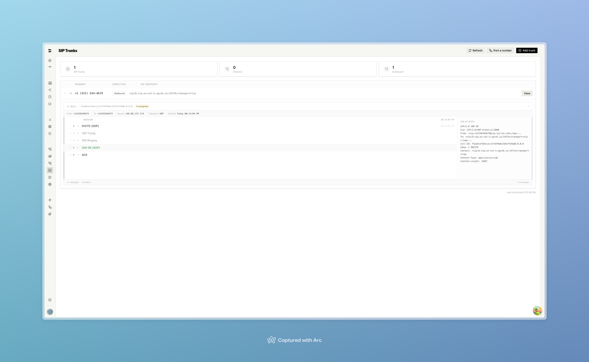
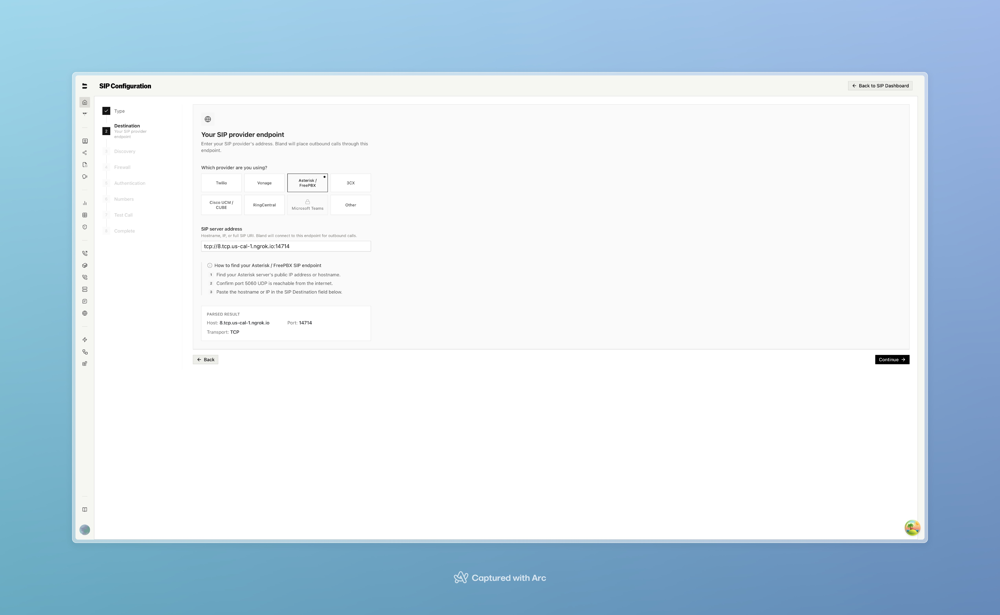
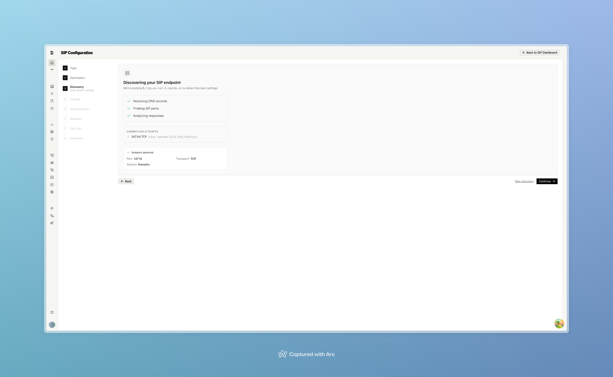
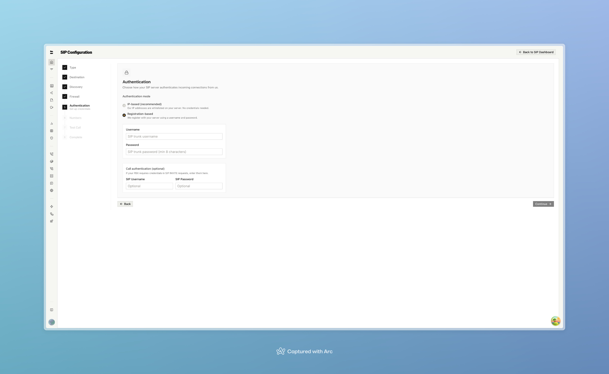
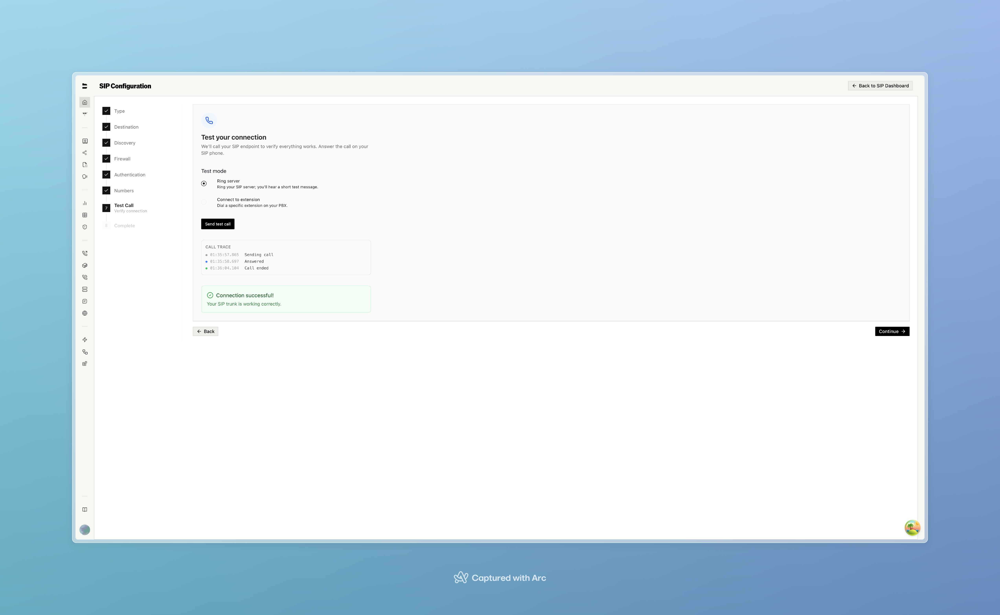
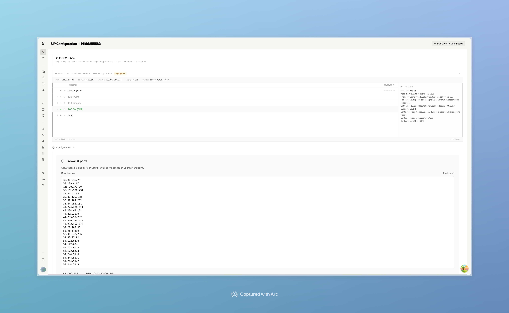
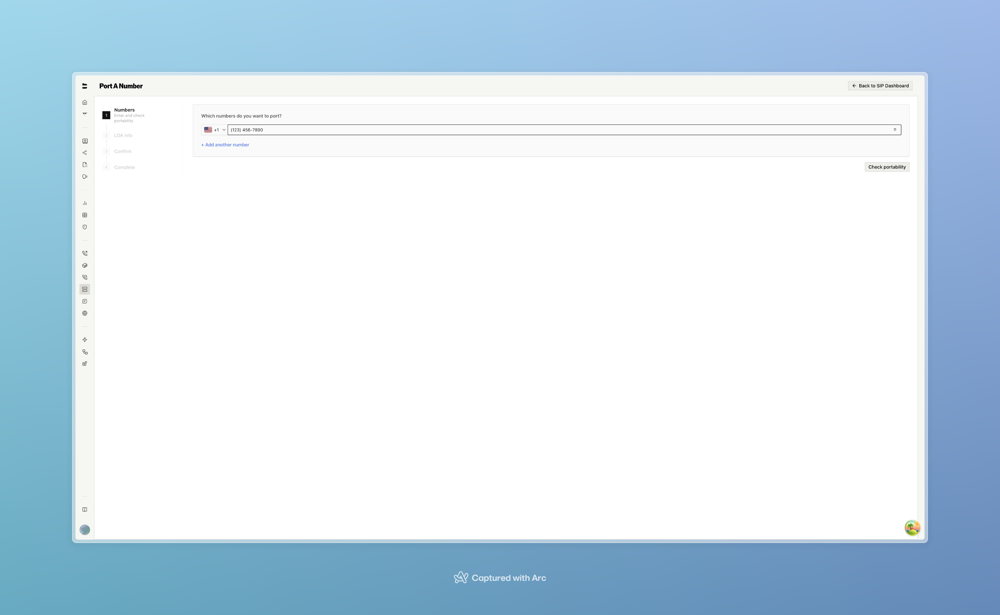
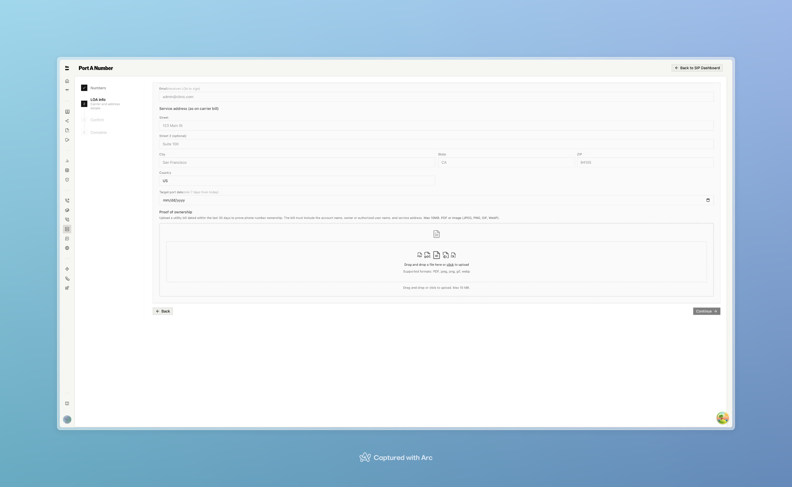

---

title: "SIP Integration"
description: "Configure and manage SIP for call routing to and from Bland, with guided setup wizard, auto-discovery, test calls, and number porting."

---

## Overview

Bland supports **inbound and outbound SIP**, allowing customers to direct calls from their SIP provider to Bland for handling — or to direct Bland to make calls through their SIP provider.

This guide covers:

* Setting up SIP trunks via the **SIP Setup Wizard** or API
* **Auto-discovery** of your SIP endpoint settings
* **Test calls** to verify connectivity
* **Number porting** to transfer numbers to Bland
* SIP connection details, firewall configuration, and security requirements
* Full API reference for all SIP endpoints

---

## Quick Start

**[1] Enable SIP**

Contact support to have the `SIP` entitlement enabled for your organization.

**[2] Open the SIP Dashboard**

Navigate to the [SIP Trunks dashboard](https://app.bland.ai/dashboard/sip-trunks) in the Bland app.



The dashboard displays all your configured SIP trunks at a glance — total trunk count, inbound vs. outbound breakdown, health status, and SIP endpoints. Click into any trunk to view live call logs with a full **SIP trace viewer** showing the INVITE/100 Trying/180 Ringing/200 OK/ACK message flow.

**[3] Add a Trunk (Outbound)**

Click **"Add trunk"** to launch the SIP Setup Wizard. For outbound trunks, the wizard walks you through:

1. **Direction** — Choose outbound
2. **Destination** — Enter your SIP provider endpoint
3. **Discovery** — Auto-detect optimal settings
4. **Firewall** — Whitelist Bland's IP addresses
5. **Authentication** — Configure IP-based or registration auth
6. **Numbers** — Select which numbers to route
7. **Test Call** — Verify the connection works
8. **Complete** — You're live

**[4] Add a Trunk (Inbound)**

For inbound, the flow is simpler — choose inbound direction, select your numbers, and you're done. Configure each inbound number's pathway, persona, and voice in the SIP Dashboard just like any regular inbound number.

**[5] Make an Outbound Call**

Use your SIP number as the `from` value in a standard `/v1/calls` request:

```json
curl -X POST https://api.bland.ai/v1/calls \
  -H "Authorization: Bearer <token>" \
  -H "Content-Type: application/json" \
  -d '{
    "task": "Say hi to the nice person!",
    "from": "+12341234123",
    "phone_number": "<the callee phone number>"
  }'
```

---

## SIP Setup Wizard

The SIP Setup Wizard provides a guided, step-by-step experience for configuring SIP trunks. Access it by clicking **"Add trunk"** on the [SIP Dashboard](https://app.bland.ai/dashboard/sip-trunks).

Every step below can also be done programmatically — see the expandable API sections under each step, or jump to the full [API Reference](#api-reference).

### Step 1: Direction

Choose whether this trunk handles **inbound** (calls coming to Bland) or **outbound** (Bland placing calls through your SIP provider).

<Accordion title="API">
  The direction is specified in the `directions` array when calling [`POST /v1/sip/attach`](/api-v1/post/sip-attach):

  ```json
  // Inbound
  { "type": "inbound" }

  // Outbound
  { "type": "outbound", "sip_endpoint": "sip:your.provider.com" }
  ```
</Accordion>

### Step 2: Destination (Outbound Only)

Enter your SIP provider's endpoint address. The wizard includes a **provider catalog** with guided instructions for popular platforms:

- **Twilio** — SIP Domain URI
- **Vonage** — SIP endpoint
- **Asterisk / FreePBX** — Public IP or hostname
- **3CX** — SIP trunk FQDN
- **Cisco UCM / CUBE** — Gateway address
- **RingCentral** — SIP endpoint
- **Microsoft Teams** — Requires a certified SBC (direct connection not supported)
- **Other** — Any standard SIP endpoint



The wizard accepts flexible input formats — hostnames, IPs, full SIP URIs like `sip:user@host:5061;transport=tls`, or shorthand like `tls://host`. It automatically parses the host, port, and transport for you.

<Accordion title="API">
  Validate a destination before attaching with `POST /v1/sip/parse-destination`:

  ```bash
  curl -X POST https://api.bland.ai/v1/sip/parse-destination \
    -H "Authorization: Bearer <token>" \
    -H "Content-Type: application/json" \
    -d '{ "input": "sip:your.provider.com:5061;transport=tls" }'
  ```

  Then set `sip_endpoint` and `options` (port, transport) in your [`POST /v1/sip/attach`](/api-v1/post/sip-attach) request.
</Accordion>

### Step 3: Auto-Discovery

Bland automatically probes your SIP endpoint to detect the optimal connection settings.



The discovery engine:

1. **Resolves DNS** — A/AAAA and SRV records (`_sip._udp`, `_sip._tcp`, `_sips._tcp`)
2. **Probes SIP ports** — Tests ports 5060, 5061, and 5080 over UDP and TCP with SIP OPTIONS messages
3. **Analyzes responses** — Detects your PBX system (Asterisk, FreeSWITCH, Kamailio, 3CX, Cisco, etc.), supported codecs, and methods

The recommended port, transport, and system are displayed once discovery completes. You can also skip discovery and configure settings manually.

<Accordion title="API">
  Run discovery with [`POST /v1/sip/discover`](/api-v1/post/sip-discover), then poll for results:

  ```bash
  # Start discovery
  curl -X POST https://api.bland.ai/v1/sip/discover \
    -H "Authorization: Bearer <token>" \
    -H "Content-Type: application/json" \
    -d '{ "host": "sip.example.com" }'

  # Poll progress
  curl -X GET 'https://api.bland.ai/v1/sip/discover/status?discovery_id=disc_abc123' \
    -H "Authorization: Bearer <token>"
  ```

  The `recommended` object in the response contains the optimal `port`, `transport`, and `detected_system`. One discovery can run per organization at a time.
</Accordion>

### Step 4: Firewall Configuration

The wizard displays Bland's static IP addresses and ports that must be whitelisted in your firewall. See the [SIP Connection Details](#sip-connection-details) section below for the full list.

<Accordion title="API">
  Retrieve your region's IPs and ports programmatically with [`GET /v1/sip/firewall-ips`](/api-v1/get/sip-firewall-ips):

  ```bash
  curl -X GET https://api.bland.ai/v1/sip/firewall-ips \
    -H "Authorization: Bearer <token>"
  ```
</Accordion>

### Step 5: Authentication

Choose how your SIP server authenticates incoming connections from Bland.



Two authentication modes are available:

- **IP-based (recommended)** — Bland's IP addresses are whitelisted on your server. No credentials needed.
- **Registration-based** — Bland registers with your server using a username and password via SIP REGISTER. A derived password is provided that you must configure in your PBX.

You can also optionally provide **call authentication** credentials (SIP username/password) that are included in SIP INVITE requests.

<Accordion title="API">
  Set `auth_mode` in the inbound direction of your [`POST /v1/sip/attach`](/api-v1/post/sip-attach) request:

  ```json
  {
    "type": "inbound",
    "auth_mode": "register",
    "register_auth": {
      "username": "my-trunk",
      "password": "securepassword"
    },
    "options": {
      "sip_username": "call-user",
      "sip_password": "call-pass"
    }
  }
  ```

  The response includes `register_password_for_pbx` — configure this derived password in your PBX.
</Accordion>

### Step 6: Number Selection

Select which phone numbers to route through this trunk. You can attach up to 100 numbers at once. Numbers must be in E.164 format.

<Accordion title="API">
  Pass numbers in `phone_numbers` when calling [`POST /v1/sip/attach`](/api-v1/post/sip-attach). List existing SIP numbers with [`GET /v1/sip/numbers`](/api-v1/get/sip-numbers).

  ```bash
  curl -X POST https://api.bland.ai/v1/sip/attach \
    -H "Authorization: Bearer <token>" \
    -H "Content-Type: application/json" \
    -d '{
      "phone_numbers": ["+14150000001", "+14150000002"],
      "directions": [{ "type": "outbound", "sip_endpoint": "sip:trunk.provider.com" }],
      "service": "sip"
    }'
  ```

  The response separates `configured` (successful) and `failed` (with error reasons) numbers.
</Accordion>

### Step 7: Test Call

Verify your connection with a live test call before going live.



The test call sends a real SIP INVITE to your endpoint. You'll see the call trace in real-time — from sending the call through to connection. A green "Connection successful!" message confirms your trunk is working correctly.

Test calls are rate-limited to **10 per 15 minutes** per organization.

<Accordion title="API">
  Initiate a test call with [`POST /v1/sip/test-call`](/api-v1/post/sip-test-call), then poll for results:

  ```bash
  # Start test call
  curl -X POST https://api.bland.ai/v1/sip/test-call \
    -H "Authorization: Bearer <token>" \
    -H "Content-Type: application/json" \
    -d '{ "phone_number": "+14150000000" }'

  # Poll status
  curl -X GET 'https://api.bland.ai/v1/sip/test-call/status?call_id=tc_abc123' \
    -H "Authorization: Bearer <token>"
  ```

  The response includes `status`, `result`, `duration_seconds`, and a `timeline` of SIP events.
</Accordion>

### Step 8: Complete

Your SIP trunk is now configured and active. You can view and manage it from the SIP Dashboard.

<Accordion title="API">
  Verify your live trunk with [`GET /v1/sip`](/api-v1/get/sip-config) and check health with [`GET /v1/sip/status`](/api-v1/get/sip-status):

  ```bash
  curl -X GET 'https://api.bland.ai/v1/sip?phone_number=%2B14150000000' \
    -H "Authorization: Bearer <token>"

  curl -X GET 'https://api.bland.ai/v1/sip/status?phone_number=%2B14150000000' \
    -H "Authorization: Bearer <token>"
  ```
</Accordion>

---

## SIP Dashboard

The SIP Dashboard at [app.bland.ai/dashboard/sip-trunks](https://app.bland.ai/dashboard/sip-trunks) is your central hub for managing SIP trunks.

### Trunk Overview

View all configured trunks with summary cards showing total SIP trunks, inbound count, and outbound count. Each trunk row displays the phone number, direction (inbound/outbound), SIP endpoint, and health status.

### Configuration Details

Click **"View"** on any trunk to see its full configuration, including the SIP trace viewer for recent calls, firewall IP addresses, and connection settings.



The configuration detail view includes:

- **SIP Trace Viewer** — A ladder diagram of SIP call events (INVITE, 100 Trying, 180 Ringing, 200 OK, ACK) with full message headers. Search, filter, and copy/download traces for debugging.
- **Call Logs** — Paginated call history with direction, status, SIP response code, duration, and timestamps. Auto-refreshes every 30 seconds.
- **Firewall & Ports** — Bland's egress IP addresses and SIP/RTP ports for your region, with a copy-all button.
- **Health Monitoring** — Real-time health status via SIP OPTIONS probes (healthy/unreachable/unchecked), uptime percentage, and average response time.

### Configuring Inbound Numbers

You can set up inbound SIP through the wizard (choose "Inbound" at the direction step) or via the API with [`POST /v1/sip/attach`](/api-v1/post/sip-attach). Inbound SIP numbers behave like regular inbound numbers — configure their pathway, persona, voice, and other settings just as you would any Bland inbound number.

### Advanced Configuration

From the configuration detail page, you can also manage:

- **Failover** — Configure primary, secondary, and tertiary SIP servers with automatic failover triggers (unreachable, auth failure, timeout) and failback mode (auto/manual).
- **Codecs** — Reorder and enable/disable codecs (PCMU, PCMA, G.729, Opus, G.722) with optional transcoding.
- **Alerts** — Set thresholds for unreachable duration, failure rate percentage, and response time, with notification channels (email, SMS, webhook).

---

## Number Porting

Bland supports **number porting** — transferring phone numbers you own from another carrier to Bland. This allows you to use your existing business numbers directly with Bland's SIP infrastructure without maintaining a separate SIP provider.

### How Number Porting Works

Number porting is a regulated process coordinated between carriers. It typically takes **7–14 business days** depending on the losing carrier and number type. The process follows these stages:

| Status | Description |
|--------|-------------|
| `waiting_for_signature` | Port request created. A Letter of Authorization (LOA) needs to be signed. |
| `submitted` | LOA signed and submitted to the losing carrier. |
| `in_progress` | The losing carrier is processing the port. |
| `completed` | Numbers have been ported successfully and are active on Bland. |
| `canceled` | The port request was canceled. |
| `failed` | The port request failed (e.g., incorrect account information). |

You can track the status of all port requests in the [SIP Dashboard](https://app.bland.ai/dashboard/sip-trunks) or via the [API](/api-v1/get/sip-port-requests).

### Porting via the Dashboard

Click **"Port a number"** on the SIP Dashboard to launch the porting wizard.

**Step 1: Enter Numbers**

Enter the phone numbers you want to port and click **"Check portability"** to verify they can be transferred.



The portability check verifies each number against the carrier database and returns whether the number is portable, the number type (mobile, landline, toll-free), and whether a PIN is required from the losing carrier.

<Accordion title="API">
  Check portability with [`GET /v1/sip/port/check`](/api-v1/get/sip-port-check):

  ```bash
  curl -X GET 'https://api.bland.ai/v1/sip/port/check?phone_numbers[]=%2B14150000000' \
    -H "Authorization: Bearer <token>"
  ```

  Returns `portable` (boolean), `number_type`, and `pin_required` for each number.
</Accordion>

**Step 2: LOA Information**

Provide the details needed for the Letter of Authorization:



- **Authorized representative** — Name and email of the person authorized to port the numbers
- **Service address** — The address on file with the losing carrier (must match their records)
- **Target port date** — Earliest date for the port (minimum 7 days from today)
- **Proof of ownership** — Upload a utility bill or carrier invoice (PDF or image, max 10MB) showing the account name and service address

<Accordion title="API">
  Upload your proof of ownership document with [`POST /v1/sip/port/document`](/api-v1/post/sip-port-document):

  ```bash
  curl -X POST https://api.bland.ai/v1/sip/port/document \
    -H "Authorization: Bearer <token>" \
    -F "file=@/path/to/utility-bill.pdf"
  ```

  Returns a `document_sid` to reference when initiating the port.
</Accordion>

**Step 3: Confirm & Submit**

Review all details and submit. You'll receive an email with the LOA for electronic signature. Once signed, the port request is submitted to the losing carrier.

After the port completes, your numbers are automatically registered as inbound numbers on Bland and ready to use.

<Accordion title="API">
  Submit the port request with [`POST /v1/sip/port/initiate`](/api-v1/post/sip-port-initiate):

  ```bash
  curl -X POST https://api.bland.ai/v1/sip/port/initiate \
    -H "Authorization: Bearer <token>" \
    -H "Content-Type: application/json" \
    -d '{
      "phone_numbers": ["+14150000000"],
      "losing_carrier_information": {
        "customer_type": "business",
        "business_name": "Acme Corp",
        "first_name": "Jane",
        "last_name": "Doe",
        "account_number": "ACC-12345",
        "authorized_representative_email": "jane@acme.com",
        "address": {
          "street": "123 Main St",
          "city": "San Francisco",
          "state": "CA",
          "zip": "94105",
          "country": "US"
        }
      },
      "target_port_date": "2026-03-20T00:00:00Z",
      "documents": ["doc_abc123"]
    }'
  ```

  Track progress with [`GET /v1/sip/port`](/api-v1/get/sip-port-requests) or cancel with [`DELETE /v1/sip/port/:id`](/api-v1/delete/sip-port-cancel).
</Accordion>

---

## SIP Connection Details

**SIP Signaling Endpoint FQDNs:**

- You **must** use TCP over TLS for all SIP signaling.
- You **must** use Secure Media / SRTP for all media streams.
- Bland **does not** accept UDP for SIP signaling.
- You **must** whitelist all IP addresses listed below in your firewall.

```
US1 (Oregon):
us1.sip.bland.ai:5061;transport=tls

EU1 (Ireland):
eu1.sip.bland.ai:5061;transport=tls

CA1 (Canada):
ca1.sip.bland.ai:5061;transport=tls

ASIA1 (Sydney):
asia1.sip.bland.ai:5061;transport=tls
```

**Static IP Addresses — US1 (Oregon):**

```
35.80.235.26
54.189.4.67
100.20.173.20
35.161.106.231
35.81.41.38
35.82.125.138
35.82.184.232
35.84.252.131
44.224.206.111
44.224.67.132
44.225.32.9
44.235.59.237
44.240.150.132
44.252.152.176
52.27.109.95
52.38.0.204
52.41.242.206
52.42.27.92
54.172.60.0
54.172.60.1
54.172.60.2
54.172.60.3
54.244.51.0
54.244.51.1
54.244.51.2
54.244.51.3
```

**Static IP Addresses — EU1 (Ireland):**

```
52.17.69.204
52.210.181.150
54.171.127.192
54.171.127.193
54.171.127.194
54.171.127.195
35.156.191.128
35.156.191.129
35.156.191.130
35.156.191.131
```

**Static IP Addresses — ASIA1 (Sydney):**

```
13.237.152.149
3.104.178.155
54.252.254.64
54.252.254.65
54.252.254.66
54.252.254.67
```

**Media Stream Ports:**

IP addresses listed above for SIP Signaling are used for Media Stream Servers as well. Media connections use ports `10000` to `20000` (UDP).

You can also retrieve your region's IP addresses and ports programmatically via `GET /v1/sip/firewall-ips`.

---

## Requirements and Security Settings

**Supported Codecs:**

* PCMU (G.711 μ-law), PCMA (G.711 A-law), Opus
* Additional codecs configurable via advanced settings: G.729, G.722

**Security Requirements:**

* SIP Signaling: TLS 1.2 or higher
* You must ensure the [Let's Encrypt](https://letsencrypt.org/certificates/) ISRG X1 Root CA is installed. [Downloadable here.](https://letsencrypt.org/certs/isrgrootx1.pem)
* RTP Media: SRTP using AES_CM_128_HMAC_SHA1_80

**Other Configurations:**

* RTCP: Uses port RTP + 1
* DTMF: RFC 2833 (Out-of-band via RTP payload)
* Transport: TCP over TLS
* Methods: INVITE, ACK, BYE, CANCEL, OPTIONS, REFER
* Number Format: +E.164 or E.164 (both supported)
* Authentication: IP-based (default) or SIP REGISTER digest auth

---

## Entitlement Requirement

All `/sip` endpoints are protected by an entitlement check.

Your organization must have the `SIP` entitlement enabled. Contact support to have SIP enabled for your Enterprise organization.

---

## API Reference

All SIP endpoints are under `/v1/sip` and require authentication via your API key. Detailed parameter documentation for each endpoint is available in the [API Reference tab](/api-v1/post/sip-attach).

### Core Endpoints

| Method | Endpoint | Description |
|--------|----------|-------------|
| `GET` | [`/v1/sip`](/api-v1/get/sip-config) | Get SIP config for a phone number |
| `POST` | [`/v1/sip/attach`](/api-v1/post/sip-attach) | Attach SIP configuration to phone numbers |
| `POST` | [`/v1/sip/update`](/api-v1/post/sip-update) | Update SIP direction settings |
| `POST` | [`/v1/sip/detach`](/api-v1/post/sip-detach) | Remove SIP configuration |
| `GET` | [`/v1/sip/numbers`](/api-v1/get/sip-numbers) | List all SIP-configured numbers |

### Discovery & Testing

| Method | Endpoint | Description |
|--------|----------|-------------|
| `POST` | [`/v1/sip/discover`](/api-v1/post/sip-discover) | Auto-discover SIP endpoint settings |
| `GET` | [`/v1/sip/discover/status`](/api-v1/get/sip-discover-status) | Poll discovery progress |
| `POST` | [`/v1/sip/test-call`](/api-v1/post/sip-test-call) | Send a test call to your SIP endpoint |
| `GET` | [`/v1/sip/test-call/status`](/api-v1/get/sip-test-call-status) | Get test call status and trace |

### Configuration & Monitoring

| Method | Endpoint | Description |
|--------|----------|-------------|
| `GET` | [`/v1/sip/firewall-ips`](/api-v1/get/sip-firewall-ips) | Get Bland's IP addresses and ports |
| `GET` | [`/v1/sip/outbound-setup`](/api-v1/get/sip-outbound-setup) | Get outbound SIP server details for PBX config |
| `GET` | [`/v1/sip/status`](/api-v1/get/sip-status) | Get trunk health status |
| `GET` | [`/v1/sip/calls`](/api-v1/get/sip-calls) | Get SIP call logs |
| `PATCH` | [`/v1/sip/config`](/api-v1/patch/sip-config) | Update advanced config (failover, codecs, alerts) |

### Number Porting

| Method | Endpoint | Description |
|--------|----------|-------------|
| `GET` | [`/v1/sip/port/check`](/api-v1/get/sip-port-check) | Check number portability |
| `POST` | [`/v1/sip/port/document`](/api-v1/post/sip-port-document) | Upload LOA / proof of ownership |
| `POST` | [`/v1/sip/port/initiate`](/api-v1/post/sip-port-initiate) | Submit a port request |
| `GET` | [`/v1/sip/port`](/api-v1/get/sip-port-requests) | List all port requests |
| `DELETE` | [`/v1/sip/port/:id`](/api-v1/delete/sip-port-cancel) | Cancel a port request |

---

## Notes

- Phone numbers can be attached independently for inbound and outbound routing.
- Up to **10 SIP configurations** can be attached per phone number.
- Up to **100 numbers** can be attached in a single API call.
- All requests must conform to the expected schema; invalid payloads will be rejected with a 400 response.
- Number porting typically takes 7–14 business days. Track status via the dashboard or API.
- Health checks probe your outbound endpoints every 60 seconds via SIP OPTIONS. Inbound-only trunks show as "unchecked" since there is no outbound endpoint to probe.
