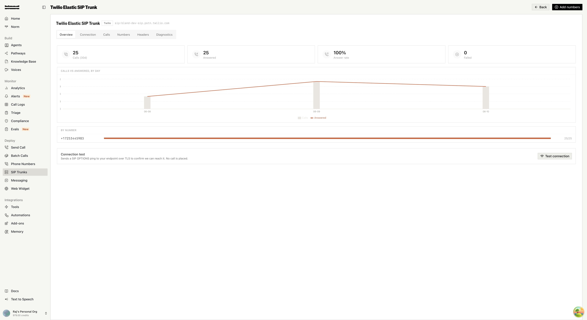
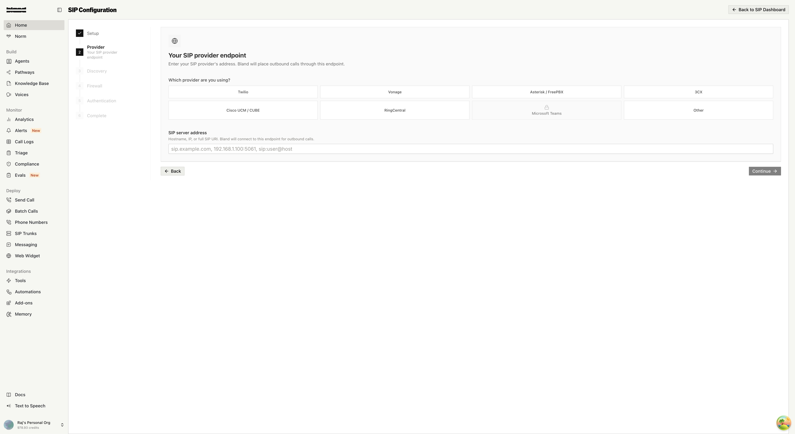
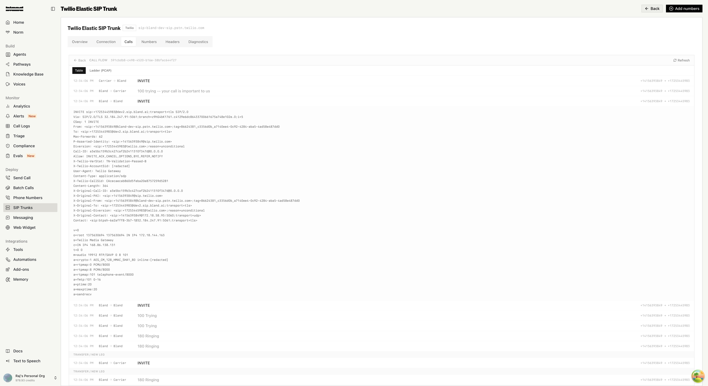

## Overview

Bland supports **inbound and outbound SIP**. Point calls from your carrier or PBX at Bland to be answered by an agent, or have Bland place calls out through your SIP provider.

Connections are organized as **trunks**. A trunk is a reusable connection to your SIP infrastructure — it holds the provider, direction, destination endpoint, and authentication. You attach **phone numbers and DIDs** to a trunk, and they inherit its connection settings.

This guide covers:

* Creating **SIP trunks** via the **Setup Wizard** or API
* Attaching **numbers and DIDs** for inbound and outbound routing
* **Auto-discovery** of endpoint settings, **connection tests**, and live **SIP tracing**
* **Number porting** to bring existing numbers to Bland
* **Connection endpoints**, firewall allow-listing, and security requirements
* The full SIP **API reference**

---

## Quick Start

**[1] Enable SIP**

Contact support to have the `SIP` entitlement enabled for your organization.

**[2] Open the SIP Dashboard**

Navigate to the [SIP Trunks dashboard](https://app.bland.ai/dashboard/sip-trunks) in the Bland app.



Each trunk has its own page with call volume, answer rate, and tabs for **Connection**, **Calls**, **Numbers**, **Headers**, and **Diagnostics** — including a one-click **connection test** that sends a SIP OPTIONS ping to your endpoint over TLS.

**[3] Create a Trunk**

Click **"Add trunk"** to launch the SIP Setup Wizard. The wizard walks you through your provider, endpoint, firewall, and authentication, then leaves you with a live trunk.

**[4] Attach Numbers and DIDs**

From the trunk's **Numbers** tab, attach the phone numbers and DIDs that should route through it. E.164 PSTN numbers and non-E.164 SIP identities (DIDs and extensions) are both supported once a number is bound to a trunk.

**[5] Make an Outbound Call**

Use a number on the trunk as the `from` value in a standard `/v1/calls` request:

```bash
curl -X POST https://api.bland.ai/v1/calls \
  -H "Authorization: Bearer <token>" \
  -H "Content-Type: application/json" \
  -d '{
    "task": "Say hi to the nice person!",
    "from": "+12341234123",
    "phone_number": "<the callee phone number>"
  }'
```

You can also pass a non-E.164 SIP trunk identity — such as a DID or a dial-plan extension like `2001` — as `from`, as long as it is attached to one of your outbound trunks. The value is forwarded to the carrier verbatim, so no country code or E.164 formatting is required:

```bash
curl -X POST https://api.bland.ai/v1/calls \
  -H "Authorization: Bearer <token>" \
  -H "Content-Type: application/json" \
  -d '{
    "task": "Say hi to the nice person!",
    "from": "2001",
    "phone_number": "<the callee phone number>"
  }'
```

---

## SIP Setup Wizard

The SIP Setup Wizard provides a guided, step-by-step experience for standing up a trunk. Access it by clicking **"Add trunk"** on the [SIP Dashboard](https://app.bland.ai/dashboard/sip-trunks).

Every step can also be done programmatically — see the expandable **API** sections under each step, or jump to the full [API Reference](#api-reference).

### Step 1: Setup

Name the trunk and choose its **direction** — **inbound** (calls coming to Bland), **outbound** (Bland placing calls through your provider), or **both**.

<Accordion title="API">
  Create a reusable trunk with [`POST /v1/sip/trunks`](#api-reference):

  ```bash
  curl -X POST https://api.bland.ai/v1/sip/trunks \
    -H "Authorization: Bearer <token>" \
    -H "Content-Type: application/json" \
    -d '{
      "name": "Acme Production",
      "provider": "Asterisk",
      "direction": "both"
    }'
  ```
</Accordion>

### Step 2: Provider

Enter your SIP provider's endpoint address. The wizard includes a **provider catalog** with guided instructions for popular platforms:

- **Vonage** — SIP endpoint
- **Asterisk / FreePBX** — Public IP or hostname
- **3CX** — SIP trunk FQDN
- **Cisco UCM / CUBE** — Gateway address
- **RingCentral** — SIP endpoint
- **Microsoft Teams** — Requires a certified SBC (direct connection not supported)
- **Other** — Any standard SIP endpoint



The wizard accepts flexible input formats — hostnames, IPs, full SIP URIs like `sip:user@host:5061;transport=tls`, or shorthand like `tls://host`. It automatically parses the host, port, and transport for you.

<Accordion title="API">
  Validate a destination before attaching with [`POST /v1/sip/parse-destination`](/api-v1/post/sip-parse-destination):

  ```bash
  curl -X POST https://api.bland.ai/v1/sip/parse-destination \
    -H "Authorization: Bearer <token>" \
    -H "Content-Type: application/json" \
    -d '{ "input": "sip:your.provider.com:5061;transport=tls" }'
  ```

  Then set `sip_endpoint` on the trunk, or in the `directions` of your [`POST /v1/sip/attach`](/api-v1/post/sip-attach) request.
</Accordion>

### Step 3: Discovery

Bland automatically probes your SIP endpoint to detect the optimal connection settings.


The discovery engine:

1. **Resolves DNS** — A/AAAA and SRV records (`_sip._udp`, `_sip._tcp`, `_sips._tcp`)
2. **Probes SIP ports** — Tests common ports over UDP, TCP, and TLS with SIP OPTIONS messages
3. **Analyzes responses** — Detects your PBX system (Asterisk, FreeSWITCH, Kamailio, 3CX, Cisco, etc.), supported codecs, and methods

The recommended port, transport, and system are displayed once discovery completes. You can also skip discovery and configure settings manually.

<Accordion title="API">
  Run discovery with [`POST /v1/sip/discover`](/api-v1/post/sip-discover). It runs the full probe and returns the result directly:

  ```bash
  curl -X POST https://api.bland.ai/v1/sip/discover \
    -H "Authorization: Bearer <token>" \
    -H "Content-Type: application/json" \
    -d '{ "host": "sip.example.com" }'
  ```

  The `recommended` object in the response contains the optimal `port`, `transport`, and `detected_system`. One discovery can run per organization at a time; long-running sessions can also be polled with [`GET /v1/sip/discover/status`](/api-v1/get/sip-discover-status).
</Accordion>

### Step 4: Firewall

The wizard displays Bland's connection endpoints and IP ranges that must be allow-listed in your firewall. See [Connection Endpoints](#connection-endpoints) below for the full reference.

<Accordion title="API">
  Retrieve your region's IPs and ports programmatically with [`GET /v1/sip/firewall-ips`](/api-v1/get/sip-firewall-ips):

  ```bash
  curl -X GET https://api.bland.ai/v1/sip/firewall-ips \
    -H "Authorization: Bearer <token>"
  ```
</Accordion>

### Step 5: Authentication

Choose how the two sides authenticate.


Two authentication modes are available:

- **IP-based (recommended)** — Bland's signaling IPs are allow-listed on your server, and Bland trusts your endpoint by source IP. No credentials to manage.
- **Registration-based** — Bland registers with your server using a username and password via SIP REGISTER. A derived password is returned that you configure in your PBX.

You can also optionally provide **call authentication** credentials (SIP username/password) included on SIP INVITE requests.

<Accordion title="API">
  Set `auth_mode` on the trunk or in the inbound direction of [`POST /v1/sip/attach`](/api-v1/post/sip-attach):

  ```json
  {
    "type": "inbound",
    "auth_mode": "register",
    "register_auth": {
      "username": "my-trunk",
      "password": "a-strong-password"
    }
  }
  ```

  When REGISTER auth is set, the response includes `register_password_for_pbx` — the one-time derived password to configure in your PBX.

  Need a password to start from? [`GET /v1/sip/generate-password`](/api-v1/get/sip-generate-password) returns a strong, PBX-safe one at a configurable length (`length` 8–256, or `strength` `standard`/`long`).
</Accordion>

### Step 6: Complete

Your trunk is now live. Attach numbers and DIDs from the **Numbers** tab, verify reachability from the **Diagnostics** tab, and monitor calls from the **Calls** tab.

<Accordion title="API">
  Confirm the trunk and its bound numbers with [`GET /v1/sip/trunks/:id`](#api-reference), and check per-number health with [`GET /v1/sip/status`](/api-v1/get/sip-status):

  ```bash
  curl -X GET 'https://api.bland.ai/v1/sip/status?phone_number=%2B14155550100' \
    -H "Authorization: Bearer <token>"
  ```
</Accordion>

---

## Trunks, Numbers, and DIDs

A **trunk** is the reusable connection to your SIP infrastructure. You attach numbers and DIDs to it, and they inherit the trunk's endpoint, transport, and authentication — so you configure the connection once and reuse it across every number.

### Attach numbers and DIDs

Bind numbers to a trunk with [`POST /v1/sip/attach`](/api-v1/post/sip-attach). You can attach up to **100** at once.

- **PSTN numbers** are normalized to E.164 (e.g. `+14155550100`).
- **DIDs and extensions** — when a number is bound to a trunk (`trunk_id`), non-E.164 SIP identities such as DIDs and dial-plan extensions (e.g. `2001`) are accepted and stored as-is.
- Each number can carry an **inbound** and an **outbound** configuration independently.

```bash
curl -X POST https://api.bland.ai/v1/sip/attach \
  -H "Authorization: Bearer <token>" \
  -H "Content-Type: application/json" \
  -d '{
    "phone_numbers": ["+14155550100", "2001"],
    "directions": [{ "type": "inbound" }, { "type": "outbound" }],
    "service": "sip",
    "trunk_id": "<trunk-id>"
  }'
```

The response separates `configured` (successful) from `failed` (with per-number error reasons). Outbound endpoint and authentication are inherited from the trunk, so you don't repeat them per number.

### Inbound numbers

Inbound SIP numbers behave like any other Bland inbound number — configure their pathway, persona, voice, and other settings exactly as you would a regular inbound number. Set them up through the wizard, the trunk's **Numbers** tab, or [`POST /v1/sip/attach`](/api-v1/post/sip-attach).

### Inspect a call (SIP trace)

Open a trunk's **Calls** tab and select a call to see the full **SIP trace** — every message across every leg, as a sortable table or a **ladder (PCAP)** diagram.



The trace shows the INVITE / 100 Trying / 180 Ringing / 200 OK / ACK flow with full headers and SDP, including transfers and new legs — copy or export it for debugging. Call logs auto-refresh and include direction, status, SIP response code, duration, and timestamps.

### Advanced configuration

From a number's configuration you can also manage:

- **Failover** — primary, secondary, and tertiary SIP servers with automatic failover triggers (unreachable, auth failure, timeout) and failback mode (auto/manual).
- **Codecs** — reorder and enable/disable codecs (PCMU, PCMA, Opus, G.722, G.729) with optional transcoding.
- **Alerts** — thresholds for unreachable duration, failure rate, and response time, with email, SMS, and webhook channels.

Set these with [`PATCH /v1/sip/config`](/api-v1/patch/sip-config).

---

## Number Porting

Bland supports **number porting** — transferring phone numbers you own from another carrier to Bland. This lets you use your existing business numbers directly with Bland's SIP infrastructure without maintaining a separate SIP provider.

### How Number Porting Works

Number porting is a regulated process coordinated between carriers. It typically takes **7–14 business days** depending on the losing carrier and number type. The process follows these stages:

| Status | Description |
|--------|-------------|
| `waiting_for_signature` | Port request created. A Letter of Authorization (LOA) needs to be signed. |
| `submitted` | LOA signed and submitted to the losing carrier. |
| `in_progress` | The losing carrier is processing the port. |
| `completed` | Numbers have been ported successfully and are active on Bland. |
| `canceled` | The port request was canceled. |
| `failed` | The port request failed (e.g., incorrect account information). |

You can track the status of all port requests in the [SIP Dashboard](https://app.bland.ai/dashboard/sip-trunks) or via the [API](/api-v1/get/sip-port-requests).

### Porting via the Dashboard

Click **"Port a number"** on the SIP Dashboard to launch the porting wizard.

**Step 1: Enter Numbers**

Enter the phone numbers you want to port and click **"Check portability"** to verify they can be transferred.


The portability check verifies each number against the carrier database and returns whether the number is portable, the number type (mobile, landline, toll-free), and whether a PIN is required from the losing carrier.

<Accordion title="API">
  Check portability with [`GET /v1/sip/port/check`](/api-v1/get/sip-port-check):

  ```bash
  curl -X GET 'https://api.bland.ai/v1/sip/port/check?phone_numbers[]=%2B14150000000' \
    -H "Authorization: Bearer <token>"
  ```

  Returns `portable` (boolean), `number_type`, and `pin_required` for each number.
</Accordion>

**Step 2: LOA Information**

Provide the details needed for the Letter of Authorization:


- **Authorized representative** — Name and email of the person authorized to port the numbers
- **Service address** — The address on file with the losing carrier (must match their records)
- **Target port date** — Earliest date for the port (minimum 7 days from today)
- **Proof of ownership** — Upload a utility bill or carrier invoice (PDF or image, max 10MB) showing the account name and service address

<Accordion title="API">
  Upload your proof of ownership document with [`POST /v1/sip/port/document`](/api-v1/post/sip-port-document):

  ```bash
  curl -X POST https://api.bland.ai/v1/sip/port/document \
    -H "Authorization: Bearer <token>" \
    -F "file=@/path/to/utility-bill.pdf"
  ```

  Returns a `document_sid` to reference when initiating the port.
</Accordion>

**Step 3: Confirm & Submit**

Review all details and submit. You'll receive an email with the LOA for electronic signature. Once signed, the port request is submitted to the losing carrier.

After the port completes, your numbers are automatically registered as inbound numbers on Bland and ready to use.

<Accordion title="API">
  Submit the port request with [`POST /v1/sip/port/initiate`](/api-v1/post/sip-port-initiate):

  ```bash
  curl -X POST https://api.bland.ai/v1/sip/port/initiate \
    -H "Authorization: Bearer <token>" \
    -H "Content-Type: application/json" \
    -d '{
      "phone_numbers": ["+14150000000"],
      "losing_carrier_information": {
        "customer_type": "Business",
        "customer_name": "Acme Corp",
        "account_number": "ACC-12345",
        "account_telephone_number": "+14150000000",
        "authorized_representative": "Jane Doe",
        "authorized_representative_email": "jane@acme.com",
        "address": {
          "street": "123 Main St",
          "city": "San Francisco",
          "state": "CA",
          "zip": "94105",
          "country": "US"
        }
      },
      "target_port_in_date": "2026-03-20",
      "documents": ["doc_abc123"]
    }'
  ```

  Track progress with [`GET /v1/sip/port`](/api-v1/get/sip-port-requests) or cancel with [`DELETE /v1/sip/port/:id`](/api-v1/delete/sip-port-cancel).
</Accordion>

---

## Connection Endpoints

Bland operates regional SIP edges. Connect to the endpoint closest to your infrastructure, and allow-list **both** its signaling and media IPs in your firewall. These IPs are static and do not change.

Bland separates **signaling** from **media**, and they use different IP addresses:

- **Signaling (connection):** SIP runs **exclusively over TLS on TCP port 5061** — there is no plaintext UDP/5060 listener. Each region has **two signaling IPs** (one per availability zone) behind its FQDN for high availability; send SIP to the FQDN and it balances across both.
- **Media (RTP):** Audio is carried over **SRTP** on a **separate set of media IPs** per region, over UDP ports **16384–32768**.

| Region | Endpoint (TLS 5061) | Signaling IPs | Media IPs (RTP) |
|--------|---------------------|---------------|-----------------|
| United States | `us2.sip.bland.ai` | `35.82.60.77`, `52.27.163.2` | `52.13.231.129`, `35.160.144.213`, `44.234.13.26`, `54.218.96.252` |
| Canada | `ca2.sip.bland.ai` | `15.156.129.66`, `15.157.196.128` | `3.96.68.79`, `35.183.80.246`, `52.60.169.171`, `16.54.43.127` |
| Asia-Pacific | `asia2.sip.bland.ai` | `32.236.162.210`, `3.104.20.26` | `3.104.151.70`, `15.134.58.75`, `52.62.109.3`, `54.79.10.189` |
| Europe | `eu2.sip.bland.ai` | `52.17.235.44`, `34.250.51.24` | `3.248.61.228`, `54.194.194.135`, `52.215.80.226`, `108.132.103.51` |

Connect using the full SIP URI for your region — for example `us2.sip.bland.ai:5061;transport=tls`.

### Firewall allow-list

Open **TLS 5061** to the signaling IPs and **UDP 16384–32768** to the media IPs for your region. You can also copy the list from the **Firewall & Ports** panel on the trunk page, or fetch it with [`GET /v1/sip/firewall-ips`](/api-v1/get/sip-firewall-ips).

<Note>
  Whitelisting is mutual: Bland allow-lists your source ranges, and you allow-list Bland's signaling and media IPs. Open RTP (UDP 16384–32768) to the media IPs in addition to TLS 5061 to the signaling IPs, or audio will not flow.
</Note>

---

## Requirements and Security

**Transport**

- SIP signaling: **TLS 1.2 or higher**, TCP port **5061** only. UDP and plaintext 5060 are not accepted.
- Ensure the [Let's Encrypt](https://letsencrypt.org/certificates/) ISRG Root X1 CA is installed — [downloadable here](https://letsencrypt.org/certs/isrgrootx1.pem).

**Media**

- **SRTP** using `AES_CM_128_HMAC_SHA1_80`.
- RTP over UDP ports **16384–32768**; RTCP uses RTP port + 1.

**Codecs**

- PCMU (G.711 μ-law), PCMA (G.711 A-law), Opus, G.722
- G.729 available via advanced configuration

**Signaling details**

- Methods: `INVITE`, `ACK`, `BYE`, `CANCEL`, `OPTIONS`, `REFER`
- DTMF: RFC 2833 (out-of-band via RTP telephone-event)
- Number format: E.164 for PSTN; DIDs and extensions supported on trunk-bound numbers
- Authentication: IP-based (default) or SIP REGISTER digest auth

---

## Entitlement Requirement

All `/v1/sip` endpoints are protected by an entitlement check. Your organization must have the `SIP` entitlement enabled — contact support to enable it for your Enterprise organization.

---

## API Reference

All SIP endpoints are under `/v1/sip` and require authentication via your API key. Per-endpoint parameter documentation is available in the [API Reference tab](/api-v1/post/sip-attach).

### Trunk Management

| Method | Endpoint | Description |
|--------|----------|-------------|
| `POST` | `/v1/sip/trunks` | Create a reusable trunk |
| `GET` | `/v1/sip/trunks` | List trunks |
| `GET` | `/v1/sip/trunks/:id` | Get a trunk and its attached numbers |
| `PATCH` | `/v1/sip/trunks/:id` | Update a trunk |
| `DELETE` | `/v1/sip/trunks/:id` | Delete a trunk |
| `POST` | `/v1/sip/trunks/:id/test-connection` | Send a SIP OPTIONS reachability ping |

### Numbers & Configuration

| Method | Endpoint | Description |
|--------|----------|-------------|
| `GET` | [`/v1/sip`](/api-v1/get/sip-config) | Get SIP config for a phone number |
| `POST` | [`/v1/sip/attach`](/api-v1/post/sip-attach) | Attach numbers and DIDs to a trunk / config |
| `POST` | [`/v1/sip/update`](/api-v1/post/sip-update) | Update one direction's settings |
| `POST` | [`/v1/sip/detach`](/api-v1/post/sip-detach) | Remove SIP configuration |
| `GET` | [`/v1/sip/numbers`](/api-v1/get/sip-numbers) | List all SIP-configured numbers |
| `GET` | [`/v1/sip/generate-password`](/api-v1/get/sip-generate-password) | Generate a strong SIP password (configurable length) |
| `PATCH` | [`/v1/sip/config`](/api-v1/patch/sip-config) | Advanced config (failover, codecs, alerts) |

### Discovery & Testing

| Method | Endpoint | Description |
|--------|----------|-------------|
| `POST` | [`/v1/sip/parse-destination`](/api-v1/post/sip-parse-destination) | Parse and validate a SIP destination |
| `POST` | [`/v1/sip/discover`](/api-v1/post/sip-discover) | Auto-discover SIP endpoint settings |
| `GET` | [`/v1/sip/discover/status`](/api-v1/get/sip-discover-status) | Poll discovery progress |
| `POST` | [`/v1/sip/test-call`](/api-v1/post/sip-test-call) | Send a test call to your SIP endpoint |
| `GET` | [`/v1/sip/test-call/status`](/api-v1/get/sip-test-call-status) | Get test call status and trace |

### Monitoring

| Method | Endpoint | Description |
|--------|----------|-------------|
| `GET` | [`/v1/sip/firewall-ips`](/api-v1/get/sip-firewall-ips) | Get Bland's IP addresses and ports |
| `GET` | [`/v1/sip/outbound-setup`](/api-v1/get/sip-outbound-setup) | Get outbound SIP server details for PBX config |
| `GET` | [`/v1/sip/status`](/api-v1/get/sip-status) | Get trunk health status |
| `GET` | [`/v1/sip/calls`](/api-v1/get/sip-calls) | Get SIP call logs |

### Number Porting

| Method | Endpoint | Description |
|--------|----------|-------------|
| `GET` | [`/v1/sip/port/check`](/api-v1/get/sip-port-check) | Check number portability |
| `POST` | [`/v1/sip/port/document`](/api-v1/post/sip-port-document) | Upload LOA / proof of ownership |
| `POST` | [`/v1/sip/port/initiate`](/api-v1/post/sip-port-initiate) | Submit a port request |
| `GET` | [`/v1/sip/port`](/api-v1/get/sip-port-requests) | List all port requests |
| `DELETE` | [`/v1/sip/port/:id`](/api-v1/delete/sip-port-cancel) | Cancel a port request |

---

## Notes

- A trunk lets you configure the connection once and attach many numbers and DIDs to it.
- Each number can have one inbound and one outbound configuration, attached independently.
- Up to **100 numbers** can be attached in a single API call.
- Trunk-bound numbers accept non-E.164 DIDs and extensions in addition to E.164 PSTN numbers.
- All requests must conform to the expected schema; invalid payloads are rejected with a `400` response.
- Test calls are rate-limited to **10 per 15 minutes** per organization.
- Number porting typically takes 7–14 business days. Track status via the dashboard or API.
- Health checks probe outbound endpoints via SIP OPTIONS. Inbound-only configurations show as "unchecked" since there is no outbound endpoint to probe.

---

Docs for agents: [llms.txt](/llms.txt)
