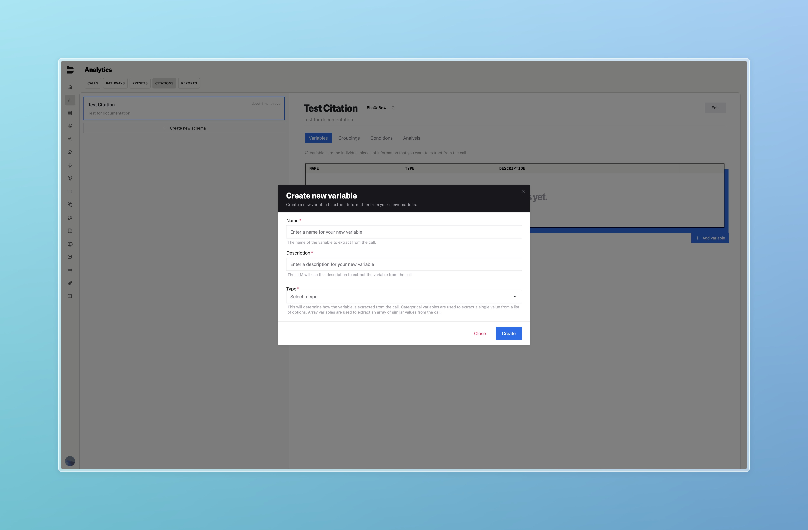
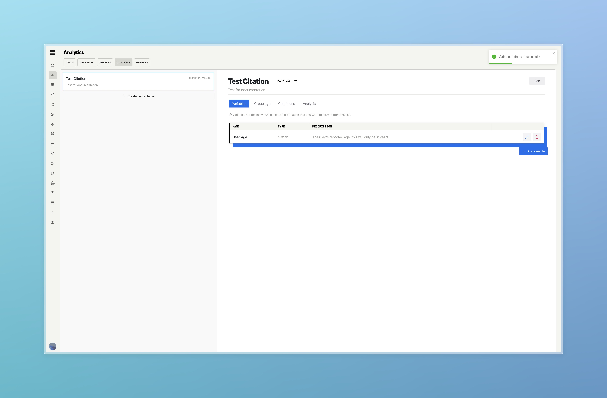
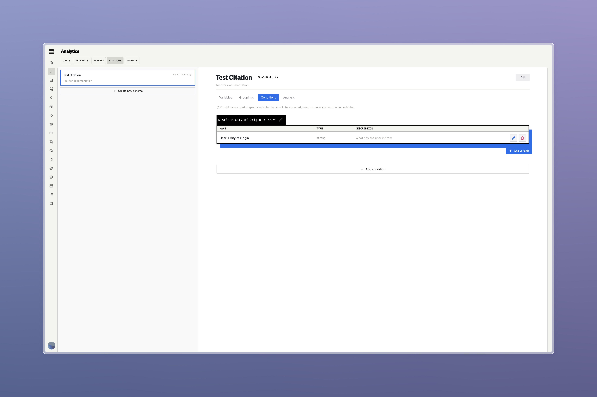
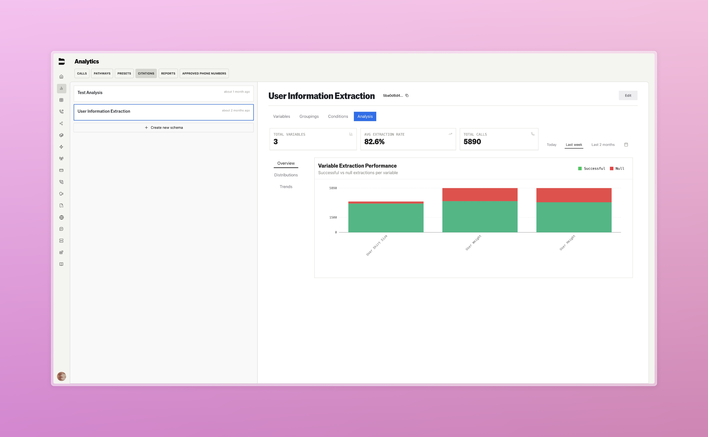
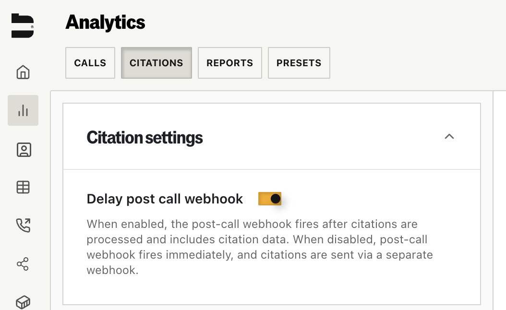

## Introduction

Citations allow you to define structured post-call analytics for enterprise use cases. By configuring schemas of variables and logic, you can automatically extract key information from call transcripts — no manual review required.

Potential use cases such as:

<CardGroup cols={2}>
  <Card title="Collect User Details" icon="user">
    Extract caller information such as names, contact info, preferences, or identifiers.
  </Card>
  <Card title="Track Transfers & Escalations" icon="phone">
    Monitor when calls are transferred, escalated, or handed off to other teams.
  </Card>
  <Card title="Confirm Issue Resolution" icon="circle-check">
    Determine whether a caller’s issue was addressed or remains unresolved.
  </Card>
  <Card title="Summarize Key Moments" icon="book-open">
    Capture important moments like intent, objections, or outcomes across conversations.
  </Card>
</CardGroup>

---

## Creating a Citation Schema

To get started, go to the **Analytics → Citations** tab in your sidebar.

Click **Create new schema** and give it a name and description.

From there, you'll enter the citation builder. Schemas are composed of:

* **Variables** — the data points you want to extract  
* **Groupings** — optional collections of related variables  
* **Conditions** — logic for flagging calls or setting output rules  
* **Analysis** — an overview of schema-level performance and extraction metrics

---

## Defining Variables

The most essential step is defining the variables your schema should extract. These are the individual values or signals pulled from the call transcript.

Click **Add variable**, then provide:

* **Name** — a human-readable label  
* **Description** — instructions for the LLM to understand and extract this value  
* **Type** — the format of the extracted data

Supported types include:

| Type      | Description                                                             |
|-----------|-------------------------------------------------------------------------|
| String    | Freeform text (e.g. “unhappy”, “San Francisco”)                |
| Number    | Any numeric quantity (e.g. ages, durations, dollar values)              |
| Boolean   | True or False                                                           |
| Array     | List of values (e.g. multiple products mentioned)                       |
| Category  | Used to extract a single value from a list of options   |

Once saved, variables will appear in the **Variables** tab.

---

## Optional: Groupings and Conditions

To better organize your schema, you can group related variables under a common theme.

Navigate to the **Groupings** tab and click **Add Grouping**. For example, you might group variables under:

- Demographics  
- Call Outcomes  
- Escalation Signals  

The **Conditions** tab allows you to write logic that will capture variables based on the passing logic of others. For example, you might only want to capture certain variables if the user meets your specific criteria.

---

## Analysis and Monitoring

Once your schema is used in live calls, visit the **Analysis** tab to view metrics:

* **Total Variables Extracted**  
* **Average Extraction Rate**  
* **Total Calls Processed**  
* **Trends and Distribution Graphs**

You can filter by time ranges (e.g. Today, Last Week, Last 2 Months) and inspect specific performance metrics.

---

## API Integration

Citations can be included in your outbound or inbound calls using the `citation_schema_ids` parameter in the [Send Call](/api-v1/post/calls#param-citation-schema-ids) or [Update Inbound Number](/api-v1/post/inbound-number-update#param-citation-schema-ids) API endpoints.

### Webhook Integration Options

You have two options for receiving citation data via webhooks:

#### Option 1: Separate Citation Webhooks (Default)
Citations are sent in a separate webhook event immediately after processing. To enable this:
- Add `citations` to your webhook events in the [Send Call](/api-v1/post/calls#param-webhook-events) or [Update Inbound Number](/api-v1/post/inbound-number-update#param-webhook-events) API endpoints

#### Option 2: Delayed Post-Call Webhook with Citations
Delay the main post-call webhook until citations are processed, then receive all data (including citations) in a single combined webhook. To enable this:

1. **API Configuration**: Include `citations` in your webhook events
2. **Dashboard Setting**: Navigate to **Analytics → Citations** and toggle on "Delay post call webhook"

> **Note:** Citations will only be processed on calls with a status of "completed". Calls that are unanswered, busy, or fail for other reasons will not generate citation data.