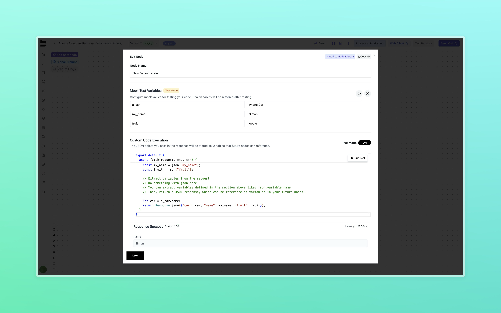
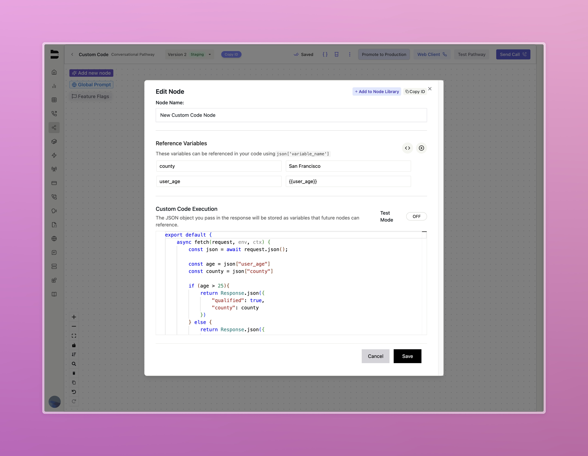

## Overview
The Custom Code Node lets you run JavaScript within your conversations for advanced data processing, calculations, API calls, and business logic—all securely on Bland’s infrastructure, with fast performance and no need for outside services.

**Prerequisites:**
- A Bland Enterprise account with Custom Code Node access (reach out to Bland support to get access)
- A Bland Pathway configured for your use case
- Basic knowledge of JavaScript programming
- Understanding of JSON data structures

## Overall Call Flow
The custom code node follows this execution flow:
1. Agent enters the custom code node during pathway execution
2. Variables from the conversation are extracted and made available to your code
3. Your custom JavaScript code executes with access to these variables
4. The code processes the data and returns a JSON response
5. Returned data becomes available as variables in subsequent pathway nodes
6. Agent continues to the next node in the pathway

## The Custom Code Node

### Node Configuration
When you add a Custom Code Node to your pathway, you'll see a comprehensive interface for configuring your code execution:


### Reference Variables
The first section allows you to define variables to be used wihtin your custom code execution. These variables can be of two types:
- **Static Variables**: Constants that are definied in this section, and will be the same throughout all your calls.
- **Dynamic Variables**: Variables that are defined based on variables extracted previously in the pathway.

Below is an example of both:


<Accordion title="Example">
```javascript
export default {
    async fetch(request, env, ctx) {
        const json = await request.json();

        const age = json["user_age"]
        const county = json["county"]
        
        if (age > 25){
            return Response.json({
                "qualified": true,
                "county": county
            })
        } else {
            return Response.json({
                "qualified": false,
                "county": county
            })
        }
    }
}
```
</Accordion>

Using dynamic variables allows you to build flexible custom code nodes that adapt to each user’s unique information.

> For instance, in the example shown, any caller under 25 will have their request automatically rejected.

To easily generate extraction code for your pathway variables, you can click the "Generate variable extraction code" button, and it will automatically insert into the editor.

In the example above, the following will be inserted:

```javascript
const age = json["user_age"]
const county = json["county"]
```

### Code Editor
The main code editor provides:
- **Syntax highlighting** for JavaScript
- **Auto-completion** and IntelliSense
- **Error detection** and debugging support
- **Code formatting** and indentation

### Test Mode
The Custom Code Node includes a robust testing environment:

**Test Mode Toggle**: Switch between normal editing and test mode
- **Normal Mode**: Configure actual variables that will be extracted from conversations
- **Test Mode**: Set mock values for testing your code logic
**Mock Test Variables**: In test mode, you can provide sample data to test your code:
**Run Test Button**: Execute your code with the mock data to see returned variables immediately

### Response Handling
The response from your custom code becomes available as variables in subsequent pathway nodes. Your code must return a JSON response using `Response.json()`.
Example response:
```javascript
return Response.json({
  processed_total: calculatedAmount,
  discount_applied: discountPercentage,
  final_price: finalAmount,
  customer_tier: tierLevel
});
```
These returned values (`processed_total`, `discount_applied`, `final_price`, `customer_tier`) become available as variables you can reference in later nodes using `{{processed_total}}`, `{{discount_applied}}`, etc.


## Code Examples
<AccordionGroup>
  <Accordion title="Basic Data Processing">
```javascript
export default {
    async fetch(request, env, ctx) {
        const json = await request.json();
        const customer_name = json["customer_name"];
        const order_total = json["order_total"];
        // Convert string to number and calculate tax
        const total = parseFloat(order_total);
        const tax_rate = 0.08;
        const tax_amount = total * tax_rate;
        const final_total = total + tax_amount;
        return Response.json({
            customer_name: customer_name,
            subtotal: total.toFixed(2),
            tax_amount: tax_amount.toFixed(2),
            final_total: final_total.toFixed(2),
            formatted_total: `$${final_total.toFixed(2)}`
        });
    }
}
```
  </Accordion>
  <Accordion title="Customer Tier Calculation">
```javascript
export default {
    async fetch(request, env, ctx) {
        const json = await request.json();
        const purchase_history = json["purchase_history"] || 0;
        const current_order = json["current_order"] || 0;
        // Calculate customer tier based on purchase history
        const total_spent = parseFloat(purchase_history) + parseFloat(current_order);
        let tier = "Bronze";
        let discount = 0;
        if (total_spent >= 5000) {
            tier = "Platinum";
            discount = 0.15;
        } else if (total_spent >= 2000) {
            tier = "Gold";
            discount = 0.10;
        } else if (total_spent >= 500) {
            tier = "Silver";
            discount = 0.05;
        }
        const discount_amount = parseFloat(current_order) * discount;
        const discounted_total = parseFloat(current_order) - discount_amount;
        return Response.json({
            customer_tier: tier,
            discount_percentage: Math.round(discount * 100),
            discount_amount: discount_amount.toFixed(2),
            original_total: current_order,
            discounted_total: discounted_total.toFixed(2),
            total_lifetime_value: total_spent.toFixed(2)
        });
    }
}
```
  </Accordion>
  <Accordion title="Date and Time Processing">
```javascript
export default {
    async fetch(request, env, ctx) {
        const json = await request.json();
        const appointment_date = json["appointment_date"];
        const preferred_time = json["preferred_time"];
        // Parse and format dates
        const date = new Date(appointment_date);
        const now = new Date();
        // Calculate days until appointment
        const timeDiff = date.getTime() - now.getTime();
        const daysDiff = Math.ceil(timeDiff / (1000 * 3600 * 24));
        // Format date for display
        const options = {
            weekday: 'long',
            year: 'numeric',
            month: 'long',
            day: 'numeric'
        };
        const formatted_date = date.toLocaleDateString('en-US', options);
        // Determine urgency
        let urgency = "normal";
        if (daysDiff <= 1) urgency = "urgent";
        else if (daysDiff <= 3) urgency = "soon";
        return Response.json({
            appointment_date: appointment_date,
            formatted_date: formatted_date,
            preferred_time: preferred_time,
            days_until_appointment: daysDiff,
            urgency_level: urgency,
            is_same_day: daysDiff <= 0,
            confirmation_needed: daysDiff <= 1
        });
    }
}
```
  </Accordion>
  <Accordion title="Complex Business Logic">
```javascript
export default {
    async fetch(request, env, ctx) {
        const json = await request.json();
        const product_type = json["product_type"];
        const quantity = json["quantity"];
        const customer_location = json["customer_location"];
        const urgency = json["urgency"];
        // Complex shipping calculation
        let base_shipping = 0;
        let estimated_days = 5;
        // Base shipping by product type
        const shipping_rates = {
            "electronics": 15.99,
            "clothing": 8.99,
            "books": 4.99,
            "furniture": 49.99
        };
        base_shipping = shipping_rates[product_type.toLowerCase()] || 10.99;
        // Quantity adjustments
        if (quantity > 5) {
            base_shipping *= 1.5;
        }
        // Location adjustments
        const remote_locations = ["alaska", "hawaii", "international"];
        if (remote_locations.some(loc => customer_location.toLowerCase().includes(loc))) {
            base_shipping += 25.00;
            estimated_days += 3;
        }
        // Urgency adjustments
        if (urgency && urgency.toLowerCase().includes("rush")) {
            base_shipping += 20.00;
            estimated_days = Math.max(1, estimated_days - 3);
        }
        return Response.json({
            base_shipping_cost: base_shipping.toFixed(2),
            estimated_delivery_days: estimated_days,
            shipping_method: urgency?.toLowerCase().includes("rush") ? "Express" : "Standard",
            can_deliver: estimated_days <= 10,
            requires_signature: base_shipping > 30,
            tracking_available: true
        });
    }
}
```
  </Accordion>
</AccordionGroup>

## Security Considerations

### Secure Execution Environment
- **Isolated Runtime**: Code runs in a secure, sandboxed environment
- **Memory Limits**: Execution is limited to prevent resource exhaustion
- **Time Limits**: Code execution times out after 30 seconds

For additional questions or advanced use cases, please reach out to hello@bland.ai or through our support channels.