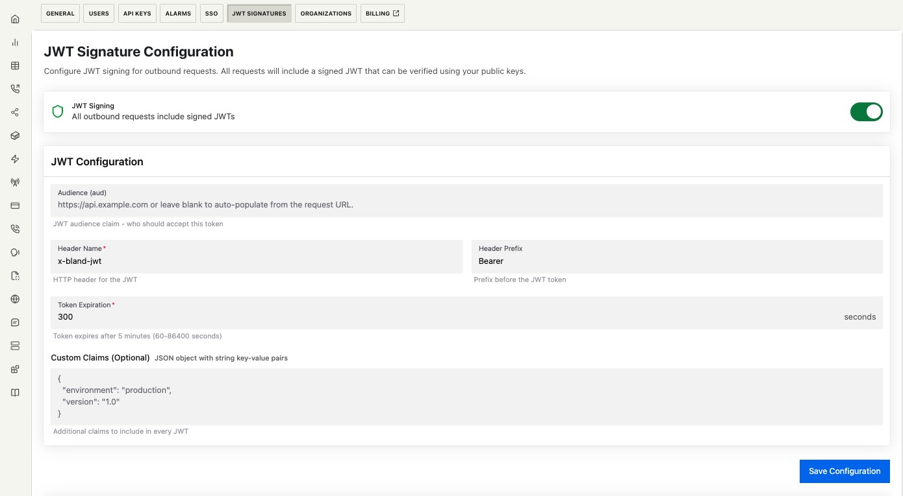

## Overview

Traditional webhook authentication using shared secrets creates critical vulnerabilities: secrets must be distributed and stored securely, rotation requires coordinating both parties, and any compromise affects all integrations.

JWT signatures eliminate these risks through asymmetric cryptography - you verify requests using our public JWKS endpoint without storing any secrets, while we can rotate keys unilaterally without disrupting your service. This zero-trust approach provides cryptographic proof of authenticity, integrity, and origin for every request, with built-in replay prevention through unique token identifiers.

## Security Guarantees

Each JWT token provides cryptographic proof of:

1. **Authenticity**: Request originated from Bland's infrastructure (verified via signature)
2. **Integrity**: Payload hasn't been modified (signature breaks if tampered)
3. **Non-repudiation**: Bland cannot deny sending the request
4. **Replay prevention**: Unique `jti` (UUIDv7) prevents token reuse
5. **Time-boxing**: `iat`, `nbf`, and `exp` claims enforce temporal validity

## Token Structure

Every JWT Bland issues contains these claims and headers:

| Header | Type   | Purpose                    | Validation Required           |
| ------ | ------ | -------------------------- | ----------------------------- |
| `alg`  | String | Signing algorithm (RS256)  | Must be `RS256`               |
| `typ`  | String | Token type (JWT)           | Must be `JWT`                 |
| `kid`  | String | Key ID for key pair lookup | Must match a key in your JWKS |

| Claim | Type           | Purpose                 | Validation Required                             |
| ----- | -------------- | ----------------------- | ----------------------------------------------- |
| `sub` | String         | Org ID                  | Must match your application's Bland Org ID      |
| `jti` | UUIDv7         | Unique token identifier | Track to prevent replay attacks                 |
| `iat` | Unix timestamp | Issued at time          | Reject if future (clock skew)                   |
| `nbf` | Unix timestamp | Not valid before        | Reject if current time < nbf                    |
| `exp` | Unix timestamp | Expiration time         | Reject if expired                               |
| `iss` | String         | Issuer URL              | Must match `https://api.bland.ai/orgs/{org_id}` |
| `aud` | String         | Intended recipient      | Must match your service identifier              |

## Configuration



### Core Settings

**JWT Signing**: Master toggle for signature generation

**Audience (aud)**:

- Leave blank: Auto-populates with request's base URL in the form of protocol://host
- Custom value: Use for service mesh routing (e.g., `svc:webhook-processor`)
- Examples (when auto populated):
  - `https://webhooks.yourdomain.com?queryparam=value` => `https://webhooks.yourdomain.com`
  - `https://api.yourdomain.com/v1/endpoint` => `https://api.yourdomain.com`
- Use the "Include Protocol" option to control whether the `https://` prefix is included in the `aud` claim.

**Token Expiration**: Seconds until token expires (300-3600)

- Shorter = Better security, more clock skew issues
- Longer = More tolerant, larger replay window

**Custom Claims**: Additional JSON claims for request context

```json
{
  "environment": "production",
  "tenant_id": "tenant_123",
  "request_type": "webhook"
}
```

## Key Management

### JWKS Endpoint

Public keys available at:

```
https://api.bland.ai/orgs/{org-id}/.well-known/jwks.json
```

This endpoint is public by design - no authentication required or desired.

### Rotation Strategy

**Standard Rotation**:

- New key generated with unique `kid`
- 24-hour overlap with previous keys (max 3 active)
- In-flight requests remain valid during transition
- Your cached JWKS continues working

**Emergency Revocation**:

- Immediately invalidates ALL tokens
- Use only for confirmed compromise
- Will break in-flight requests
- Requires immediate cache purge on your side

## Implementation

### Verification Example

```typescript
import { createRemoteJWKSet, jwtVerify } from "jose";

const JWKS = createRemoteJWKSet(
  new URL("https://api.bland.ai/orgs/{org_id}/.well-known/jwks.json")
);

// Track JTIs to prevent replay (use Redis/DB in production)
const seenTokens = new Set();

async function verifyRequest(token: string) {
  const { payload } = await jwtVerify(token, JWKS, {
    issuer: `https://api.bland.ai/orgs/${org_id}`,
    audience: "your-service-identifier",
  });

  // Prevent replay attacks
  if (seenTokens.has(payload.jti)) {
    throw new Error("Token replay detected");
  }
  seenTokens.add(payload.jti);

  return payload;
}
```

### Cache Invalidation Strategy

When verification fails with an unknown `kid`:

1. Force refresh your JWKS cache immediately
2. Retry verification once with fresh keys
3. If still failing, reject the request
4. Log the failure with the `kid` for investigation

Rate limit cache refreshes to prevent DoS attacks (minimum 5 seconds between refreshes).

## Security Considerations

### Why This Prevents Breaches

**Compromised database**: Attacker finds your database backup

- Shared secret: Can forge webhooks immediately
- JWT: No secrets stored, cannot forge signatures

**MITM attack**: Attacker intercepts webhook traffic

- Shared secret: Can replay requests or extract secret
- JWT: Can replay only until `exp`, cannot forge new requests

**Insider threat**: Malicious employee wants to forge webhooks

- Shared secret: Anyone with production access has the secret
- JWT: Would need Bland's private key (never exposed)

**Partner compromise**: Another Bland customer gets breached

- Shared secret: If secrets are reused, you're affected
- JWT: Each org has unique issuer, no cross-contamination

### Production Requirements

1. **Always verify** `jti` uniqueness within the token's lifetime
2. **Cache JWKS** for 1-24 hours, refresh on unknown `kid`
3. **Implement replay prevention** using Redis or similar
4. **Monitor verification failures** - spike indicates rotation or attack
5. **Set clock tolerance** to ±30 seconds for distributed systems
6. **Never accept** tokens with future `iat` (issued-at) times

## Troubleshooting

<AccordionGroup>
  <Accordion title="ERR_JWKS_NO_MATCHING_KEY errors">
    **Cause**: Key rotation occurred, your cache has old keys
    
    **Fix**: Force JWKS cache refresh and retry once
  </Accordion>

{" "}

<Accordion title="Token expired errors during normal operations">
  **Cause**: Clock skew or network latency exceeding token lifetime **Fix**:
  Increase token expiration to 600-900 seconds
</Accordion>

{" "}

<Accordion title="Replay detection triggering on legitimate requests">
  **Cause**: Retry logic or load balancer sending duplicate requests **Fix**:
  Implement idempotency keys separate from JWT `jti`
</Accordion>

  <Accordion title="Cannot verify after emergency revocation">
    **Cause**: All keys invalidated, including cached ones
    
    **Fix**: Manually purge JWKS cache and fetch fresh keys
  </Accordion>
</AccordionGroup>
