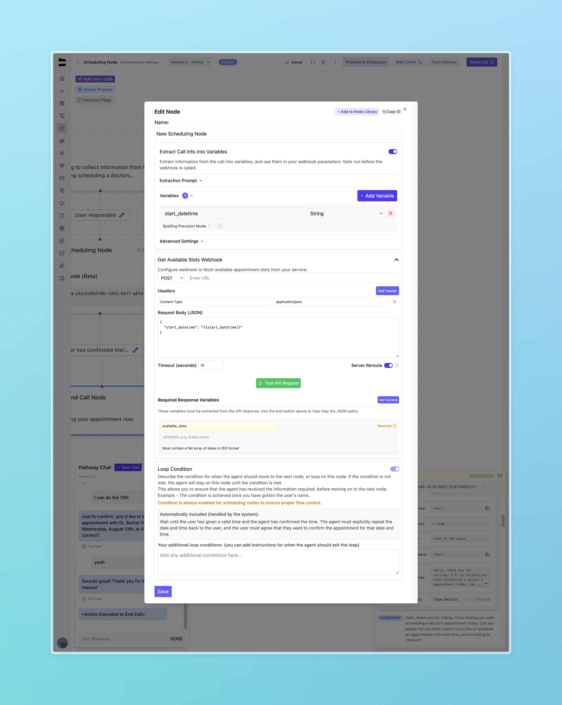

## Overview

Appointment scheduling can be tricky for AI agents, since it requires a level of precision that's not always easy to achieve. The Scheduling Node in Bland is designed to tackle this challenge by using internal prompts and configuration, making it easy to collect preferred time slots from available options.

The Scheduling Node works by sending web requests to your appointment scheduling system to gather date and time options for your agent to offer callers. The agent then confirms the appointment and captures the caller's preferred date and time, so you can use it seamlessly in your own system.

**Prerequisites:**
- A Bland Pathway configured for scheduling workflows
- A webhook endpoint that can provide a flat array of dates in ISO format representing available time slots for the caller to choose from
- A webhook endpoint that can receive the caller's preferred date and time for the appointment

## Overall Call Flow

The scheduling node follows this call flow:

1. Agent and caller conversation leading up to scheduling an appointment
2. Agent enters scheduling node in pathway
3. Scheduling Node sends a request to your webhook to get available time slots 
4. Agent and caller discuss options 
5. Caller picks a preferred date and time 
6. Agent confirms the appointment time with caller
7. Agent exits scheduling node with the caller's preferred date and time as a variable

## The Scheduling Node

### Breakdown

In this section, we'll go over the scheduling node and all its configuration options.


### Extract Call Info Into Variables

This feature, common to other Bland pathway nodes, lets you pull out information already discussed through the conversation so far.

Each variable type can be specified between String, Number, and Boolean. An additional description can be added to help guide the agent when extracting the variable. Our agent will use the name and description of the variable to extract the information from the conversation.

After being pulled from the conversation, these variables can be used in your scheduling node by referencing them in the `{{}}` syntax. For example, if you want to use the caller's name in your scheduling node, you can reference it as `{{contact_name}}` in the body of your webhook request. A default example of this is the `start_datetime` variable.

When adding this node to your pathway, we include a default `start_datetime` variable to be extracted from the conversation. This variable represents the starting date and time the caller is interested in scheduling an appointment for. This variable is not required to be explicitly answered by the caller, and will default to the current date and time if not provided. We additionally include it as a variable in the body of the webhook request:

```json
{
  "start_datetime": "{{start_datetime}}"
}
```

### Get Available Slots Webhook

Similarly to our other [webhook nodes](/tutorials/webhooks), the scheduling node is configured to send a request to your system to get available time slots. This request can be include additional headers and timeout settings. See our [webhook node](/tutorials/webhooks) documentation for more information on the body of the request, and including pathway variables.

### Required Response Variables

Below the body of the request, you can test your API request to ensure it is capturing the available time slots accurately. The scheduling node will expect a response of a flat array fo dates in ISO format. For example:

```json
{
  "available_slots": [
    "2025-08-15T23:08:39.000Z",
    "2025-08-18T17:49:31.000Z",
    "2025-08-20T22:52:43.000Z",
    "2025-08-22T16:51:35.000Z",
    "2025-08-27T20:28:22.000Z",
    "2025-08-28T17:40:55.000Z"
  ]
}
```

After testing your webhook, the API response field will become populated. You will need to set the JSON path of the flat array underneath the required `available_slots` field. In the above example, the JSON path would be `$.available_slots`. Feel free to press the "+" button to the left of the field to automatically add the JSON path to the list of response variables. Additionally, any other variables you want to extract from the webhook response can be added to the list of response variables in the same way.

### Loop Condition

The loop condition, similar to other nodes, controls when the agent should move forward in the pathway. By default, the loop condition on scheduling nodes is always enabled with the following built in prompting: 

> *Wait until the user has given a valid time and the agent has confirmed the time. The agent must explicitly repeat the date and time back to the user, and the user must agree that they want to confirm the appointment for that date and time.* 

This loop condition keeps the agent in the scheduling node until the necessary prompts are achieved. There's also an additional section below where you can add your own instructions or set conditions for when you want the agent to exit the scheduling node.

For example, if you would like to allow the caller to cancel the appointment scheduling, you can include the following prompting:

> *The condition can also be true when the user wants to cancel or stop scheduling an appointment.*

### After The Scheduling Node

After the agent moves out of the scheduling node, you will gain access to the variable `chosen_datetime`. This will be an ISO formatted string based on the caller's preferred date and time for the appointment. Moving forward, this can be used as a variable in an additional webhook node to schedule the appointment with your appointment scheduling system.

For any additional questions, please reach out to hello@bland.ai or any other support channels.
