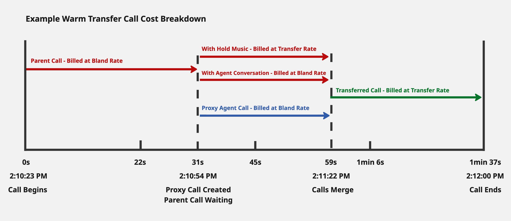

## Billing Overview

Bland charges based on the actual resources consumed across voice, SMS, and other interaction types. Enterprise accounts may be eligible for custom pricing.

---

## Bland Voice Billing

| Component        | Description                                                   | Price         |
|------------------|---------------------------------------------------------------|---------------|
| **Call Time**    | Prorated to the exact second. Only active call time is counted. | $0.09 / min   |
| **Outbound Minimum** | Minimum charge per outbound call attempt using Bland's telephony. | $0.015 / call |
| **Transfer (BYOT)** | Free when using your own Twilio number.                      | $0.00 / min   |
| **Transfer (Bland)** | Billed at a reduced rate when using Bland-provided numbers. Free for BYOT customers. | $0.025 / min  |
| **Voicemail**    | Billed as part of standard call time.                         | $0.09 / min   |
| **Failed Calls** | Minimum charge applies if using Bland's telephony.           | $0.015 / call |

### Outbound Call Pricing Details

**Effective June 16, 2025:** Outbound calls placed using Bland's telephony have a minimum charge of $0.015 per dispatched call.

- **Short calls or failed connections:** $0.015 flat fee
- **Connected calls over ~10 seconds:** Standard $0.09/minute rate applies (minimum charge is absorbed)
- **Enterprise customers:** This change does not apply to enterprise agreements before June 16, 2025.

**Examples:**
- Call that doesn't connect: $0.015 flat fee
- Call that connects for 1 minute: $0.09 (standard per-minute rate)

---

## Warm Transfer Billing

| Component           | Description                                               | Price         |
|--------------------|------------------------------------------------------------|---------------|
| **Proxy Agent**    | Charged for talk time while active.                        | $0.09 / min   |
| **Primary Agent**  | Billing stops once the agent disconnects.                  | $0.09 / min   |
| **Merged Calls**   | Billed for transfer duration. This is free for BYOT customers.  | $0.025 / min   |

### Example Warm Transfer Billing Diagram

Above is an example of a warm transfer duration and how it's billed. A warm transfer starts with the Bland agent speaking with the customer. When a transfer is needed, the agent initiates a second proxy agent call in the background. Depending on the warm transfer configuration, the customer either hears hold music or continues speaking with the Bland agent. That difference changes the billing rate while the customer waits for the proxy agent call to merge.

Once the proxy agent call is created, it's billed at the Bland rate, \$0.09/min in this example. After the calls merge, the time is billed at the transfer rate, \$0.025/min in this example.

Per the table above, transfer rate is free when using a BYOT number.

---

## SIP Billing

Bland supports SIP connectivity for enterprise customers who wish to connect directly from their own telephony infrastructure or contact center platform.

| Component               | Description                                                                                   | Price                     |
|--------------------------|-----------------------------------------------------------------------------------------------|----------------------------|
| **SIP (Inbound / Outbound)** | Calls routed through Bland’s SIP endpoints. Standard call rates apply; SIP cost is included. | $0.09 / min                |
| **SIP (BYOT)**           | When using your own Twilio or SIP provider, all carrier fees are billed to your account. Bland still applies its standard call rate. | $0.09 / min + carrier rate |
| **SIP Termination Fee**  | Twilio charges Bland $0.004 / min for SIP traffic that terminates on Bland infrastructure. This cost is currently absorbed by Bland and not passed through. | —                          |

### SIP Pricing Notes

- SIP usage is billed the same as standard voice minutes, regardless of whether the call is made through PSTN or SIP.  
- When calls terminate on Bland's Twilio SIP infrastructure, Bland incurs a $0.004 / min fee to Twilio for that call leg.  
- There is currently no discounted or specialized SIP rate; the SIP cost is treated as equivalent to standard call usage. 
- Future enterprise plans may include dedicated SIP pricing tiers depending on call volume and termination routing.

---

## SMS Billing

| Type            | Rate         |
|------------------|--------------|
| SMS (in/outbound) | $0.02 per message |

Both incoming and outgoing messages are billed. Pricing is uniform unless otherwise agreed upon in an enterprise contract.

---

## Plan Tiers

Below are the standard Bland usage plans. Custom enterprise agreements are available.

| Plan       | Price   | Daily Cap     | Hourly Cap    | Concurrency | Voice Clones |
|------------|---------|---------------|---------------|-------------|---------------|
| **Start**  | Free    | 100 calls      | 100 calls      | 10 calls     | 1             |
| **Build**  | $299    | 2,000 calls    | 1,000 calls    | 50 calls     | 5             |
| **Scale**  | $499    | 5,000 calls    | 1,000 calls    | 100 calls    | 15            |
| **Enterprise** | Contact Us | Unlimited      | Unlimited      | Unlimited   | Unlimited     |

[Upgrade your plan](https://app.bland.ai/dashboard/pay)

---

## Credit Usage

Your current credit balance, usage history, and purchase options are all visible on the billing dashboard:

[Go to Billing Dashboard](https://app.bland.ai/dashboard/pay)

---
