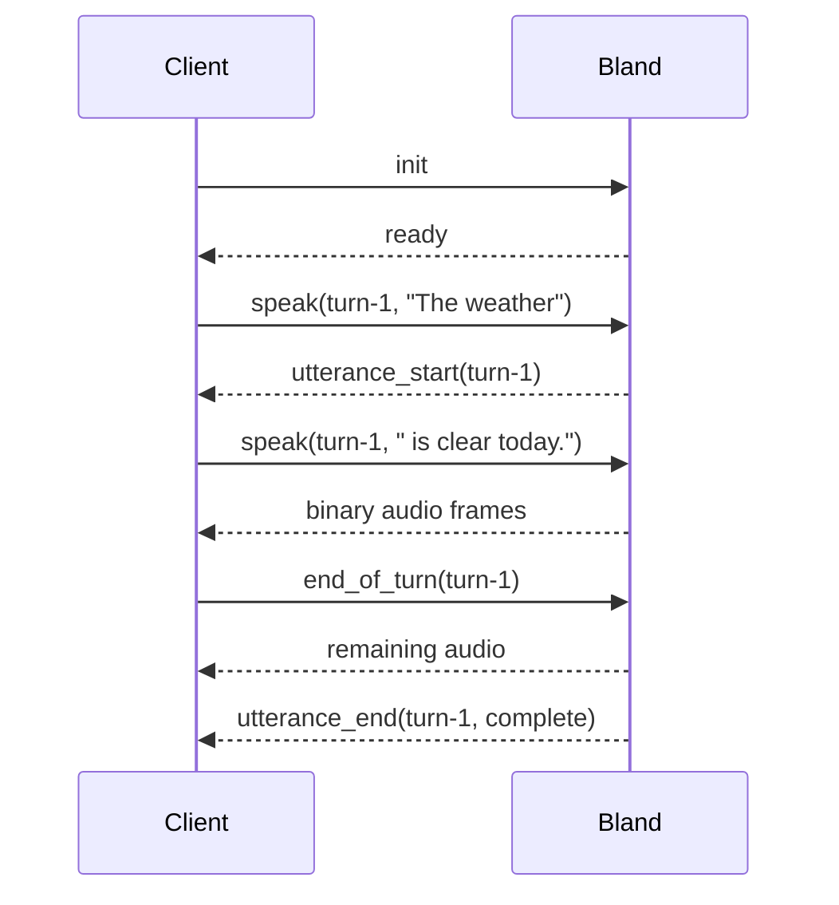

[`/v2/tts/ws`](/api-v2/post/tts-ws) is designed for a streaming text source. An LLM can still be generating the end of a response while Bland is already synthesizing and returning audio for the beginning.

## The connection and turn model

Keep one WebSocket open for one conversation. The voice and audio format are fixed by `init` for the life of that connection.

A `context_id` identifies one turn of speech. Reuse the same ID for every text delta in that turn, then send `end_of_turn` when the LLM is finished.



The socket is not a queue of independent requests and does not multiplex simultaneous turns. Exactly one turn is active at a time.

## Bland buffers incoming text

Send tokens as soon as you receive them. Bland accumulates the deltas, detects useful speech boundaries, and releases text to synthesis when it has enough context for natural output.

You do not need to:

- Wait for complete sentences before sending text.
- Build a character threshold or timer.
- Send a flush command after every fragment.
- Predict how much text the model needs for natural prosody.

Unfinished text may remain buffered for a moment without producing audio. Two things release it before the next sentence boundary:

- **The idle timer.** When no `speak` has arrived for `max_buffer_delay_ms` (default 150 ms, set on `init`) and nothing else is being spoken, Bland speaks the buffered text as its own short generation. This is what keeps an opener like "Sure." from sitting in silence while the LLM thinks. The timer never cuts into a sentence that is still rendering and never speaks text that ends mid-word. Set `max_buffer_delay_ms` to `0` to turn it off.
- **`flush`.** Send `{ "type": "flush", "context_id": "..." }` to speak the buffered text immediately, for example when your application knows the LLM has paused for a tool call. `flush` does not wait for a word boundary.

`end_of_turn` tells Bland to synthesize whatever tail remains. The sentence-boundary thresholds are tuned internally and are not part of the API contract.

<Tip>
  Preserve the spaces and punctuation from the LLM stream. Each `speak.text` value is appended verbatim to the turn.
</Tip>

## Preemption and barge-in

Sending `speak` with a new `context_id` immediately preempts the active turn:

1. Bland stops forwarding new audio for the old turn.
2. In-flight synthesis for the old turn is aborted.
3. Unsynthesized buffered text for the old turn is discarded.
4. The old turn receives `utterance_end` with reason `preempted`.
5. If the new turn passes admission, it receives `utterance_start` and begins buffering.

If admission fails, the old turn remains preempted and the new `context_id` receives an `error` without `utterance_start` or `utterance_end`.

```js
// turn-17 is currently speaking. This message preempts it.
ws.send(
  JSON.stringify({
    type: "speak",
    context_id: "turn-18",
    text: "Actually, let me correct that.",
  }),
);
```

The server cannot retract audio frames that already reached your client. When a turn is preempted, discard any unplayed audio for the old `context_id` from your local playback queue.

## Cancellation without replacement

Use `cancel` when a user interrupts but the replacement response is not ready:

```js
ws.send(JSON.stringify({ type: "cancel", context_id: "turn-17" }));
```

The turn ends with reason `cancelled`. Late `cancel` or `end_of_turn` messages for a context that is no longer active are ignored.

When replacement tokens arrive, start them under a new ID. Use unique context IDs so application logs and playback state remain unambiguous.

## Completing a turn and closing a session

These operations are different:

- `end_of_turn` flushes the active turn's remaining text and lets its audio complete.
- `close` cancels any active turn, settles the session, sends `done`, and closes the socket.

For a normal final turn:

1. Send `end_of_turn` after the LLM finishes.
2. Keep reading audio.
3. Wait for `utterance_end` with reason `complete`.
4. Send `close` when the conversation itself is finished.

Sending `close` immediately after the final text can truncate the buffered tail.

## Buffering audio for playback

Bland handles input text buffering. Your client still owns output playback buffering.

The server sends raw audio frames as soon as they are generated, which may be faster than real-time playback. Enqueue them in order and let the audio device or media transport consume them at the negotiated sample rate.

Associate incoming binary frames with the active context between `utterance_start` and `utterance_end`:

```js
let activeContext = null;

ws.on("message", (data, isBinary) => {
  if (isBinary) {
    playbackQueue.enqueue(activeContext, Buffer.from(data));
    return;
  }

  const message = JSON.parse(data.toString());
  if (message.type === "utterance_start") {
    activeContext = message.context_id;
  }
  if (message.type === "utterance_end") {
    if (message.reason !== "complete") {
      playbackQueue.discard(message.context_id);
    }
    activeContext = null;
  }
});
```

For 48 kHz `pcm_s16le`, each second of mono audio is 96,000 bytes: `48,000 samples * 2 bytes`. For 8 kHz mu-law, each second is 8,000 bytes.

## Billing on interrupted turns

Billing follows delivered audio:

- A synthesized text chunk becomes billable when the server accepts its first audio frame for delivery.
- The complete chunk is billed because Bland does not have frame-to-character attribution.
- Text still buffered, queued, or synthesized without delivering a frame is not billed.
- A preempted or cancelled turn can therefore have a partial set of its text billed.
- Each turn settles separately and is subject to the current $0.001 minimum charge when it delivers billable audio.

Per-character billing is therefore an estimate at synthesized-chunk granularity, not a measurement of the exact characters represented by each audio frame. Charging the chunk from its first delivered frame also prevents cancellation near the end of a chunk from skipping its charge.

## Concurrency and long-lived sockets

A successfully initialized WebSocket holds one organization-wide speech concurrency slot until it closes. The slot remains occupied between turns because the connection keeps a warm synthesis session reserved.

Close sockets you no longer need. If the organization is at its concurrency cap, initialization returns `rate_limited`. See [Speech Limits](/speech/limits) for default limits and retry guidance.

## Recommended client state

Track these values explicitly:

| State | Purpose |
| --- | --- |
| `session_id` | Correlate connection logs after `ready`. |
| Active `context_id` | Attribute binary frames to the current turn. |
| Turn phase | Distinguish streaming text, finalized text, and terminal state. |
| Playback queue per context | Drop unplayed audio after preemption or cancellation. |
| Session timeout | Bound network or upstream failures in your application. |

Treat `utterance_end` as the terminal for a turn and `done` as the terminal for the session. Do not infer completion from a pause in binary frames.

---

Docs for agents: [llms.txt](/llms.txt)
